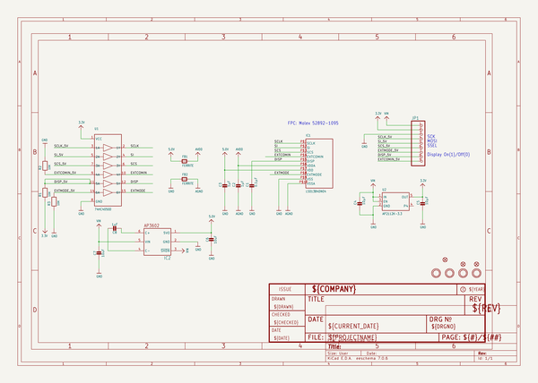
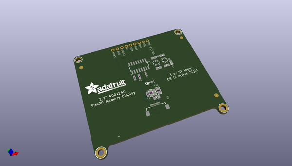
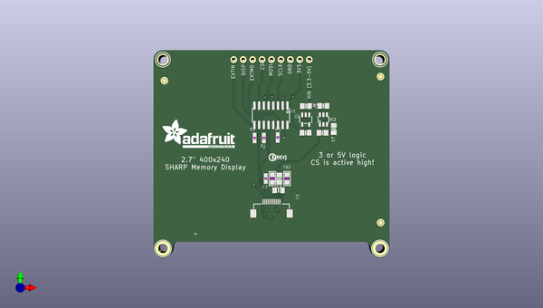
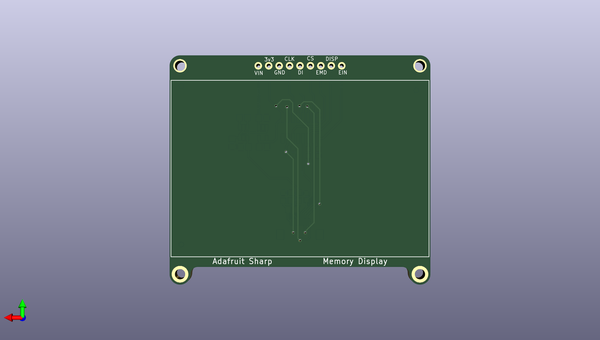

# adafruit_sharp_memory_display_pcbs
 
## summary 
* id: adafruit_adafruit_sharp_memory_display_pcbs_adafruit_2_7in_sharp_memory_display
* user: adafruit
* name: adafruit_sharp_memory_display_pcbs
* board: adafruit_2_7in_sharp_memory_display
* repo: https://github.com/adafruit/Adafruit-Sharp-Memory-Display-PCBs

* src_file_repo_sch: 
* src_file_repo_sch_link: https://github.com/adafruit/Adafruit-Sharp-Memory-Display-PCBs/tree/master/
* full details link: https://github.com/oomlout/oomlout_oomp_project_bot_v_2/tree/main/projects/adafruit_adafruit_sharp_memory_display_pcbs_adafruit_2_7in_sharp_memory_display/current_version/working  

## schematic  
  
[schematic (pdf)](working_schematic.pdf)  

## pcb  
 
  
  
  
[board (pdf)](working.pdf)  

## working_bom
| Id | Designator | Footprint | Quantity | Designation | Supplier and ref |  | None | 
| --- | --- | --- | --- | --- | --- | --- | --- | 
| 1 | FID1,FID3,FID2 | FIDUCIAL_1MM | 3 | FIDUCIAL_1MM |  |  | [''] | 
| 2 | JP1 | 1X09_ROUND_70 | 1 |  |  |  | [''] | 
| 3 | R2,R1,R3 | 0603-NO | 3 | 10K |  |  | [''] | 
| 4 | C3 | 0805-NO | 1 | 1µF |  |  | [''] | 
| 5 | C8 | 0805-NO | 1 | 1uF |  |  | [''] | 
| 6 | C6,C7 | 0805-NO | 2 | 10uF |  |  | [''] | 
| 7 | C2 | 0805_10MGAP | 1 | 1µF |  |  | [''] | 
| 8 | U$29 | PCBFEAT-REV-040 | 1 |  |  |  | [''] | 
| 9 | C5,C4 | 0805-NO | 2 | 10µF |  |  | [''] | 
| 10 | FB1,FB2 | _0805 | 2 | FERRITE |  |  | [''] | 
| 11 | U2 | SOT23-5 | 1 | AP2112K-3.3 |  |  | [''] | 
| 12 | U$32 | ADAFRUIT_TEXT_20MM | 1 |  |  |  | [''] | 
| 13 | IC1 | SHARP_2.7IN | 1 | LS013B4DN04 |  |  | [''] | 
| 14 | U$22,U$21 | MOUNTINGHOLE_2.5_PLATED_THICK | 2 | MOUNTINGHOLE2.5_THICK |  |  | [''] | 
| 15 | C1 | 0603-NO | 1 | 0.1µF |  |  | [''] | 
| 16 | U$27,U$28 | MOUNTINGHOLE_2.5_PLATED | 2 | MOUNTINGHOLE2.5 |  |  | [''] | 
| 17 | IC2 | SOT23-6 | 1 | AP3602 |  |  | [''] | 
| 18 | U1 | SOIC16 | 1 | 74HC4050D |  |  | [''] | 

## bom_schematic
| Ref | Qnty | Value | Cmp name | Footprint | Description | Vendor | DNP | 
| --- | --- | --- | --- | --- | --- | --- | --- | 
| C1 | 1 | 0.1µF | CAP_CERAMIC0603_NO | working:0603-NO |  |  |  | 
| C2 | 1 | 1µF | CAP_CERAMIC0805_10MGAP | working:0805_10MGAP |  |  |  | 
| C3 | 1 | 1µF | CAP_CERAMIC0805-NOOUTLINE | working:0805-NO |  |  |  | 
| C4, C5 | 2 | 10µF | CAP_CERAMIC0805-NOOUTLINE | working:0805-NO |  |  |  | 
| C6, C7 | 2 | 10uF | CAP_CERAMIC0805-NOOUTLINE | working:0805-NO |  |  |  | 
| C8 | 1 | 1uF | CAP_CERAMIC0805-NOOUTLINE | working:0805-NO |  |  |  | 
| FB1, FB2 | 2 | FERRITE | FERRITE_0805 | working:_0805 |  |  |  | 
| FID1, FID2, FID3 | 3 | FIDUCIAL_1MM | FIDUCIAL_1MM | working:FIDUCIAL_1MM |  |  |  | 
| IC1 | 1 | LS013B4DN04 | DISP_EINK_SHARPMEMORYLCD_10PIN_27IN | working:SHARP_2.7IN |  |  |  | 
| IC2 | 1 | AP3602 | AP3602 | working:SOT23-6 |  |  |  | 
| JP1 | 1 | HEADER-1X970MIL | HEADER-1X970MIL | working:1X09_ROUND_70 |  |  |  | 
| R1, R2, R3 | 3 | 10K | RESISTOR_0603_NOOUT | working:0603-NO |  |  |  | 
| U1 | 1 | 74HC4050D | 74HC4050D | working:SOIC16 |  |  |  | 
| U2 | 1 | AP2112K-3.3 | VREG_SOT23-5 | working:SOT23-5 |  |  |  | 
| U$21, U$22 | 2 | MOUNTINGHOLE2.5_THICK | MOUNTINGHOLE2.5_THICK | working:MOUNTINGHOLE_2.5_PLATED_THICK |  |  |  | 
| U$27, U$28 | 2 | MOUNTINGHOLE2.5 | MOUNTINGHOLE2.5 | working:MOUNTINGHOLE_2.5_PLATED |  |  |  | 

## mounting_holes
| x | y | package | value | ref | size | 
| --- | --- | --- | --- | --- | --- | 
| 58.41999999999999 | 0.0 | MOUNTINGHOLE_2.5_PLATED_THICK | MOUNTINGHOLE2.5_THICK | U$21 | m3 | 
| 0.0 | 0.0 | MOUNTINGHOLE_2.5_PLATED_THICK | MOUNTINGHOLE2.5_THICK | U$22 | m3 | 
| 58.41999999999999 | 50.80000000000001 | MOUNTINGHOLE_2.5_PLATED | MOUNTINGHOLE2.5 | U$27 | m3 | 
| 0.0 | 50.80000000000001 | MOUNTINGHOLE_2.5_PLATED | MOUNTINGHOLE2.5 | U$28 | m3 | 

