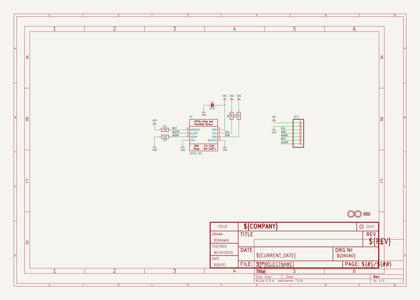

# adafruit_sht31_sensor_breakout_pcb
 
## summary 
* id: adafruit_adafruit_sht31_sensor_breakout_pcb_adafruit_sht31_d_stemma_qt_breakout
* user: adafruit
* name: adafruit_sht31_sensor_breakout_pcb
* board: adafruit_sht31_d_stemma_qt_breakout
* repo: https://github.com/adafruit/Adafruit-SHT31-Sensor-Breakout-PCB

* src_file_repo_sch: 
* src_file_repo_sch_link: https://github.com/adafruit/Adafruit-SHT31-Sensor-Breakout-PCB/tree/master/
* full details link: https://github.com/oomlout/oomlout_oomp_project_bot_v_2/tree/main/projects/adafruit_adafruit_sht31_sensor_breakout_pcb_adafruit_sht31_d_stemma_qt_breakout/current_version/working  

## schematic  
  
[schematic (pdf)](working_schematic.pdf) 

## pcb  
 
  
  
  
[board (pdf)](working.pdf)  

## working_bom
| Id | Designator | Footprint | Quantity | Designation | Supplier and ref |  | None | 
| --- | --- | --- | --- | --- | --- | --- | --- | 
| 1 | R4,R2,R1 | 0805-NO | 3 | 10K |  |  | [''] | 
| 2 | JP2 | 1X07_ROUND_70 | 1 |  |  |  | [''] | 
| 3 | R3 | _0805MP | 1 | 10K |  |  | [''] | 
| 4 | FID3,FID2 | FIDUCIAL_1MM | 2 | FIDUCIAL" |  |  | [''] | 
| 5 | C1 | 0805-NO | 1 | 10uF |  |  | [''] | 
| 6 | U$1,U$2 | MOUNTINGHOLE_2.5_PLATED | 2 | MOUNTINGHOLE2.5 |  |  | [''] | 
| 7 | U1 | SHT3X | 1 | SHT31-DIS |  |  | [''] | 
| 8 | U$13 | ADAFRUIT_2.5MM | 1 |  |  |  | [''] | 
| 9 | U$11 | PCBFEAT-REV-040 | 1 |  |  |  | [''] | 

## bom_schematic
| Ref | Qnty | Value | Cmp name | Footprint | Description | Vendor | DNP | 
| --- | --- | --- | --- | --- | --- | --- | --- | 
| C1 | 1 | 10uF | CAP_CERAMIC0805-NOOUTLINE | working:0805-NO |  |  |  | 
| FID2, FID3 | 2 | FIDUCIAL"" | FIDUCIAL{dblquote}{dblquote} | working:FIDUCIAL_1MM |  |  |  | 
| JP2 | 1 | HEADER-1X770MIL | HEADER-1X770MIL | working:1X07_ROUND_70 |  |  |  | 
| R1, R2, R4 | 3 | 10K | RESISTOR0805_NOOUTLINE | working:0805-NO |  |  |  | 
| R3 | 1 | 10K | RESISTOR_0805MP | working:_0805MP |  |  |  | 
| U1 | 1 | SHT31-DIS | SHT3X | working:SHT3X |  |  |  | 
| U$1, U$2 | 2 | MOUNTINGHOLE2.5 | MOUNTINGHOLE2.5 | working:MOUNTINGHOLE_2.5_PLATED |  |  |  | 

## mounting_holes
| x | y | package | value | ref | size | 
| --- | --- | --- | --- | --- | --- | 
| 0.0 | 0.0 | MOUNTINGHOLE_2.5_PLATED | MOUNTINGHOLE2.5 | U$1 | m3 | 
| 12.7 | 0.0 | MOUNTINGHOLE_2.5_PLATED | MOUNTINGHOLE2.5 | U$2 | m3 | 

