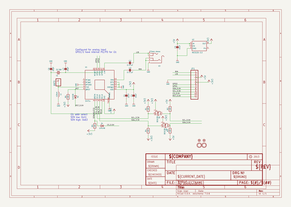
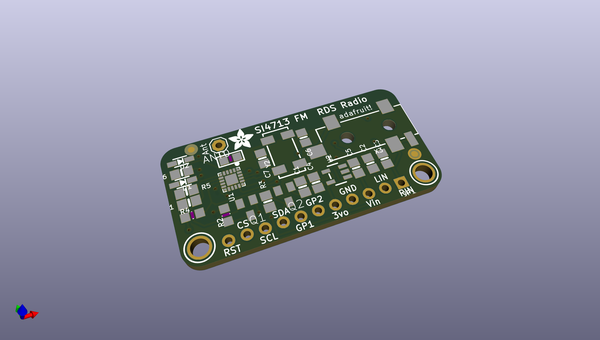
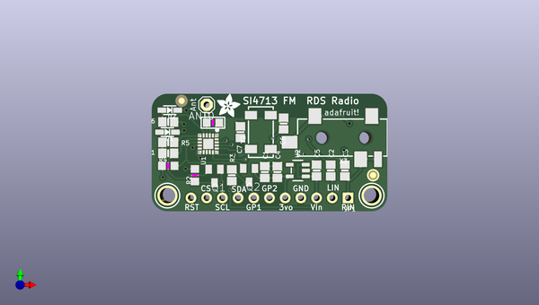
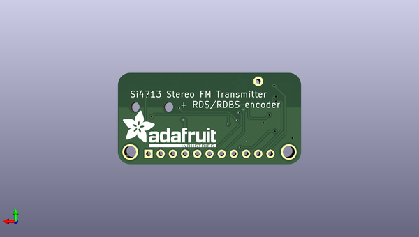

# adafruit_si4713_pcb
 
## summary 
* id: adafruit_adafruit_si4713_pcb_adafruit_si471x_pcb
* user: adafruit
* name: adafruit_si4713_pcb
* board: adafruit_si471x_pcb
* repo: https://github.com/adafruit/Adafruit-Si4713-PCB

* src_file_repo_sch: 
* src_file_repo_sch_link: https://github.com/adafruit/Adafruit-Si4713-PCB/tree/master/
* full details link: https://github.com/oomlout/oomlout_oomp_project_bot_v_2/tree/main/projects/adafruit_adafruit_si4713_pcb_adafruit_si471x_pcb/current_version/working  

## schematic  
  
[schematic (pdf)](working_schematic.pdf) 

## pcb  
 
  
  
  
[board (pdf)](working.pdf)  

## working_bom
| Id | Designator | Footprint | Quantity | Designation | Supplier and ref |  | None | 
| --- | --- | --- | --- | --- | --- | --- | --- | 
| 1 | JP1 | 1X11_ROUND | 1 |  |  |  | [''] | 
| 2 | X3 | 4UCONN_19269 | 1 | 3.5mm stereo |  |  | [''] | 
| 3 | D2,D1 | SOD-323 | 2 | 1n4148 |  |  | [''] | 
| 4 | C2,C3 | 0805-NO | 2 | 0.47uF |  |  | [''] | 
| 5 | ANT0 | 1X01 | 1 |  |  |  | [''] | 
| 6 | U$7 | ADAFRUIT_3.5MM | 1 |  |  |  | [''] | 
| 7 | U1 | SI471X | 1 | Si471x |  |  | [''] | 
| 8 | U$17,U$15 | MOUNTINGHOLE_2.5_PLATED | 2 | MOUNTINGHOLE2.5 |  |  | [''] | 
| 9 | C5,C4 | 0805-NO | 2 | 10uF |  |  | [''] | 
| 10 | R4,R2 | _0805MP | 2 | 10K |  |  | [''] | 
| 11 | Y2 | CRYSTAL_8X3.8 | 1 | 32.768 |  |  | [''] | 
| 12 | C1 | 0805-NO | 1 | 22nF |  |  | [''] | 
| 13 | FID2,FID1 | FIDUCIAL_1MM | 2 | FIDUCIAL" |  |  | [''] | 
| 14 | R5,R1,R3,R6 | 0805-NO | 4 | 10K |  |  | [''] | 
| 15 | C7,C6 | 0805-NO | 2 | 20pF |  |  | [''] | 
| 16 | Q2,Q1 | SOT23 | 2 | BSS138 |  |  | [''] | 
| 17 | L1 | _0805 | 1 | 120nH |  |  | [''] | 
| 18 | U2 | SOT23-5 | 1 | MIC5225-3.3 |  |  | [''] | 
| 19 | U$9 | ADAFRUIT_TEXT_20MM | 1 |  |  |  | [''] | 

## bom_schematic
| Ref | Qnty | Value | Cmp name | Footprint | Description | Vendor | DNP | 
| --- | --- | --- | --- | --- | --- | --- | --- | 
| ANT0 | 1 | PINHD-1X1 | PINHD-1X1 | working:1X01 |  |  |  | 
| C1 | 1 | 22nF | CAP_CERAMIC0805-NOOUTLINE | working:0805-NO |  |  |  | 
| C2, C3 | 2 | 0.47uF | CAP_CERAMIC0805-NOOUTLINE | working:0805-NO |  |  |  | 
| C4, C5 | 2 | 10uF | CAP_CERAMIC0805-NOOUTLINE | working:0805-NO |  |  |  | 
| C6, C7 | 2 | 20pF | CAP_CERAMIC0805-NOOUTLINE | working:0805-NO |  |  |  | 
| D1, D2 | 2 | 1n4148 | DIODESOD-323 | working:SOD-323 |  |  |  | 
| FID1, FID2 | 2 | FIDUCIAL"" | FIDUCIAL{dblquote}{dblquote} | working:FIDUCIAL_1MM |  |  |  | 
| JP1 | 1 | HEADER-1X11 | HEADER-1X11 | working:1X11_ROUND |  |  |  | 
| L1 | 1 | 120nH | INDUCTOR_0805 | working:_0805 |  |  |  | 
| Q1, Q2 | 2 | BSS138 | MOSFET-NREFLOW | working:SOT23 |  |  |  | 
| R1, R3, R5, R6 | 4 | 10K | RESISTOR0805_NOOUTLINE | working:0805-NO |  |  |  | 
| R2, R4 | 2 | 10K | RESISTOR_0805MP | working:_0805MP |  |  |  | 
| U1 | 1 | Si471x | SI471X | working:SI471X |  |  |  | 
| U2 | 1 | MIC5225-3.3 | VREG_SOT23-5 | working:SOT23-5 |  |  |  | 
| U$15, U$17 | 2 | MOUNTINGHOLE2.5 | MOUNTINGHOLE2.5 | working:MOUNTINGHOLE_2.5_PLATED |  |  |  | 
| X3 | 1 | 3.5mm stereo | AUDIO_3.5MMJACK | working:4UCONN_19269 |  |  |  | 
| Y2 | 1 | 32.768 | CRYSTAL8.0X3.8 | working:CRYSTAL_8X3.8 |  |  |  | 

## mounting_holes
| x | y | package | value | ref | size | 
| --- | --- | --- | --- | --- | --- | 
| 33.02 | 0.0 | MOUNTINGHOLE_2.5_PLATED | MOUNTINGHOLE2.5 | U$15 | m3 | 
| 0.0 | 0.0 | MOUNTINGHOLE_2.5_PLATED | MOUNTINGHOLE2.5 | U$17 | m3 | 

