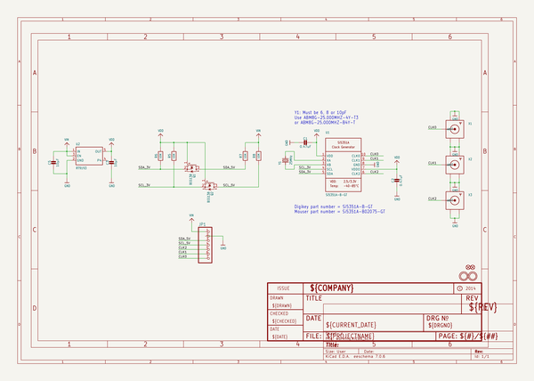
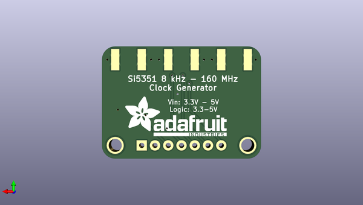

# adafruit_si5351a_clock_generator_breakout_pcb
 
## summary 
* id: adafruit_adafruit_si5351a_clock_generator_breakout_pcb_adafruit_si5351a
* user: adafruit
* name: adafruit_si5351a_clock_generator_breakout_pcb
* board: adafruit_si5351a
* repo: https://github.com/adafruit/Adafruit-Si5351A-Clock-Generator-Breakout-PCB

* src_file_repo_sch: 
* src_file_repo_sch_link: https://github.com/adafruit/Adafruit-Si5351A-Clock-Generator-Breakout-PCB/tree/master/
* full details link: https://github.com/oomlout/oomlout_oomp_project_bot_v_2/tree/main/projects/adafruit_adafruit_si5351a_clock_generator_breakout_pcb_adafruit_si5351a/current_version/working  

## schematic  
  
[schematic (pdf)](working_schematic.pdf)  

## pcb  
 
  
  
  
[board (pdf)](working.pdf)  

## working_bom
| Id | Designator | Footprint | Quantity | Designation | Supplier and ref |  | None | 
| --- | --- | --- | --- | --- | --- | --- | --- | 
| 1 | Q2,Q1 | SOT23-WIDE | 2 | BSS138 |  |  | [''] | 
| 2 | X1,X2,X3 | SMA_EDGELAUNCH | 3 |  |  |  | [''] | 
| 3 | R5,R6,R7,R8 | 0805-NO | 4 | 10K |  |  | [''] | 
| 4 | C2,C1 | 0805-NO | 2 | 0.47uF |  |  | [''] | 
| 5 | U$12 | ADAFRUIT_3.5MM | 1 |  |  |  | [''] | 
| 6 | FID1,FID2 | FIDUCIAL_1MM | 2 | FIDUCIAL" |  |  | [''] | 
| 7 | Y1 | CRYSTAL_3.2X2.5 | 1 | 25MHz |  |  | [''] | 
| 8 | U1 | MSOP10 | 1 | Si5351A-B-GT |  |  | [''] | 
| 9 | C5,C3 | 0805-NO | 2 | 10µF |  |  | [''] | 
| 10 | U$11,U$10 | MOUNTINGHOLE_2.5_PLATED | 2 | MOUNTINGHOLE2.5 |  |  | [''] | 
| 11 | JP1 | 1X07_ROUND_76 | 1 |  |  |  | [''] | 
| 12 | U2 | SOT23-5 | 1 | RT9193 |  |  | [''] | 
| 13 | U$23 | ADAFRUIT_TEXT_20MM | 1 |  |  |  | [''] | 

## bom_schematic
| Ref | Qnty | Value | Cmp name | Footprint | Description | Vendor | DNP | 
| --- | --- | --- | --- | --- | --- | --- | --- | 
| C1, C2 | 2 | 0.47uF | CAP_CERAMIC0805-NOOUTLINE | working:0805-NO |  |  |  | 
| C3, C5 | 2 | 10µF | CAP_CERAMIC0805-NOOUTLINE | working:0805-NO |  |  |  | 
| FID1, FID2 | 2 | FIDUCIAL"" | FIDUCIAL{dblquote}{dblquote} | working:FIDUCIAL_1MM |  |  |  | 
| JP1 | 1 | HEADER-1X7THICKER | HEADER-1X7THICKER | working:1X07_ROUND_76 |  |  |  | 
| Q1, Q2 | 2 | BSS138 | MOSFET-NWIDE | working:SOT23-WIDE |  |  |  | 
| R5, R6, R7, R8 | 4 | 10K | RESISTOR0805_NOOUTLINE | working:0805-NO |  |  |  | 
| U1 | 1 | Si5351A-B-GT | SI5351A | working:MSOP10 |  |  |  | 
| U2 | 1 | RT9193 | VREG_SOT23-5 | working:SOT23-5 |  |  |  | 
| U$10, U$11 | 2 | MOUNTINGHOLE2.5 | MOUNTINGHOLE2.5 | working:MOUNTINGHOLE_2.5_PLATED |  |  |  | 
| X1, X2, X3 | 3 | SMACONNECTOR_EDGE | SMACONNECTOR_EDGE | working:SMA_EDGELAUNCH |  |  |  | 
| Y1 | 1 | 25MHz | CRYSTAL3.2X2.5 | working:CRYSTAL_3.2X2.5 |  |  |  | 

## mounting_holes
| x | y | package | value | ref | size | 
| --- | --- | --- | --- | --- | --- | 
| 25.400000000000006 | 0.0 | MOUNTINGHOLE_2.5_PLATED | MOUNTINGHOLE2.5 | U$10 | m3 | 
| 0.0 | 0.0 | MOUNTINGHOLE_2.5_PLATED | MOUNTINGHOLE2.5 | U$11 | m3 | 

