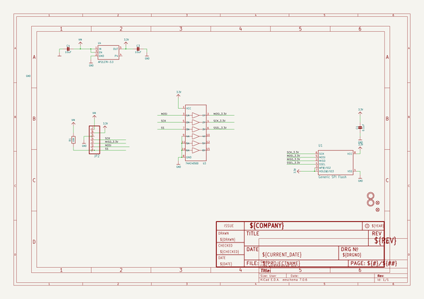
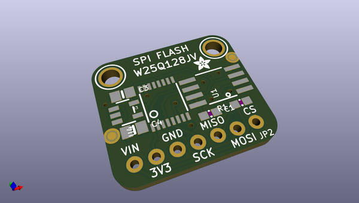
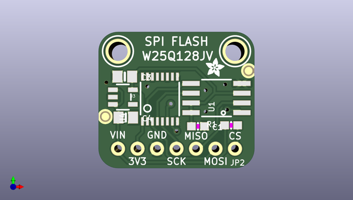
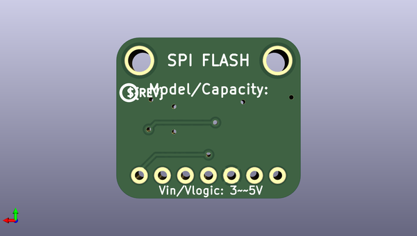

# adafruit_spi_flash_breakout_pcb
 
## summary 
* id: adafruit_adafruit_spi_flash_breakout_pcb_spi_flash_rev_e
* user: adafruit
* name: adafruit_spi_flash_breakout_pcb
* board: spi_flash_rev_e
* repo: https://github.com/adafruit/Adafruit-SPI-Flash-Breakout-PCB

* src_file_repo_sch: 
* src_file_repo_sch_link: https://github.com/adafruit/Adafruit-SPI-Flash-Breakout-PCB/tree/main/
* full details link: https://github.com/oomlout/oomlout_oomp_project_bot_v_2/tree/main/projects/adafruit_adafruit_spi_flash_breakout_pcb_spi_flash_rev_e/current_version/working  

## schematic  
  
[schematic (pdf)](working_schematic.pdf) 

## pcb  
 
  
  
  
[board (pdf)](working.pdf)  

## working_bom
| Id | Designator | Footprint | Quantity | Designation | Supplier and ref |  | None | 
| --- | --- | --- | --- | --- | --- | --- | --- | 
| 1 | C3,C4 | 0805-NO | 2 | 10uF |  |  | [''] | 
| 2 | C1 | 0603-NO | 1 | 0.1uF |  |  | [''] | 
| 3 | R1 | 0603-NO | 1 | 10K |  |  | [''] | 
| 4 | U$13 | ADAFRUIT_2.5MM | 1 |  |  |  | [''] | 
| 5 | U1 | SOIC8_208MIL | 1 | Generic SPI Flash |  |  | [''] | 
| 6 | U4 | SOT23-5 | 1 | AP2127K-3.3 |  |  | [''] | 
| 7 | FID3,FID2 | FIDUCIAL_1MM | 2 | FIDUCIAL_1MM |  |  | [''] | 
| 8 | JP2 | 1X07_ROUND_70 | 1 |  |  |  | [''] | 
| 9 | U$16,U$17 | MOUNTINGHOLE_2.5_PLATED | 2 | MOUNTINGHOLE2.5 |  |  | [''] | 
| 10 | U3 | TSSOP16 | 1 | 74HC4050D |  |  | [''] | 
| 11 | U$21 | PCBFEAT-REV-040 | 1 |  |  |  | [''] | 

## bom_schematic
| Ref | Qnty | Value | Cmp name | Footprint | Description | Vendor | DNP | 
| --- | --- | --- | --- | --- | --- | --- | --- | 
| C1 | 1 | 0.1uF | CAP_CERAMIC0603_NO | working:0603-NO |  |  |  | 
| C3, C4 | 2 | 10uF | CAP_CERAMIC0805-NOOUTLINE | working:0805-NO |  |  |  | 
| FID2, FID3 | 2 | FIDUCIAL_1MM | FIDUCIAL_1MM | working:FIDUCIAL_1MM |  |  |  | 
| JP2 | 1 | HEADER-1X770MIL | HEADER-1X770MIL | working:1X07_ROUND_70 |  |  |  | 
| R1 | 1 | 10K | RESISTOR_0603_NOOUT | working:0603-NO |  |  |  | 
| U1 | 1 | Generic SPI Flash | SPIFLASH_8PIN208MIL | working:SOIC8_208MIL |  |  |  | 
| U3 | 1 | 74HC4050D | 74HC4050DTSSOP | working:TSSOP16 |  |  |  | 
| U4 | 1 | AP2127K-3.3 | VREG_SOT23-5 | working:SOT23-5 |  |  |  | 
| U$16, U$17 | 2 | MOUNTINGHOLE2.5 | MOUNTINGHOLE2.5 | working:MOUNTINGHOLE_2.5_PLATED |  |  |  | 

## mounting_holes
| x | y | package | value | ref | size | 
| --- | --- | --- | --- | --- | --- | 
| 0.0 | 0.0 | MOUNTINGHOLE_2.5_PLATED | MOUNTINGHOLE2.5 | U$16 | m3 | 
| 15.24 | 0.0 | MOUNTINGHOLE_2.5_PLATED | MOUNTINGHOLE2.5 | U$17 | m3 | 

