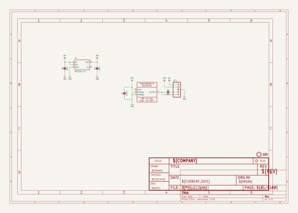
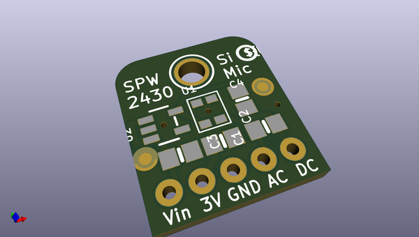
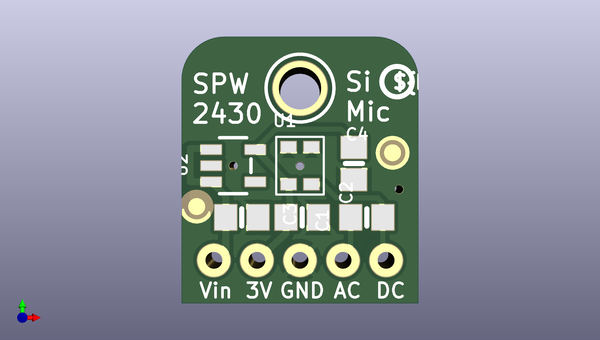
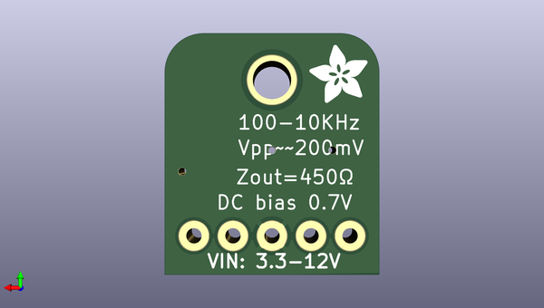

# adafruit_spw2430_pcb
 
## summary 
* id: adafruit_adafruit_spw2430_pcb_spw2430_silicon_mic_rev_b
* user: adafruit
* name: adafruit_spw2430_pcb
* board: spw2430_silicon_mic_rev_b
* repo: https://github.com/adafruit/Adafruit-SPW2430-PCB

* src_file_repo_sch: 
* src_file_repo_sch_link: https://github.com/adafruit/Adafruit-SPW2430-PCB/tree/master/
* full details link: https://github.com/oomlout/oomlout_oomp_project_bot_v_2/tree/main/projects/adafruit_adafruit_spw2430_pcb_spw2430_silicon_mic_rev_b/current_version/working  

## schematic  
  
[schematic (pdf)](working_schematic.pdf) 

## pcb  
 
  
  
  
[board (pdf)](working.pdf)  

## working_bom
| Id | Designator | Footprint | Quantity | Designation | Supplier and ref |  | None | 
| --- | --- | --- | --- | --- | --- | --- | --- | 
| 1 | C2 | 0805-NO | 1 | 0.1uF |  |  | [''] | 
| 2 | JP1 | 1X05_ROUND_76 | 1 |  |  |  | [''] | 
| 3 | U1 | SPW2430HR5H-B | 1 | SPW2430HR5H-B |  |  | [''] | 
| 4 | U2 | SOT23-5 | 1 | MIC5225-3.3 |  |  | [''] | 
| 5 | C3,C1,C4 | 0805-NO | 3 | 10uF |  |  | [''] | 
| 6 | U$12 | MOUNTINGHOLE_2.5_PLATED | 1 | MOUNTINGHOLE2.5 |  |  | [''] | 
| 7 | U$13 | PCBFEAT-REV-040 | 1 |  |  |  | [''] | 
| 8 | FID1,FID2 | FIDUCIAL_1MM | 2 | FIDUCIAL" |  |  | [''] | 
| 9 | U$5 | ADAFRUIT_3.5MM | 1 |  |  |  | [''] | 

## bom_schematic
| Ref | Qnty | Value | Cmp name | Footprint | Description | Vendor | DNP | 
| --- | --- | --- | --- | --- | --- | --- | --- | 
| C1, C3, C4 | 3 | 10uF | CAP_CERAMIC0805-NOOUTLINE | working:0805-NO |  |  |  | 
| C2 | 1 | 0.1uF | CAP_CERAMIC0805-NOOUTLINE | working:0805-NO |  |  |  | 
| FID1, FID2 | 2 | FIDUCIAL"" | FIDUCIAL{dblquote}{dblquote} | working:FIDUCIAL_1MM |  |  |  | 
| JP1 | 1 | HEADER-1X576MIL | HEADER-1X576MIL | working:1X05_ROUND_76 |  |  |  | 
| U1 | 1 | SPW2430HR5H-B | SPW2430HR5H-B | working:SPW2430HR5H-B |  |  |  | 
| U2 | 1 | MIC5225-3.3 | VREG_SOT23-5 | working:SOT23-5 |  |  |  | 
| U$12 | 1 | MOUNTINGHOLE2.5 | MOUNTINGHOLE2.5 | working:MOUNTINGHOLE_2.5_PLATED |  |  |  | 

## mounting_holes
| x | y | package | value | ref | size | 
| --- | --- | --- | --- | --- | --- | 
| 0.0 | 0.0 | MOUNTINGHOLE_2.5_PLATED | MOUNTINGHOLE2.5 | U$12 | m3 | 

