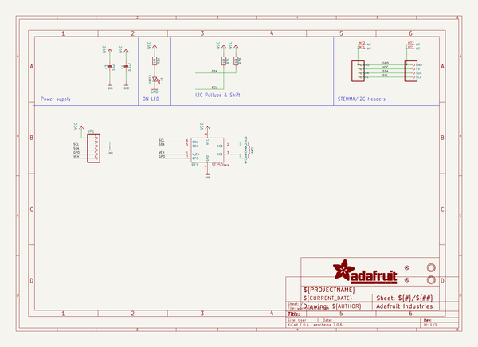
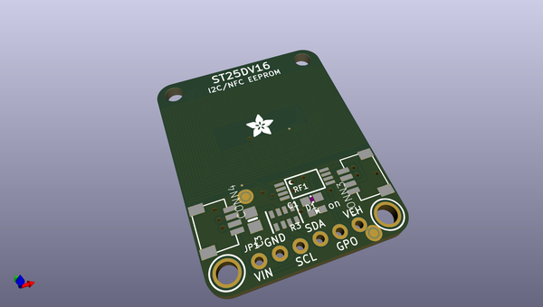
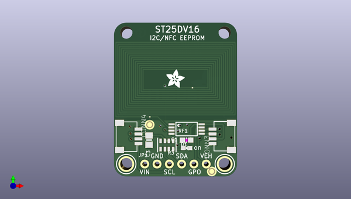
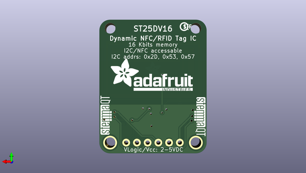

# adafruit_st25dv16_pcb
 
## summary 
* id: adafruit_adafruit_st25dv16_pcb_adafruit_st25dv16
* user: adafruit
* name: adafruit_st25dv16_pcb
* board: adafruit_st25dv16
* repo: https://github.com/adafruit/Adafruit-ST25DV16-PCB

* src_file_repo_sch: 
* src_file_repo_sch_link: https://github.com/adafruit/Adafruit-ST25DV16-PCB/tree/main/
* full details link: https://github.com/oomlout/oomlout_oomp_project_bot_v_2/tree/main/projects/adafruit_adafruit_st25dv16_pcb_adafruit_st25dv16/current_version/working  

## schematic  
  
[schematic (pdf)](working_schematic.pdf) 

## pcb  
 
  
  
  
[board (pdf)](working.pdf)  

## working_bom
| Id | Designator | Footprint | Quantity | Designation | Supplier and ref |  | None | 
| --- | --- | --- | --- | --- | --- | --- | --- | 
| 1 | @HOLE0,@HOLE1 |  | 2 |  |  |  | [''] | 
| 2 | CONN3,CONN4 | JST_SH4 | 2 | STEMMA_I2C_QT |  |  | [''] | 
| 3 | U$19,U$21 | MOUNTINGHOLE_2.5_PLATED | 2 | MOUNTINGHOLE2.5 |  |  | [''] | 
| 4 | FID3,FID4 | FIDUCIAL_1MM | 2 | FIDUCIAL_1MM |  |  | [''] | 
| 5 | D1 | CHIPLED_0603_NOOUTLINE | 1 | GREEN |  |  | [''] | 
| 6 | C1 | 0603-NO | 1 | 0.1uF |  |  | [''] | 
| 7 | R3 | RESPACK_4X0603 | 1 | 10K |  |  | [''] | 
| 8 | C3 | 0805-NO | 1 | 10uF |  |  | [''] | 
| 9 | ANT1 | NFCANT_25X15 | 1 | NFC_ANTENNA_25X15 |  |  | [''] | 
| 10 | JP1 | 1X06_ROUND_70 | 1 |  |  |  | [''] | 
| 11 | U$22 | ADAFRUIT_3.5MM | 1 |  |  |  | [''] | 
| 12 | RF1 | TSSOP8-4.4MM | 1 | ST25DVXX_TSSOP |  |  | [''] | 
| 13 | U$1 | ADAFRUIT_TEXT_20MM | 1 |  |  |  | [''] | 
| 14 | U$31,U$30 | STEMMAQT | 2 |  |  |  | [''] | 
| 15 | U$25 | PCBFEAT-REV-040 | 1 |  |  |  | [''] | 

## bom_schematic
| Ref | Qnty | Value | Cmp name | Footprint | Description | Vendor | DNP | 
| --- | --- | --- | --- | --- | --- | --- | --- | 
| ANT1 | 1 | NFC_ANTENNA_25X15 | NFC_ANTENNA_25X15 | working:NFCANT_25X15 |  |  |  | 
| C1 | 1 | 0.1uF | CAP_CERAMIC0603_NO | working:0603-NO |  |  |  | 
| C3 | 1 | 10uF | CAP_CERAMIC0805-NOOUTLINE | working:0805-NO |  |  |  | 
| CONN3, CONN4 | 2 | STEMMA_I2C_QT | STEMMA_I2C_QT | working:JST_SH4 |  |  |  | 
| D1 | 1 | GREEN | LED0603_NOOUTLINE | working:CHIPLED_0603_NOOUTLINE |  |  |  | 
| FID3, FID4 | 2 | FIDUCIAL_1MM | FIDUCIAL_1MM | working:FIDUCIAL_1MM |  |  |  | 
| JP1 | 1 | HEADER-1X670MIL | HEADER-1X670MIL | working:1X06_ROUND_70 |  |  |  | 
| R3 | 1 | 10K | RESISTOR_4PACK | working:RESPACK_4X0603 |  |  |  | 
| RF1 | 1 | ST25DVXX_TSSOP | ST25DVXX_TSSOP | working:TSSOP8-4.4MM |  |  |  | 
| U$19, U$21 | 2 | MOUNTINGHOLE2.5 | MOUNTINGHOLE2.5 | working:MOUNTINGHOLE_2.5_PLATED |  |  |  | 

## mounting_holes
| x | y | package | value | ref | size | 
| --- | --- | --- | --- | --- | --- | 
| 0.0 | 0.0 | MOUNTINGHOLE_2.5_PLATED | MOUNTINGHOLE2.5 | U$19 | m3 | 
| 20.32 | 0.0 | MOUNTINGHOLE_2.5_PLATED | MOUNTINGHOLE2.5 | U$21 | m3 | 

