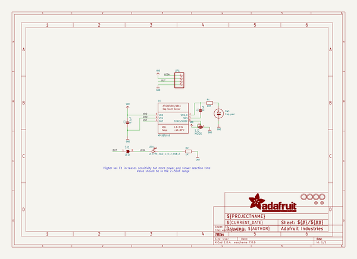
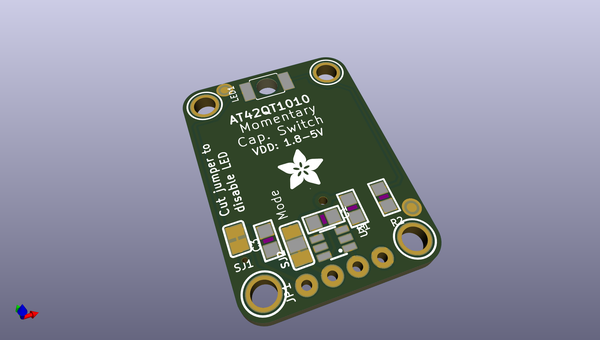
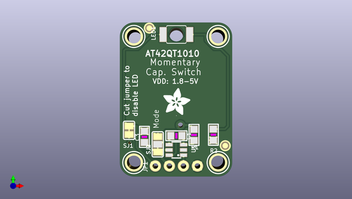
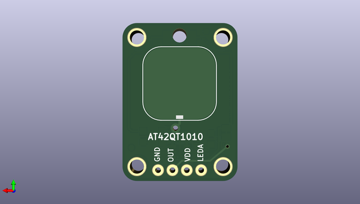

# adafruit_standalone_capacitive_sensor_pcb
 
## summary 
* id: adafruit_adafruit_standalone_capacitive_sensor_pcb_adafruit_at42qt1070_breakout
* user: adafruit
* name: adafruit_standalone_capacitive_sensor_pcb
* board: adafruit_at42qt1070_breakout
* repo: https://github.com/adafruit/Adafruit-Standalone-Capacitive-Sensor-PCB

* src_file_repo_sch: 
* src_file_repo_sch_link: https://github.com/adafruit/Adafruit-Standalone-Capacitive-Sensor-PCB/tree/master/
* full details link: https://github.com/oomlout/oomlout_oomp_project_bot_v_2/tree/main/projects/adafruit_adafruit_standalone_capacitive_sensor_pcb_adafruit_at42qt1070_breakout/current_version/working  

## schematic  
  
[schematic (pdf)](working_schematic.pdf)  

## pcb  
 
  
  
  
[board (pdf)](working.pdf)  

## bom_schematic
| Ref | Qnty | Value | Cmp name | Footprint | Description | Vendor | DNP | 
| --- | --- | --- | --- | --- | --- | --- | --- | 
| C1 | 1 | 22nF | CAP_CERAMIC_0805 | working:_0805 |  |  |  | 
| C3 | 1 | 0.1µF | CAP_CERAMIC_0805 | working:_0805 |  |  |  | 
| FID1, FID2 | 2 | FIDUCIAL"" | FIDUCIAL{dblquote}{dblquote} | working:FIDUCIAL_1MM |  |  |  | 
| JP1 | 1 | HEADER-1X476MIL | HEADER-1X476MIL | working:1X04_ROUND_76 |  |  |  | 
| LED1 | 1 | LS T77K-J1L2-1-0-2-R18-Z | LEDPLCC2_REV | working:PLCC2_REVMOUNT |  |  |  | 
| R1 | 1 | 10K | RESISTOR_0805 | working:_0805 |  |  |  | 
| R2 | 1 | 1K | RESISTOR_0805 | working:_0805 |  |  |  | 
| SJ1 | 1 | LED | SOLDERJUMPERCLOSED | working:SOLDERJUMPER_CLOSEDWIRE |  |  |  | 
| SJ2 | 1 | MODE | SOLDERJUMPER_2WAY | working:SOLDERJUMPER_2WAY_OPEN_NOPASTE |  |  |  | 
| SW1 | 1 | Cap pad | SWITCH_CAPTOUCHATMELAT42QT | working:CAPTOUCH_SIMPLE_12.5MM |  |  |  | 
| U1 | 1 | AT42QT1010 | AT42QT1010/1 | working:SOT23-6 |  |  |  | 
| U$6, U$9, U$10, U$11 | 4 | MOUNTINGHOLE2.5 | MOUNTINGHOLE2.5 | working:MOUNTINGHOLE_2.5_PLATED |  |  |  | 

