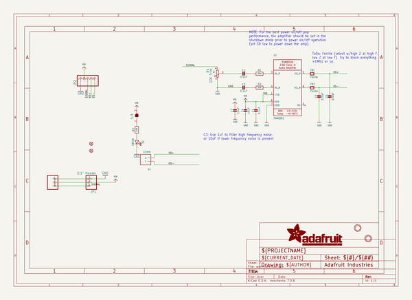
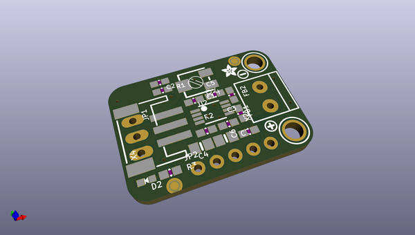
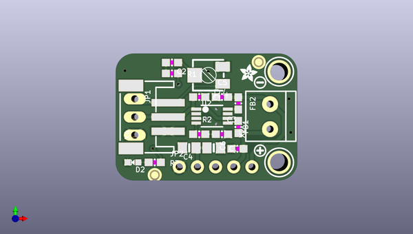
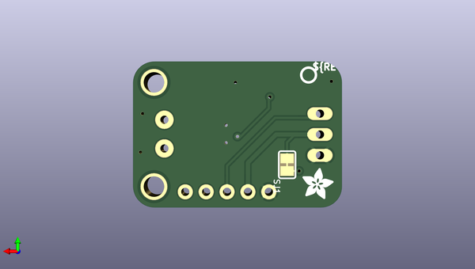

# adafruit_stemma_audio_amp_pcb
 
## summary 
* id: adafruit_adafruit_stemma_audio_amp_pcb_adafruit_stemma_audio_amp
* user: adafruit
* name: adafruit_stemma_audio_amp_pcb
* board: adafruit_stemma_audio_amp
* repo: https://github.com/adafruit/Adafruit-STEMMA-Audio-Amp-PCB

* src_file_repo_sch: 
* src_file_repo_sch_link: https://github.com/adafruit/Adafruit-STEMMA-Audio-Amp-PCB/tree/main/
* full details link: https://github.com/oomlout/oomlout_oomp_project_bot_v_2/tree/main/projects/adafruit_adafruit_stemma_audio_amp_pcb_adafruit_stemma_audio_amp/current_version/working  

## schematic  
  
[schematic (pdf)](working_schematic.pdf)  

## pcb  
 
  
  
  
[board (pdf)](working.pdf)  

## working_bom
| Id | Designator | Footprint | Quantity | Designation | Supplier and ref |  | None | 
| --- | --- | --- | --- | --- | --- | --- | --- | 
| 1 | R4 | RTRIM3314J | 1 | 10K Trim |  |  | [''] | 
| 2 | FID2,FID3 | FIDUCIAL_1MM | 2 | FIDUCIAL_1MM |  |  | [''] | 
| 3 | R3 | 0603-NO | 1 | 10K |  |  | [''] | 
| 4 | PLABEL1 | PLABEL1 | 1 |  |  |  | [''] | 
| 5 | FB1,FB2 | 0603-NO | 2 | Ferrite |  |  | [''] | 
| 6 | U$19 | ADAFRUIT_2.5MM | 1 |  |  |  | [''] | 
| 7 | C6,C5 | 0603-NO | 2 | 220pF |  |  | [''] | 
| 8 | X4 | JSTPH3 | 1 | JST PH 3 |  |  | [''] | 
| 9 | U$8,U$1 | MOUNTINGHOLE_2.5_PLATED | 2 | MOUNTINGHOLE2.5 |  |  | [''] | 
| 10 | C1,C2,C3 | 0603-NO | 3 | 0.1uF |  |  | [''] | 
| 11 | X2 | TERMBLOCK_1X2-3.5MM | 1 | 3.5mm |  |  | [''] | 
| 12 | C4,C7 | 0805-NO | 2 | 10uF |  |  | [''] | 
| 13 | R1,R2 | 0603-NO | 2 | 30K |  |  | [''] | 
| 14 | U$9 | SYMBOL_MINUS | 1 |  |  |  | [''] | 
| 15 | PLABEL2 | PLABEL2 | 1 |  |  |  | [''] | 
| 16 | JP1 | 1X03_OVAL | 1 | 0.1 Header" |  |  | [''] | 
| 17 | U2 | MSOP8_0.65MM | 1 | PAM8302 |  |  | [''] | 
| 18 | U$3 | SYMBOL_PLUS | 1 |  |  |  | [''] | 
| 19 | PLABEL0 | PLABEL0 | 1 |  |  |  | [''] | 
| 20 | D2 | CHIPLED_0603_NOOUTLINE | 1 | GREEN |  |  | [''] | 
| 21 | JP2 | 1X05_ROUND_70 | 1 |  |  |  | [''] | 
| 22 | PLABEL6 | PLABEL6 | 1 |  |  |  | [''] | 
| 23 | PLABEL7 | PLABEL7 | 1 |  |  |  | [''] | 
| 24 | PLABEL10 | PLABEL10 | 1 |  |  |  | [''] | 
| 25 | PLABEL8 | PLABEL8 | 1 |  |  |  | [''] | 
| 26 | PLABEL12 | PLABEL12 | 1 |  |  |  | [''] | 
| 27 | PLABEL3 | PLABEL3 | 1 |  |  |  | [''] | 
| 28 | U$5 | PCBFEAT-REV-040 | 1 |  |  |  | [''] | 
| 29 | PLABEL11 | PLABEL11 | 1 |  |  |  | [''] | 
| 30 | SJ1 | SOLDERJUMPER_CLOSEDWIRE | 1 |  |  |  | [''] | 
| 31 | U$12 | ADAFRUIT_3.5MM | 1 |  |  |  | [''] | 
| 32 | PLABEL9 | PLABEL9 | 1 |  |  |  | [''] | 
| 33 | PLABEL5 | PLABEL5 | 1 |  |  |  | [''] | 
| 34 | PLABEL4 | PLABEL4 | 1 |  |  |  | [''] | 

## bom_schematic
| Ref | Qnty | Value | Cmp name | Footprint | Description | Vendor | DNP | 
| --- | --- | --- | --- | --- | --- | --- | --- | 
| C1, C2, C3 | 3 | 0.1uF | CAP_CERAMIC0603_NO | working:0603-NO |  |  |  | 
| C4, C7 | 2 | 10uF | CAP_CERAMIC0805-NOOUTLINE | working:0805-NO |  |  |  | 
| C5, C6 | 2 | 220pF | CAP_CERAMIC0603_NO | working:0603-NO |  |  |  | 
| D2 | 1 | GREEN | LED0603_NOOUTLINE | working:CHIPLED_0603_NOOUTLINE |  |  |  | 
| FB1, FB2 | 2 | Ferrite | FERRITE-0603NO | working:0603-NO |  |  |  | 
| FID2, FID3 | 2 | FIDUCIAL_1MM | FIDUCIAL_1MM | working:FIDUCIAL_1MM |  |  |  | 
| JP1 | 1 | 0.1" Header | HEADER-1X3 | working:1X03_OVAL |  |  |  | 
| JP2 | 1 | HEADER-1X570MIL | HEADER-1X570MIL | working:1X05_ROUND_70 |  |  |  | 
| R1, R2 | 2 | 30K | RESISTOR_0603_NOOUT | working:0603-NO |  |  |  | 
| R3 | 1 | 10K | RESISTOR_0603_NOOUT | working:0603-NO |  |  |  | 
| R4 | 1 | 10K Trim | R-TRIMM3314J | working:RTRIM3314J |  |  |  | 
| SJ1 | 1 | SOLDERJUMPER_CLOSED | SOLDERJUMPER_CLOSED | working:SOLDERJUMPER_CLOSEDWIRE |  |  |  | 
| U2 | 1 | PAM8302 | AUDIOAMP_PAM8302A | working:MSOP8_0.65MM |  |  |  | 
| U$1, U$8 | 2 | MOUNTINGHOLE2.5 | MOUNTINGHOLE2.5 | working:MOUNTINGHOLE_2.5_PLATED |  |  |  | 
| X2 | 1 | 3.5mm | TERMBLOCK_1X2_3.5MM | working:TERMBLOCK_1X2-3.5MM |  |  |  | 
| X4 | 1 | JST PH 3 | CON_JST_PH_3PIN | working:JSTPH3 |  |  |  | 

## mounting_holes
| x | y | package | value | ref | size | 
| --- | --- | --- | --- | --- | --- | 
| 0.0 | 0.0 | MOUNTINGHOLE_2.5_PLATED | MOUNTINGHOLE2.5 | U$1 | m3 | 
| 0.0 | 12.700000000000003 | MOUNTINGHOLE_2.5_PLATED | MOUNTINGHOLE2.5 | U$8 | m3 | 

