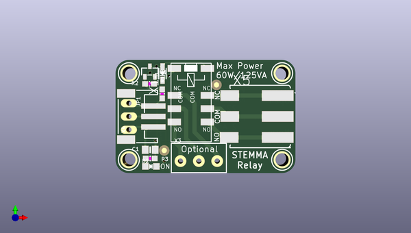

# adafruit_stemma_non_latching_mini_relay_pcb
 
## summary 
* id: adafruit_adafruit_stemma_non_latching_mini_relay_pcb_adafruit_non_latching_relay_breakout
* user: adafruit
* name: adafruit_stemma_non_latching_mini_relay_pcb
* board: adafruit_non_latching_relay_breakout
* repo: https://github.com/adafruit/Adafruit-STEMMA-Non-Latching-Mini-Relay-PCB

* src_file_repo_sch: 
* src_file_repo_sch_link: https://github.com/adafruit/Adafruit-STEMMA-Non-Latching-Mini-Relay-PCB/tree/master/
* full details link: https://github.com/oomlout/oomlout_oomp_project_bot_v_2/tree/main/projects/adafruit_adafruit_stemma_non_latching_mini_relay_pcb_adafruit_non_latching_relay_breakout/current_version/working  

## schematic  
  
[schematic (pdf)](working_schematic.pdf) 

## pcb  
 
  
  
  
[board (pdf)](working.pdf)  

## working_bom
| Id | Designator | Footprint | Quantity | Designation | Supplier and ref |  | None | 
| --- | --- | --- | --- | --- | --- | --- | --- | 
| 1 | U$8,U$10,U$9,U$1 | MOUNTINGHOLE_2.5_PLATED | 4 | MOUNTINGHOLE2.5 |  |  | [''] | 
| 2 | X4 | JSTPH3 | 1 | JST PH 3 |  |  | [''] | 
| 3 | R2 | 0603-NO | 1 | 10K |  |  | [''] | 
| 4 | X1 | RELAY_EE2_NOLATCH | 1 | RELAY_NONLATCHING-EE2NUH |  |  | [''] | 
| 5 | R1,R3 | 0603-NO | 2 | 1K |  |  | [''] | 
| 6 | X5 | P-2060-403_998-404 | 1 | 2060-403/998-404 |  |  | [''] | 
| 7 | D1 | SOD-323 | 1 | 1N4148 |  |  | [''] | 
| 8 | FID2,FID3 | FIDUCIAL_1MM | 2 | FIDUCIAL_1MM |  |  | [''] | 
| 9 | D2 | CHIPLED_0805_NOOUTLINE | 1 | RED |  |  | [''] | 
| 10 | C1 | 0805-NO | 1 | 10uF |  |  | [''] | 
| 11 | X3 | TERMBLOCK_1X3-3.5MM | 1 | 3.5mm Terminal |  |  | [''] | 
| 12 | Q1 | SOT23-R | 1 | MMBT2222 |  |  | [''] | 
| 13 | JP1 | 1X03_OVAL | 1 | 0.1 Header" |  |  | [''] | 
| 14 | U$5 | PCBFEAT-REV-040 | 1 |  |  |  | [''] | 
| 15 | SJ1 | SOLDERJUMPER_CLOSEDWIRE | 1 |  |  |  | [''] | 

## bom_schematic
| Ref | Qnty | Value | Cmp name | Footprint | Description | Vendor | DNP | 
| --- | --- | --- | --- | --- | --- | --- | --- | 
| C1 | 1 | 10uF | CAP_CERAMIC0805-NOOUTLINE | working:0805-NO |  |  |  | 
| D1 | 1 | 1N4148 | DIODESOD-323 | working:SOD-323 |  |  |  | 
| D2 | 1 | RED | LED0805_NOOUTLINE | working:CHIPLED_0805_NOOUTLINE |  |  |  | 
| FID2, FID3 | 2 | FIDUCIAL_1MM | FIDUCIAL_1MM | working:FIDUCIAL_1MM |  |  |  | 
| JP1 | 1 | 0.1" Header | HEADER-1X3 | working:1X03_OVAL |  |  |  | 
| Q1 | 1 | MMBT2222 | TRANSISTOR_NPN | working:SOT23-R |  |  |  | 
| R1, R3 | 2 | 1K | RESISTOR_0603_NOOUT | working:0603-NO |  |  |  | 
| R2 | 1 | 10K | RESISTOR_0603_NOOUT | working:0603-NO |  |  |  | 
| SJ1 | 1 | SOLDERJUMPER_CLOSED | SOLDERJUMPER_CLOSED | working:SOLDERJUMPER_CLOSEDWIRE |  |  |  | 
| U$1, U$8, U$9, U$10 | 4 | MOUNTINGHOLE2.5 | MOUNTINGHOLE2.5 | working:MOUNTINGHOLE_2.5_PLATED |  |  |  | 
| X1 | 1 | RELAY_NONLATCHING-EE2NUH | RELAY_NONLATCHING-EE2NUH | working:RELAY_EE2_NOLATCH |  |  |  | 
| X3 | 1 | 3.5mm Terminal | TERMBLOCK_1X3 | working:TERMBLOCK_1X3-3.5MM |  |  |  | 
| X4 | 1 | JST PH 3 | CON_JST_PH_3PIN | working:JSTPH3 |  |  |  | 
| X5 | 1 | 2060-403/998-404 | 2060-403/998-404 | working:P-2060-403_998-404 |  |  |  | 

## mounting_holes
| x | y | package | value | ref | size | 
| --- | --- | --- | --- | --- | --- | 
| 29.21 | 0.0 | MOUNTINGHOLE_2.5_PLATED | MOUNTINGHOLE2.5 | U$1 | m3 | 
| 29.21 | 16.51 | MOUNTINGHOLE_2.5_PLATED | MOUNTINGHOLE2.5 | U$8 | m3 | 
| 0.0 | 16.51 | MOUNTINGHOLE_2.5_PLATED | MOUNTINGHOLE2.5 | U$9 | m3 | 
| 0.0 | 0.0 | MOUNTINGHOLE_2.5_PLATED | MOUNTINGHOLE2.5 | U$10 | m3 | 

