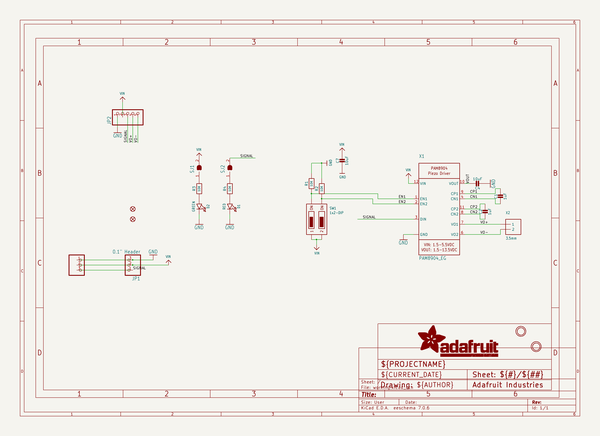

# adafruit_stemma_piezo_driver_amp_pcb
 
## summary 
* id: adafruit_adafruit_stemma_piezo_driver_amp_pcb_adafruit_stemma_piezo_driver_amp
* user: adafruit
* name: adafruit_stemma_piezo_driver_amp_pcb
* board: adafruit_stemma_piezo_driver_amp
* repo: https://github.com/adafruit/Adafruit-STEMMA-Piezo-Driver-Amp-PCB

* src_file_repo_sch: 
* src_file_repo_sch_link: https://github.com/adafruit/Adafruit-STEMMA-Piezo-Driver-Amp-PCB/tree/main/
* full details link: https://github.com/oomlout/oomlout_oomp_project_bot_v_2/tree/main/projects/adafruit_adafruit_stemma_piezo_driver_amp_pcb_adafruit_stemma_piezo_driver_amp/current_version/working  

## schematic  
  
[schematic (pdf)](working_schematic.pdf) 

## pcb  
 
  
  
  
[board (pdf)](working.pdf)  

## working_bom
| Id | Designator | Footprint | Quantity | Designation | Supplier and ref |  | None | 
| --- | --- | --- | --- | --- | --- | --- | --- | 
| 1 | R1,R2,R3,R4 | 0603-NO | 4 | 10K |  |  | [''] | 
| 2 | D2 | CHIPLED_0603_NOOUTLINE | 1 | GREEN |  |  | [''] | 
| 3 | C2,C1 | 0603-NO | 2 | 1uF |  |  | [''] | 
| 4 | JP2 | 1X05_ROUND_70 | 1 |  |  |  | [''] | 
| 5 | PLABEL14 | PLABEL14 | 1 |  |  |  | [''] | 
| 6 | U$1,U$8 | MOUNTINGHOLE_2.5_PLATED | 2 | MOUNTINGHOLE2.5 |  |  | [''] | 
| 7 | C4,C7 | 0805-NO | 2 | 10uF |  |  | [''] | 
| 8 | X4 | JSTPH3 | 1 | JST PH 3 |  |  | [''] | 
| 9 | PLABEL17 | PLABEL17 | 1 |  |  |  | [''] | 
| 10 | FID3,FID2 | FIDUCIAL_1MM | 2 | FIDUCIAL_1MM |  |  | [''] | 
| 11 | D1 | CHIPLED_0603_NOOUTLINE | 1 | RED |  |  | [''] | 
| 12 | X1 | QFN12-2MM | 1 | PAM8904_EG |  |  | [''] | 
| 13 | JP1 | 1X03_OVAL | 1 | 0.1 Header" |  |  | [''] | 
| 14 | PLABEL0 | PLABEL0 | 1 |  |  |  | [''] | 
| 15 | PLABEL15 | PLABEL15 | 1 |  |  |  | [''] | 
| 16 | SW1 | DIPSWITCH_2PIN | 1 | 1x2-DIP |  |  | [''] | 
| 17 | PLABEL16 | PLABEL16 | 1 |  |  |  | [''] | 
| 18 | X2 | TERMBLOCK_1X2-3.5MM | 1 | 3.5mm |  |  | [''] | 
| 19 | U$19 | ADAFRUIT_2.5MM | 1 |  |  |  | [''] | 
| 20 | PLABEL13 | PLABEL13 | 1 |  |  |  | [''] | 
| 21 | PLABEL11 | PLABEL11 | 1 |  |  |  | [''] | 
| 22 | SJ1,SJ2 | SOLDERJUMPER_CLOSEDWIRE | 2 |  |  |  | [''] | 
| 23 | PLABEL8 | PLABEL8 | 1 |  |  |  | [''] | 
| 24 | PLABEL19 | PLABEL19 | 1 |  |  |  | [''] | 
| 25 | PLABEL20 | PLABEL20 | 1 |  |  |  | [''] | 
| 26 | PLABEL10 | PLABEL10 | 1 |  |  |  | [''] | 
| 27 | PLABEL7 | PLABEL7 | 1 |  |  |  | [''] | 
| 28 | PLABEL12 | PLABEL12 | 1 |  |  |  | [''] | 
| 29 | PLABEL18 | PLABEL18 | 1 |  |  |  | [''] | 
| 30 | U$5 | PCBFEAT-REV-040 | 1 |  |  |  | [''] | 

## bom_schematic
| Ref | Qnty | Value | Cmp name | Footprint | Description | Vendor | DNP | 
| --- | --- | --- | --- | --- | --- | --- | --- | 
| C1, C2 | 2 | 1uF | CAP_CERAMIC0603_NO | working:0603-NO |  |  |  | 
| C4, C7 | 2 | 10uF | CAP_CERAMIC0805-NOOUTLINE | working:0805-NO |  |  |  | 
| D1 | 1 | RED | LED0603_NOOUTLINE | working:CHIPLED_0603_NOOUTLINE |  |  |  | 
| D2 | 1 | GREEN | LED0603_NOOUTLINE | working:CHIPLED_0603_NOOUTLINE |  |  |  | 
| FID2, FID3 | 2 | FIDUCIAL_1MM | FIDUCIAL_1MM | working:FIDUCIAL_1MM |  |  |  | 
| JP1 | 1 | 0.1" Header | HEADER-1X3 | working:1X03_OVAL |  |  |  | 
| JP2 | 1 | HEADER-1X570MIL | HEADER-1X570MIL | working:1X05_ROUND_70 |  |  |  | 
| R1, R2, R3, R4 | 4 | 10K | RESISTOR_0603_NOOUT | working:0603-NO |  |  |  | 
| SJ1, SJ2 | 2 | SOLDERJUMPER_CLOSED | SOLDERJUMPER_CLOSED | working:SOLDERJUMPER_CLOSEDWIRE |  |  |  | 
| SW1 | 1 | 1x2-DIP | DIPSWITCH_2PIN | working:DIPSWITCH_2PIN |  |  |  | 
| U$1, U$8 | 2 | MOUNTINGHOLE2.5 | MOUNTINGHOLE2.5 | working:MOUNTINGHOLE_2.5_PLATED |  |  |  | 
| X1 | 1 | PAM8904_EG | PAM8904_EG | working:QFN12-2MM |  |  |  | 
| X2 | 1 | 3.5mm | TERMBLOCK_1X2_3.5MM | working:TERMBLOCK_1X2-3.5MM |  |  |  | 
| X4 | 1 | JST PH 3 | CON_JST_PH_3PIN | working:JSTPH3 |  |  |  | 

## mounting_holes
| x | y | package | value | ref | size | 
| --- | --- | --- | --- | --- | --- | 
| 0.0 | 0.0 | MOUNTINGHOLE_2.5_PLATED | MOUNTINGHOLE2.5 | U$1 | m3 | 
| 0.0 | 12.7 | MOUNTINGHOLE_2.5_PLATED | MOUNTINGHOLE2.5 | U$8 | m3 | 

