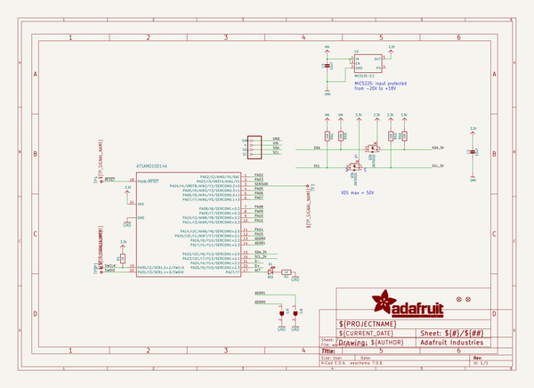
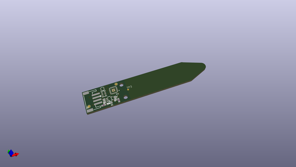
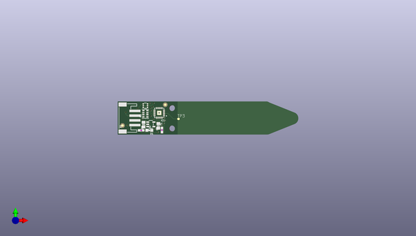
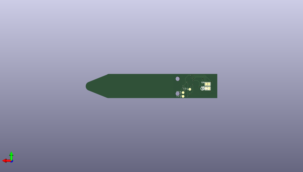

# adafruit_stemma_soil_sensor_pcb
 
## summary 
* id: adafruit_adafruit_stemma_soil_sensor_pcb_adafruit_stemma_soil_sensor
* user: adafruit
* name: adafruit_stemma_soil_sensor_pcb
* board: adafruit_stemma_soil_sensor
* repo: https://github.com/adafruit/Adafruit-STEMMA-Soil-Sensor-PCB

* src_file_repo_sch: 
* src_file_repo_sch_link: https://github.com/adafruit/Adafruit-STEMMA-Soil-Sensor-PCB/tree/master/
* full details link: https://github.com/oomlout/oomlout_oomp_project_bot_v_2/tree/main/projects/adafruit_adafruit_stemma_soil_sensor_pcb_adafruit_stemma_soil_sensor/current_version/working  

## schematic  
  
[schematic (pdf)](working_schematic.pdf)  

## pcb  
 
  
  
  
[board (pdf)](working.pdf)  

## working_bom
| Id | Designator | Footprint | Quantity | Designation | Supplier and ref |  | None | 
| --- | --- | --- | --- | --- | --- | --- | --- | 
| 1 | U2 | SOT23-5 | 1 | MIC5225-3.3 |  |  | [''] | 
| 2 | TP3 | TP10R | 1 | TPTP10R |  |  | [''] | 
| 3 | R1,R2 | 0603-NO | 2 | 1K |  |  | [''] | 
| 4 | @HOLE1,@HOLE0 |  | 2 |  |  |  | [''] | 
| 5 | C5,C3 | 0805-NO | 2 | 10uF |  |  | [''] | 
| 6 | D1 | CHIPLED_0805_NOOUTLINE | 1 | RED |  |  | [''] | 
| 7 | R6 | RESPACK_4X0603 | 1 | 10K |  |  | [''] | 
| 8 | Q3 | SOT363 | 1 | 2N7002D |  |  | [''] | 
| 9 | U$5 | STEMMA_SOIL_TOP | 1 |  |  |  | [''] | 
| 10 | FID1,FID2 | FIDUCIAL_1MM | 2 | FIDUCIAL_1MM |  |  | [''] | 
| 11 | X1 | JSTPH4 | 1 | STEMMA_I2C_RASMT |  |  | [''] | 
| 12 | IC1 | QFN24_4MM | 1 | ATSAMD10D14A |  |  | [''] | 
| 13 | SJ8,SJ9 | SOLDERJUMPER_ARROW_NOPASTE | 2 |  |  |  | [''] | 
| 14 | TP1,TP4,TP2 | TP15R | 3 | TPTP15R |  |  | [''] | 
| 15 | U$4 | STEMMA_SOIL_BOT | 1 |  |  |  | [''] | 
| 16 | U$12 | PCBFEAT-REV-040 | 1 |  |  |  | [''] | 

## bom_schematic
| Ref | Qnty | Value | Cmp name | Footprint | Description | Vendor | DNP | 
| --- | --- | --- | --- | --- | --- | --- | --- | 
| C3, C5 | 2 | 10uF | CAP_CERAMIC0805-NOOUTLINE | working:0805-NO |  |  |  | 
| D1 | 1 | RED | LED0805_NOOUTLINE | working:CHIPLED_0805_NOOUTLINE |  |  |  | 
| FID1, FID2 | 2 | FIDUCIAL_1MM | FIDUCIAL_1MM | working:FIDUCIAL_1MM |  |  |  | 
| IC1 | 1 | ATSAMD10D14A | ATSAMD10D14A | working:QFN24_4MM |  |  |  | 
| Q3 | 1 | 2N7002D | MOSFET-N_DUAL | working:SOT363 |  |  |  | 
| R1, R2 | 2 | 1K | RESISTOR_0603_NOOUT | working:0603-NO |  |  |  | 
| R6 | 1 | 10K | RESISTOR_4PACK | working:RESPACK_4X0603 |  |  |  | 
| SJ8, SJ9 | 2 | SOLDERJUMPER | SOLDERJUMPER | working:SOLDERJUMPER_ARROW_NOPASTE |  |  |  | 
| TP1, TP2, TP4 | 3 | TPTP15R | TPTP15R | working:TP15R |  |  |  | 
| TP3 | 1 | TPTP10R | TPTP10R | working:TP10R |  |  |  | 
| U2 | 1 | MIC5225-3.3 | VREG_SOT23-5 | working:SOT23-5 |  |  |  | 
| X1 | 1 | STEMMA_I2C_RASMT | STEMMA_I2C_RASMT | working:JSTPH4 |  |  |  | 

