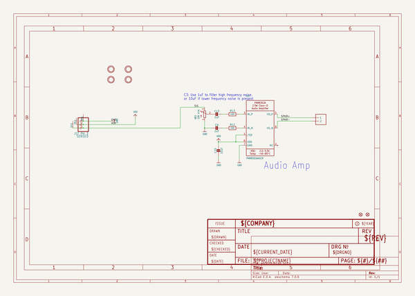
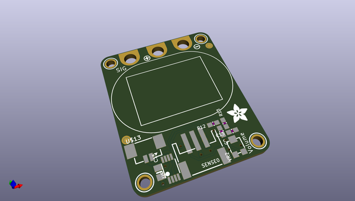
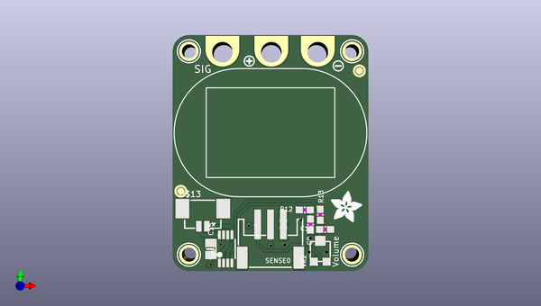
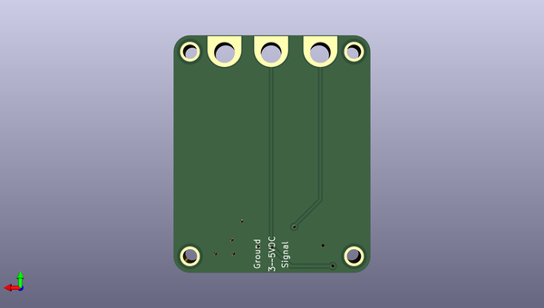

# adafruit_stemma_speaker_pcb
 
## summary 
* id: adafruit_adafruit_stemma_speaker_pcb_adafruit_stemma_speaker
* user: adafruit
* name: adafruit_stemma_speaker_pcb
* board: adafruit_stemma_speaker
* repo: https://github.com/adafruit/Adafruit-STEMMA-Speaker-PCB

* src_file_repo_sch: 
* src_file_repo_sch_link: https://github.com/adafruit/Adafruit-STEMMA-Speaker-PCB/tree/master/
* full details link: https://github.com/oomlout/oomlout_oomp_project_bot_v_2/tree/main/projects/adafruit_adafruit_stemma_speaker_pcb_adafruit_stemma_speaker/current_version/working  

## schematic  
  
[schematic (pdf)](working_schematic.pdf) 

## pcb  
 
  
  
  
[board (pdf)](working.pdf)  

## working_bom
| Id | Designator | Footprint | Quantity | Designation | Supplier and ref |  | None | 
| --- | --- | --- | --- | --- | --- | --- | --- | 
| 1 | U$3 | ADAFRUIT_5MM | 1 |  |  |  | [''] | 
| 2 | R13,R12 | 0603-NO | 2 | 100 |  |  | [''] | 
| 3 | SENSE0 | JSTPH3 | 1 | JST PH 3 |  |  | [''] | 
| 4 | TP2,TP3,TP1 | PCB_ALLI | 3 | SEWTAPPCB_ALLIGATOR |  |  | [''] | 
| 5 | U$9,U$11,U$10,U$12 | MOUNTINGHOLE_2.0_PLATED | 4 | MOUNTINGHOLE2.0 |  |  | [''] | 
| 6 | U$5 | SYMBOL_MINUS | 1 |  |  |  | [''] | 
| 7 | FID2,FID1 | FIDUCIAL_1MM | 2 | FIDUCIAL_1MM |  |  | [''] | 
| 8 | U$13 | 53398-0271 | 1 | CON_MOLEX_2P |  |  | [''] | 
| 9 | C9,C13 | 0603-NO | 2 | 1uF |  |  | [''] | 
| 10 | VR2 | TRIMPOT_BOURNS_3303W | 1 | 10K trim |  |  | [''] | 
| 11 | U$6 | SYMBOL_PLUS | 1 |  |  |  | [''] | 
| 12 | U5 | MSOP8_0.65MM | 1 | PAM8302AASCR |  |  | [''] | 
| 13 | U$1 | SPEAKER_OVAL8OHM | 1 |  |  |  | [''] | 
| 14 | C15 | 0805-NO | 1 | 10uF |  |  | [''] | 
| 15 | U$4 | STEMMA_SPEAKER | 1 |  |  |  | [''] | 

## bom_schematic
| Ref | Qnty | Value | Cmp name | Footprint | Description | Vendor | DNP | 
| --- | --- | --- | --- | --- | --- | --- | --- | 
| C9, C13 | 2 | 1uF | CAP_CERAMIC0603_NO | working:0603-NO |  |  |  | 
| C15 | 1 | 10uF | CAP_CERAMIC0805-NOOUTLINE | working:0805-NO |  |  |  | 
| FID1, FID2 | 2 | FIDUCIAL_1MM | FIDUCIAL_1MM | working:FIDUCIAL_1MM |  |  |  | 
| R12, R13 | 2 | 100 | RESISTOR_0603_NOOUT | working:0603-NO |  |  |  | 
| SENSE0 | 1 | JST PH 3 | CON_JST_PH_3PIN | working:JSTPH3 |  |  |  | 
| TP1, TP2, TP3 | 3 | SEWTAPPCB_ALLIGATOR | SEWTAPPCB_ALLIGATOR | working:PCB_ALLI |  |  |  | 
| U5 | 1 | PAM8302AASCR | AUDIOAMP_PAM8302A | working:MSOP8_0.65MM |  |  |  | 
| U$9, U$10, U$11, U$12 | 4 | MOUNTINGHOLE2.0 | MOUNTINGHOLE2.0 | working:MOUNTINGHOLE_2.0_PLATED |  |  |  | 
| U$13 | 1 | CON_MOLEX_2P | CON_MOLEX_2P | working:53398-0271 |  |  |  | 
| VR2 | 1 | 10K trim | TRIMPOT3303W/X | working:TRIMPOT_BOURNS_3303W |  |  |  | 

## mounting_holes
| x | y | package | value | ref | size | 
| --- | --- | --- | --- | --- | --- | 
| 25.4 | 0.0 | MOUNTINGHOLE_2.0_PLATED | MOUNTINGHOLE2.0 | U$9 | m3 | 
| 25.4 | 31.75 | MOUNTINGHOLE_2.0_PLATED | MOUNTINGHOLE2.0 | U$10 | m3 | 
| 0.0 | 31.75 | MOUNTINGHOLE_2.0_PLATED | MOUNTINGHOLE2.0 | U$11 | m3 | 
| 0.0 | 0.0 | MOUNTINGHOLE_2.0_PLATED | MOUNTINGHOLE2.0 | U$12 | m3 | 

