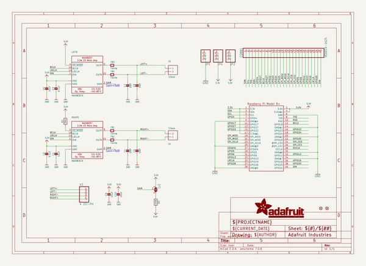
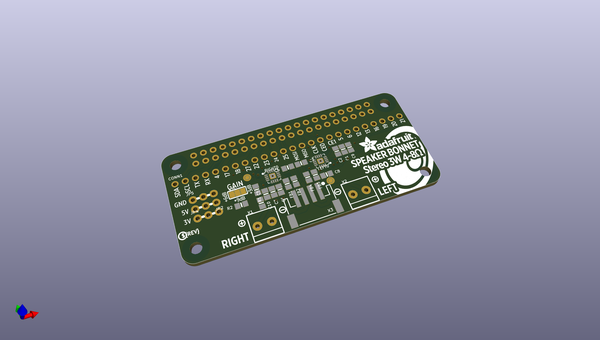
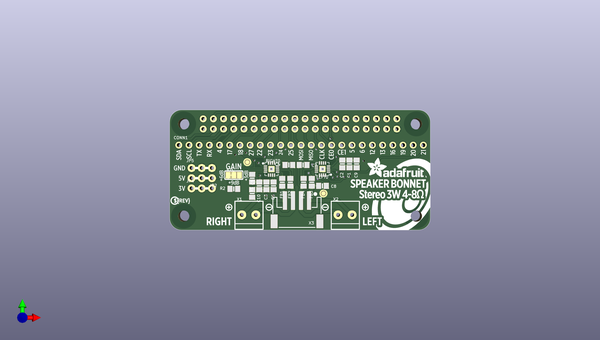
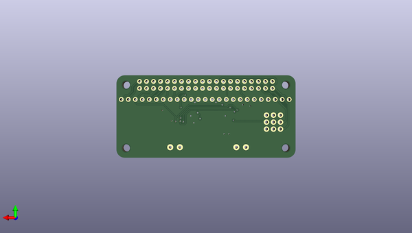

# adafruit_stereo_speaker_bonnet_pcb
 
## summary 
* id: adafruit_adafruit_stereo_speaker_bonnet_pcb_adafruit_speaker_bonnet
* user: adafruit
* name: adafruit_stereo_speaker_bonnet_pcb
* board: adafruit_speaker_bonnet
* repo: https://github.com/adafruit/Adafruit-Stereo-Speaker-Bonnet-PCB

* src_file_repo_sch: 
* src_file_repo_sch_link: https://github.com/adafruit/Adafruit-Stereo-Speaker-Bonnet-PCB/tree/master/
* full details link: https://github.com/oomlout/oomlout_oomp_project_bot_v_2/tree/main/projects/adafruit_adafruit_stereo_speaker_bonnet_pcb_adafruit_speaker_bonnet/current_version/working  

## schematic  
  
[schematic (pdf)](working_schematic.pdf)  

## pcb  
 
  
  
  
[board (pdf)](working.pdf)  

## working_bom
| Id | Designator | Footprint | Quantity | Designation | Supplier and ref |  | None | 
| --- | --- | --- | --- | --- | --- | --- | --- | 
| 1 | U$11 | PCBFEAT-REV-040 | 1 |  |  |  | [''] | 
| 2 | RIGHT0,LEFT0 | QFN16_3MM | 2 | MAX98357A |  |  | [''] | 
| 3 | FID2,FID1 | FIDUCIAL_1MM | 2 | FIDUCIAL" |  |  | [''] | 
| 4 | CONN1 | 1X25_ROUND_70MIL | 1 | HEADER-1X25 |  |  | [''] | 
| 5 | U$30 | BONNET_SPEAKER_REVB | 1 |  |  |  | [''] | 
| 6 | C4,C5,C7,C8 | 0805-NO | 4 | DNP |  |  | [''] | 
| 7 | R1 | 0805-NO | 1 | 390K |  |  | [''] | 
| 8 | FB2,FB1,FB4,FB3 | 0805-NO | 4 | Ferrite |  |  | [''] | 
| 9 | C1,C10,C9,C6 | 0805-NO | 4 | 10uF |  |  | [''] | 
| 10 | C2,C3 | 0805-NO | 2 | 0.1uF |  |  | [''] | 
| 11 | X1,X2 | TERMBLOCK_1X2-3.5MM | 2 | 3.5mm |  |  | [''] | 
| 12 | JP4,JP2,JP5 | 1X03_ROUND_76 | 3 |  |  |  | [''] | 
| 13 | SJ1 | SOLDERJUMPER_2WAY_OPEN_NOPASTE | 1 |  |  |  | [''] | 
| 14 | X3 | JSTPH4 | 1 | 4 JST-PH |  |  | [''] | 
| 15 | RPI1 | PI_BONNET_NODIM | 1 | RASPBERRYPI_BPLUS_BONNETNODIM |  |  | [''] | 
| 16 | R2 | 0805-NO | 1 | 100K |  |  | [''] | 

## bom_schematic
| Ref | Qnty | Value | Cmp name | Footprint | Description | Vendor | DNP | 
| --- | --- | --- | --- | --- | --- | --- | --- | 
| C1, C6, C9, C10 | 4 | 10uF | CAP_CERAMIC0805-NOOUTLINE | working:0805-NO |  |  |  | 
| C2, C3 | 2 | 0.1uF | CAP_CERAMIC0805-NOOUTLINE | working:0805-NO |  |  |  | 
| C4, C5, C7, C8 | 4 | DNP | CAP_CERAMIC0805-NOOUTLINE | working:0805-NO |  |  |  | 
| CONN1 | 1 | HEADER-1X25 | HEADER-1X25 | working:1X25_ROUND_70MIL |  |  |  | 
| FB1, FB2, FB3, FB4 | 4 | Ferrite | FERRITE-0805NO | working:0805-NO |  |  |  | 
| FID1, FID2 | 2 | FIDUCIAL"" | FIDUCIAL{dblquote}{dblquote} | working:FIDUCIAL_1MM |  |  |  | 
| JP2, JP4, JP5 | 3 | HEADER-1X376MIL | HEADER-1X376MIL | working:1X03_ROUND_76 |  |  |  | 
| LEFT0 | 1 | MAX98357A | AUDIOAMP_MAX98357 | working:QFN16_3MM |  |  |  | 
| R1 | 1 | 390K | RESISTOR0805_NOOUTLINE | working:0805-NO |  |  |  | 
| R2 | 1 | 100K | RESISTOR0805_NOOUTLINE | working:0805-NO |  |  |  | 
| RIGHT0 | 1 | MAX98357A | AUDIOAMP_MAX98357 | working:QFN16_3MM |  |  |  | 
| RPI1 | 1 | RASPBERRYPI_BPLUS_BONNETNODIM | RASPBERRYPI_BPLUS_BONNETNODIM | working:PI_BONNET_NODIM |  |  |  | 
| SJ1 | 1 | SOLDERJUMPER_2WAY | SOLDERJUMPER_2WAY | working:SOLDERJUMPER_2WAY_OPEN_NOPASTE |  |  |  | 
| X1, X2 | 2 | 3.5mm | TERMBLOCK_1X2 | working:TERMBLOCK_1X2-3.5MM |  |  |  | 
| X3 | 1 | 4 JST-PH | CON_JST_PH_4PIN | working:JSTPH4 |  |  |  | 

