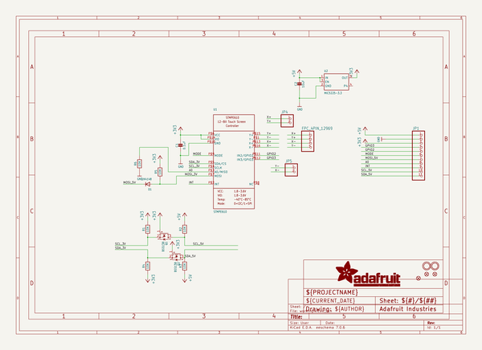
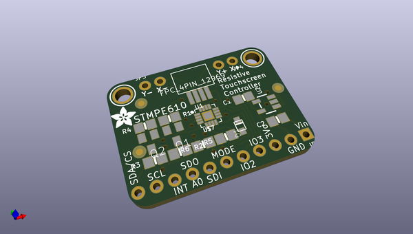
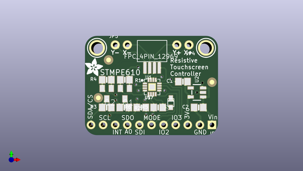
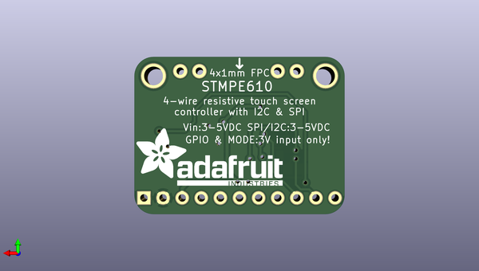

# adafruit_stmpe610_breakout_pcb
 
## summary 
* id: adafruit_adafruit_stmpe610_breakout_pcb_adafruit_stmpe610
* user: adafruit
* name: adafruit_stmpe610_breakout_pcb
* board: adafruit_stmpe610
* repo: https://github.com/adafruit/Adafruit-STMPE610-Breakout-PCB

* src_file_repo_sch: 
* src_file_repo_sch_link: https://github.com/adafruit/Adafruit-STMPE610-Breakout-PCB/tree/master/
* full details link: https://github.com/oomlout/oomlout_oomp_project_bot_v_2/tree/main/projects/adafruit_adafruit_stmpe610_breakout_pcb_adafruit_stmpe610/current_version/working  

## schematic  
  
[schematic (pdf)](working_schematic.pdf) 

## pcb  
 
  
  
  
[board (pdf)](working.pdf)  

## working_bom
| Id | Designator | Footprint | Quantity | Designation | Supplier and ref |  | None | 
| --- | --- | --- | --- | --- | --- | --- | --- | 
| 1 | D1 | SOD-323F | 1 | 1N4148 |  |  | [''] | 
| 2 | U$8 | ADAFRUIT_3.5MM | 1 |  |  |  | [''] | 
| 3 | FID1,FID3,FID2 | FIDUCIAL_1MM | 3 | FIDUCIAL" |  |  | [''] | 
| 4 | R6,R2,R3,R1,R5,R4 | 0805-NO | 6 | 10K |  |  | [''] | 
| 5 | JP5,JP4 | 1X02_ROUND | 2 |  |  |  | [''] | 
| 6 | C1 | 0805-NO | 1 | 0.1uF |  |  | [''] | 
| 7 | Q1,Q2 | SOT23 | 2 | BSS138 |  |  | [''] | 
| 8 | U$4,U$5 | MOUNTINGHOLE_2.5_PLATED | 2 | MOUNTINGHOLE2.5 |  |  | [''] | 
| 9 | U1 | QFN16_3MM | 1 | STMPE610 |  |  | [''] | 
| 10 | U2 | SOT23-5 | 1 | MIC5225-3.3 |  |  | [''] | 
| 11 | U$7 | FPC_CONN_1MM_DUAL_4P | 1 | FPC_4PIN_12969 |  |  | [''] | 
| 12 | JP1 | 1X11_ROUND | 1 |  |  |  | [''] | 
| 13 | C2 | 0805-NO | 1 | 10uF |  |  | [''] | 
| 14 | U$6 | ADAFRUIT_TEXT_20MM | 1 |  |  |  | [''] | 

## bom_schematic
| Ref | Qnty | Value | Cmp name | Footprint | Description | Vendor | DNP | 
| --- | --- | --- | --- | --- | --- | --- | --- | 
| C1 | 1 | 0.1uF | CAP_CERAMIC0805-NOOUTLINE | working:0805-NO |  |  |  | 
| C2 | 1 | 10uF | CAP_CERAMIC0805-NOOUTLINE | working:0805-NO |  |  |  | 
| D1 | 1 | 1N4148 | DIODESOD-323F | working:SOD-323F |  |  |  | 
| FID1, FID2, FID3 | 3 | FIDUCIAL"" | FIDUCIAL{dblquote}{dblquote} | working:FIDUCIAL_1MM |  |  |  | 
| JP1 | 1 | HEADER-1X11 | HEADER-1X11 | working:1X11_ROUND |  |  |  | 
| JP4, JP5 | 2 | HEADER-1X2ROUND | HEADER-1X2ROUND | working:1X02_ROUND |  |  |  | 
| Q1, Q2 | 2 | BSS138 | MOSFET-NREFLOW | working:SOT23 |  |  |  | 
| R1, R2, R3, R4, R5, R6 | 6 | 10K | RESISTOR0805_NOOUTLINE | working:0805-NO |  |  |  | 
| U1 | 1 | STMPE610 | STMPE610 | working:QFN16_3MM |  |  |  | 
| U2 | 1 | MIC5225-3.3 | VREG_SOT23-5 | working:SOT23-5 |  |  |  | 
| U$4, U$5 | 2 | MOUNTINGHOLE2.5 | MOUNTINGHOLE2.5 | working:MOUNTINGHOLE_2.5_PLATED |  |  |  | 
| U$7 | 1 | FPC_4PIN_12969 | FPC_4PIN_12969 | working:FPC_CONN_1MM_DUAL_4P |  |  |  | 

## mounting_holes
| x | y | package | value | ref | size | 
| --- | --- | --- | --- | --- | --- | 
| 0.0 | 0.0 | MOUNTINGHOLE_2.5_PLATED | MOUNTINGHOLE2.5 | U$4 | m3 | 
| 22.86 | 0.0 | MOUNTINGHOLE_2.5_PLATED | MOUNTINGHOLE2.5 | U$5 | m3 | 

