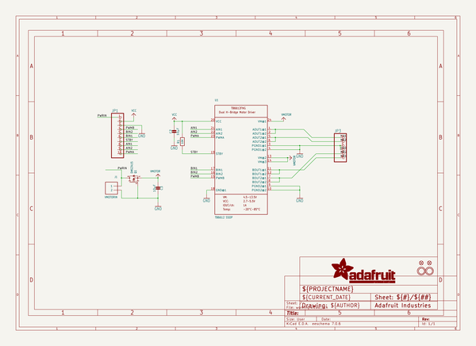
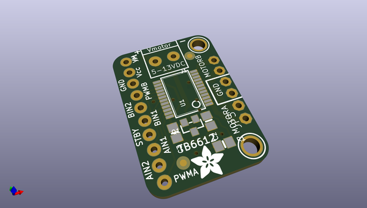
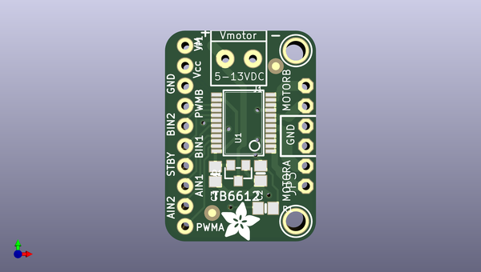
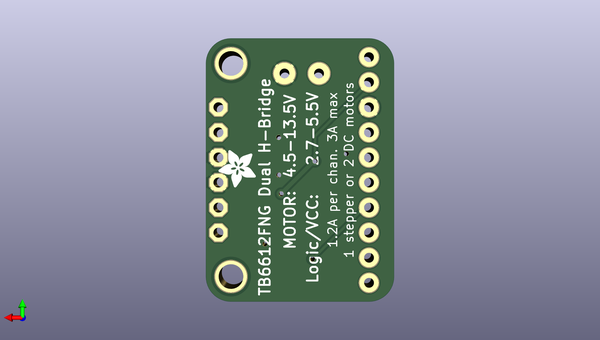

# adafruit_tb6612_motor_driver_breakout_pcb
 
## summary 
* id: adafruit_adafruit_tb6612_motor_driver_breakout_pcb_adafruit_tb6612
* user: adafruit
* name: adafruit_tb6612_motor_driver_breakout_pcb
* board: adafruit_tb6612
* repo: https://github.com/adafruit/Adafruit-TB6612-Motor-Driver-Breakout-PCB

* src_file_repo_sch: 
* src_file_repo_sch_link: https://github.com/adafruit/Adafruit-TB6612-Motor-Driver-Breakout-PCB/tree/master/
* full details link: https://github.com/oomlout/oomlout_oomp_project_bot_v_2/tree/main/projects/adafruit_adafruit_tb6612_motor_driver_breakout_pcb_adafruit_tb6612/current_version/working  

## schematic  
  
[schematic (pdf)](working_schematic.pdf)  

## pcb  
 
  
  
  
[board (pdf)](working.pdf)  

## working_bom
| Id | Designator | Footprint | Quantity | Designation | Supplier and ref |  | None | 
| --- | --- | --- | --- | --- | --- | --- | --- | 
| 1 | FID1,FID2 | FIDUCIAL_1MM | 2 | FIDUCIAL" |  |  | [''] | 
| 2 | U$14,U$13 | MOUNTINGHOLE_2.5_PLATED | 2 | MOUNTINGHOLE2.5 |  |  | [''] | 
| 3 | C2,C3 | 0805-NO | 2 | 10µF |  |  | [''] | 
| 4 | JP1 | 1X10_ROUND_76 | 1 |  |  |  | [''] | 
| 5 | J1 | TERMBLOCK_1X2-3.5MM | 1 | VMOTORIN |  |  | [''] | 
| 6 | Q1 | SOT23-WIDE | 1 | DMG3415 |  |  | [''] | 
| 7 | U1 | SSOP24 | 1 | TB6612 SSOP |  |  | [''] | 
| 8 | U$15 | ADAFRUIT_5MM | 1 |  |  |  | [''] | 
| 9 | R1 | 0805-NO | 1 | 10K |  |  | [''] | 
| 10 | JP3 | 1X06-CLEANBIG | 1 |  |  |  | [''] | 
| 11 | U$11 | ADAFRUIT_3.5MM | 1 |  |  |  | [''] | 

## bom_schematic
| Ref | Qnty | Value | Cmp name | Footprint | Description | Vendor | DNP | 
| --- | --- | --- | --- | --- | --- | --- | --- | 
| C2, C3 | 2 | 10µF | CAP_CERAMIC0805-NOOUTLINE | working:0805-NO |  |  |  | 
| FID1, FID2 | 2 | FIDUCIAL"" | FIDUCIAL{dblquote}{dblquote} | working:FIDUCIAL_1MM |  |  |  | 
| J1 | 1 | VMOTORIN | TERMBLOCK_1X2 | working:TERMBLOCK_1X2-3.5MM |  |  |  | 
| JP1 | 1 | HEADER-1X10THICKER | HEADER-1X10THICKER | working:1X10_ROUND_76 |  |  |  | 
| JP3 | 1 | PINHD-1X6CB | PINHD-1X6CB | working:1X06-CLEANBIG |  |  |  | 
| Q1 | 1 | DMG3415 | MOSFET-PWIDE | working:SOT23-WIDE |  |  |  | 
| R1 | 1 | 10K | RESISTOR0805_NOOUTLINE | working:0805-NO |  |  |  | 
| U1 | 1 | TB6612 SSOP | TB6612FNGSSOP | working:SSOP24 |  |  |  | 
| U$13, U$14 | 2 | MOUNTINGHOLE2.5 | MOUNTINGHOLE2.5 | working:MOUNTINGHOLE_2.5_PLATED |  |  |  | 

## mounting_holes
| x | y | package | value | ref | size | 
| --- | --- | --- | --- | --- | --- | 
| 0.0 | 21.58999999999999 | MOUNTINGHOLE_2.5_PLATED | MOUNTINGHOLE2.5 | U$13 | m3 | 
| 0.0 | 0.0 | MOUNTINGHOLE_2.5_PLATED | MOUNTINGHOLE2.5 | U$14 | m3 | 

