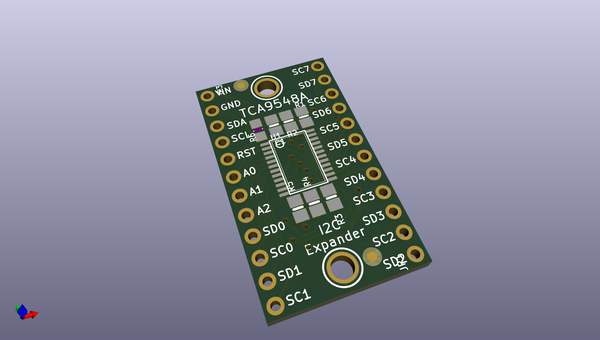
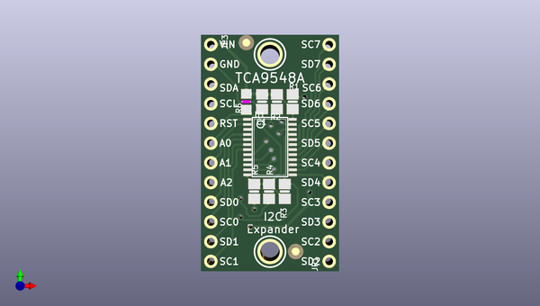
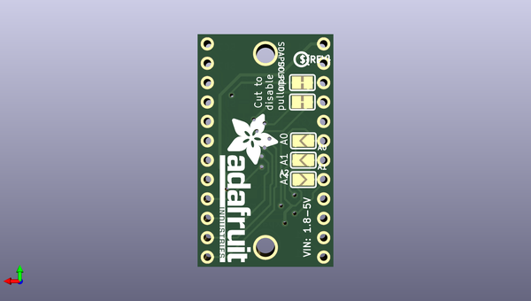

# adafruit_tca9548a_i2c_multiplexer_pcb
 
## summary 
* id: adafruit_adafruit_tca9548a_i2c_multiplexer_pcb_adafruit_tca9548a
* user: adafruit
* name: adafruit_tca9548a_i2c_multiplexer_pcb
* board: adafruit_tca9548a
* repo: https://github.com/adafruit/Adafruit-TCA9548A-I2C-Multiplexer-PCB

* src_file_repo_sch: 
* src_file_repo_sch_link: https://github.com/adafruit/Adafruit-TCA9548A-I2C-Multiplexer-PCB/tree/master/
* full details link: https://github.com/oomlout/oomlout_oomp_project_bot_v_2/tree/main/projects/adafruit_adafruit_tca9548a_i2c_multiplexer_pcb_adafruit_tca9548a/current_version/working  

## schematic  
  
[schematic (pdf)](working_schematic.pdf) 

## pcb  
 
  
  
  
[board (pdf)](working.pdf)  

## working_bom
| Id | Designator | Footprint | Quantity | Designation | Supplier and ref |  | None | 
| --- | --- | --- | --- | --- | --- | --- | --- | 
| 1 | R6 | _0805MP | 1 | 10K |  |  | [''] | 
| 2 | R1,R2,R4,R5,R3 | 0805-NO | 5 | 10K |  |  | [''] | 
| 3 | JP1,JP3 | 1X12_ROUND | 2 |  |  |  | [''] | 
| 4 | U1 | TSSOP24 | 1 |  TCA9548APWR |  |  | [''] | 
| 5 | U$5,U$4 | MOUNTINGHOLE_2.5_PLATED | 2 | MOUNTINGHOLE2.5 |  |  | [''] | 
| 6 | FID1,FID3 | FIDUCIAL_1MM | 2 | FIDUCIAL" |  |  | [''] | 
| 7 | C1 | 0805-NO | 1 | 10uF |  |  | [''] | 
| 8 | A1,A2,A0 | SOLDERJUMPER_ARROW_NOPASTE | 3 |  |  |  | [''] | 
| 9 | SCLPU0,SDAPU0 | SOLDERJUMPER_CLOSEDWIRE | 2 |  |  |  | [''] | 
| 10 | U$6 | PCBFEAT-REV-040 | 1 |  |  |  | [''] | 
| 11 | U$7 | ADAFRUIT_TEXT_20MM | 1 |  |  |  | [''] | 

## mounting_holes
| x | y | package | value | ref | size | 
| --- | --- | --- | --- | --- | --- | 
| 0.0 | 0.0 | MOUNTINGHOLE_2.5_PLATED | MOUNTINGHOLE2.5 | U$4 | m3 | 
| 0.0 | 25.4 | MOUNTINGHOLE_2.5_PLATED | MOUNTINGHOLE2.5 | U$5 | m3 | 

