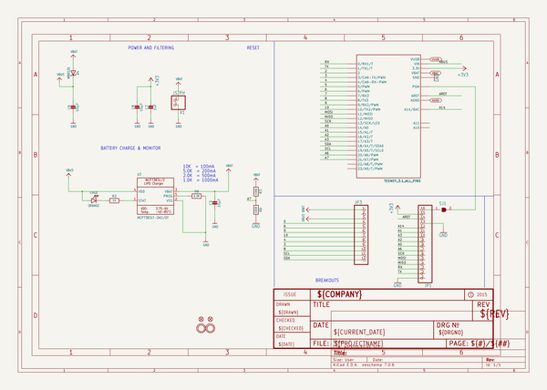

# adafruit_teensy_3_x_feather_adapter_pcb
 
## summary 
* id: adafruit_adafruit_teensy_3_x_feather_adapter_pcb_adafruit_feather_teensy3_adapter
* user: adafruit
* name: adafruit_teensy_3_x_feather_adapter_pcb
* board: adafruit_feather_teensy3_adapter
* repo: https://github.com/adafruit/Adafruit-Teensy-3.x-Feather-Adapter-PCB

* src_file_repo_sch: 
* src_file_repo_sch_link: https://github.com/adafruit/Adafruit-Teensy-3.x-Feather-Adapter-PCB/tree/master/
* full details link: https://github.com/oomlout/oomlout_oomp_project_bot_v_2/tree/main/projects/adafruit_adafruit_teensy_3_x_feather_adapter_pcb_adafruit_feather_teensy3_adapter/current_version/working  

## schematic  
  
[schematic (pdf)](working_schematic.pdf)  

## pcb  
 
  
  
  
[board (pdf)](working.pdf)  

## working_bom
| Id | Designator | Footprint | Quantity | Designation | Supplier and ref |  | None | 
| --- | --- | --- | --- | --- | --- | --- | --- | 
| 1 | U$34,U$35 | FIDUCIAL_1MM | 2 | FIDUCIAL" |  |  | [''] | 
| 2 | U$1 | TEENSY3-ALL_PINS | 1 | TEENSY_3.1_ALL_PINS |  |  | [''] | 
| 3 | U$7 | ADAFRUIT_3.5MM | 1 |  |  |  | [''] | 
| 4 | C8,C6,C3 | 0805-NO | 3 | 10µF |  |  | [''] | 
| 5 | R2 | 0603-NO | 1 | 1K |  |  | [''] | 
| 6 | R8 | 0603-NO | 1 | 2.2K |  |  | [''] | 
| 7 | X1 | JSTPH2 | 1 | JSTPH |  |  | [''] | 
| 8 | U3 | SOT23-5 | 1 | MCP73831T-2ACI/OT |  |  | [''] | 
| 9 | CHG0 | CHIPLED_0805_NOOUTLINE | 1 | ORANGE |  |  | [''] | 
| 10 | JP3 | 1X12_ROUND | 1 |  |  |  | [''] | 
| 11 | U$5,U$6 | PCBFEAT-REV-040 | 2 |  |  |  | [''] | 
| 12 | C7 | 0603-NO | 1 | 1uF |  |  | [''] | 
| 13 | U$32,U$31 | MOUNTINGHOLE_2.5_PLATED | 2 | MOUNTINGHOLE2.5 |  |  | [''] | 
| 14 | R6 | 0603-NO | 1 | 100K |  |  | [''] | 
| 15 | R3 | 0603-NO | 1 | 100k |  |  | [''] | 
| 16 | JP1 | 1X16_ROUND | 1 |  |  |  | [''] | 
| 17 | D4 | SOD-123 | 1 | MBR120 |  |  | [''] | 
| 18 | U$4 | ADAFRUIT_5MM | 1 |  |  |  | [''] | 
| 19 | SJ1 | SOLDERJUMPER_CLOSEDWIRE | 1 |  |  |  | [''] | 

## bom_schematic
| Ref | Qnty | Value | Cmp name | Footprint | Description | Vendor | DNP | 
| --- | --- | --- | --- | --- | --- | --- | --- | 
| C3, C6, C8 | 3 | 10µF | CAP_CERAMIC0805-NOOUTLINE | working:0805-NO |  |  |  | 
| C7 | 1 | 1uF | CAP_CERAMIC0603_NO | working:0603-NO |  |  |  | 
| CHG0 | 1 | ORANGE | LED0805_NOOUTLINE | working:CHIPLED_0805_NOOUTLINE |  |  |  | 
| D4 | 1 | MBR120 | DIODE-SCHOTTKYSOD-123 | working:SOD-123 |  |  |  | 
| JP1 | 1 | HEADER-1X16ROUND | HEADER-1X16ROUND | working:1X16_ROUND |  |  |  | 
| JP3 | 1 | HEADER-1X12 | HEADER-1X12 | working:1X12_ROUND |  |  |  | 
| R2 | 1 | 1K | RESISTOR_0603_NOOUT | working:0603-NO |  |  |  | 
| R3 | 1 | 100k | RESISTOR_0603_NOOUT | working:0603-NO |  |  |  | 
| R6 | 1 | 100K | RESISTOR_0603_NOOUT | working:0603-NO |  |  |  | 
| R8 | 1 | 2.2K | RESISTOR_0603_NOOUT | working:0603-NO |  |  |  | 
| SJ1 | 1 | SOLDERJUMPERCLOSED | SOLDERJUMPERCLOSED | working:SOLDERJUMPER_CLOSEDWIRE |  |  |  | 
| U3 | 1 | MCP73831T-2ACI/OT | MCP73831/2 | working:SOT23-5 |  |  |  | 
| U$1 | 1 | TEENSY_3.1_ALL_PINS | TEENSY_3.1_ALL_PINS | working:TEENSY3-ALL_PINS |  |  |  | 
| U$31, U$32 | 2 | MOUNTINGHOLE2.5 | MOUNTINGHOLE2.5 | working:MOUNTINGHOLE_2.5_PLATED |  |  |  | 
| U$34, U$35 | 2 | FIDUCIAL"" | FIDUCIAL{dblquote}{dblquote} | working:FIDUCIAL_1MM |  |  |  | 
| X1 | 1 | JSTPH | CON_JST_PH_2PIN | working:JSTPH2 |  |  |  | 

## mounting_holes
| x | y | package | value | ref | size | 
| --- | --- | --- | --- | --- | --- | 
| 0.0 | 17.78 | MOUNTINGHOLE_2.5_PLATED | MOUNTINGHOLE2.5 | U$31 | m3 | 
| 0.0 | 0.0 | MOUNTINGHOLE_2.5_PLATED | MOUNTINGHOLE2.5 | U$32 | m3 | 

