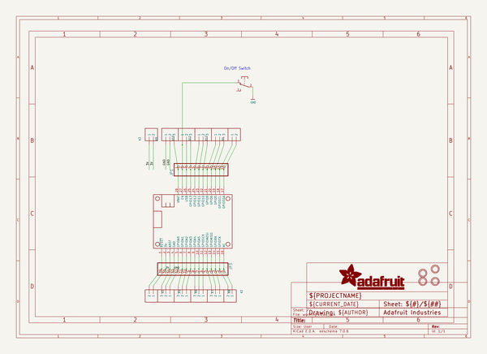

# adafruit_terminal_block_featherwing_pcb
 
## summary 
* id: adafruit_adafruit_terminal_block_featherwing_pcb_adafruit_terminal_featherwing
* user: adafruit
* name: adafruit_terminal_block_featherwing_pcb
* board: adafruit_terminal_featherwing
* repo: https://github.com/adafruit/Adafruit-Terminal-Block-FeatherWing-PCB

* src_file_repo_sch: 
* src_file_repo_sch_link: https://github.com/adafruit/Adafruit-Terminal-Block-FeatherWing-PCB/tree/master/
* full details link: https://github.com/oomlout/oomlout_oomp_project_bot_v_2/tree/main/projects/adafruit_adafruit_terminal_block_featherwing_pcb_adafruit_terminal_featherwing/current_version/working  

## schematic  
  
[schematic (pdf)](working_schematic.pdf)  

## pcb  
 
  
  
  
[board (pdf)](working.pdf)  

## working_bom
| Id | Designator | Footprint | Quantity | Designation | Supplier and ref |  | None | 
| --- | --- | --- | --- | --- | --- | --- | --- | 
| 1 | X1,X4,X3,X2 | TERMBLOCK_1X2-3.5MM | 4 |  |  |  | [''] | 
| 2 | X9,X8,X11,X10,X6,X7,X5,X12 | TERMBLOCK_1X3-3.5MM | 8 |  |  |  | [''] | 
| 3 | U$7,U$8 | ADAFRUIT_3.5MM | 2 |  |  |  | [''] | 
| 4 | S2 | OS102011MA1Q | 1 | OS102011MA1Q |  |  | [''] | 
| 5 | JP3 | 1X16_ROUND_76MIL | 1 |  |  |  | [''] | 
| 6 | MS1 | FEATHERWING_DIM | 1 | FEATHERWING_NODIM |  |  | [''] | 
| 7 | U$3,U$5,U$4,U$2 | MOUNTINGHOLE_3.0_PLATEDTHIN | 4 | MOUNTINGHOLE3.0THIN |  |  | [''] | 
| 8 | JP1 | 1X12_ROUND_76MIL | 1 |  |  |  | [''] | 
| 9 | U$6 | PCBFEAT-REV-040 | 1 |  |  |  | [''] | 

## bom_schematic
| Ref | Qnty | Value | Cmp name | Footprint | Description | Vendor | DNP | 
| --- | --- | --- | --- | --- | --- | --- | --- | 
| JP1 | 1 | HEADER-1X1276MIL | HEADER-1X1276MIL | working:1X12_ROUND_76MIL |  |  |  | 
| JP3 | 1 | HEADER-1X16_76MIL | HEADER-1X16_76MIL | working:1X16_ROUND_76MIL |  |  |  | 
| MS1 | 1 | FEATHERWING_NODIM | FEATHERWING_NODIM | working:FEATHERWING_DIM |  |  |  | 
| S2 | 1 | OS102011MA1Q | OS102011MA1Q | working:OS102011MA1Q |  |  |  | 
| U$2, U$3, U$4, U$5 | 4 | MOUNTINGHOLE3.0THIN | MOUNTINGHOLE3.0THIN | working:MOUNTINGHOLE_3.0_PLATEDTHIN |  |  |  | 
| X1, X2, X3, X4 | 4 | TERMBLOCK_1X2 | TERMBLOCK_1X2 | working:TERMBLOCK_1X2-3.5MM |  |  |  | 
| X5, X6, X7, X8, X9, X10, X11, X12 | 8 | TERMBLOCK_1X3 | TERMBLOCK_1X3 | working:TERMBLOCK_1X3-3.5MM |  |  |  | 

## mounting_holes
| x | y | package | value | ref | size | 
| --- | --- | --- | --- | --- | --- | 
| 0.0 | 20.320000000000007 | MOUNTINGHOLE_3.0_PLATEDTHIN | MOUNTINGHOLE3.0THIN | U$2 | m3 | 
| 0.0 | 0.0 | MOUNTINGHOLE_3.0_PLATEDTHIN | MOUNTINGHOLE3.0THIN | U$3 | m3 | 
| 58.41999999999999 | 0.0 | MOUNTINGHOLE_3.0_PLATEDTHIN | MOUNTINGHOLE3.0THIN | U$4 | m3 | 
| 58.41999999999999 | 20.320000000000007 | MOUNTINGHOLE_3.0_PLATEDTHIN | MOUNTINGHOLE3.0THIN | U$5 | m3 | 

