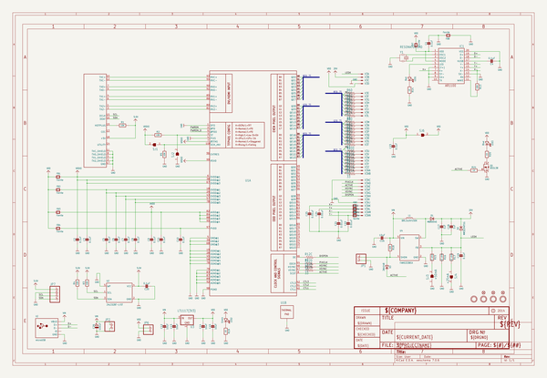
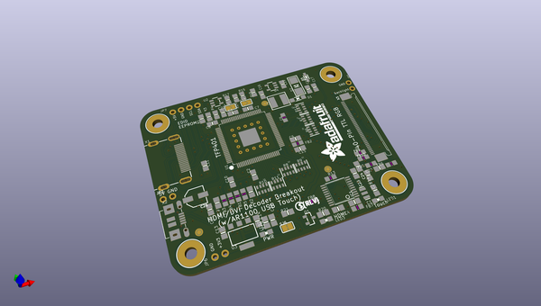
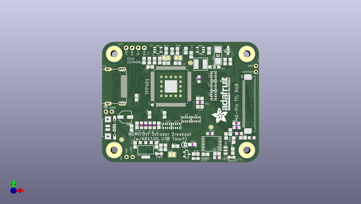
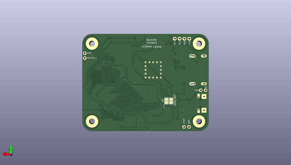

# adafruit_tfp401_hdmi_to_40pin_tft_pcb
 
## summary 
* id: adafruit_adafruit_tfp401_hdmi_to_40pin_tft_pcb_adafruit_tfp401_to_40pin_tft
* user: adafruit
* name: adafruit_tfp401_hdmi_to_40pin_tft_pcb
* board: adafruit_tfp401_to_40pin_tft
* repo: https://github.com/adafruit/Adafruit-TFP401-HDMI-To-40Pin-TFT-PCB

* src_file_repo_sch: 
* src_file_repo_sch_link: https://github.com/adafruit/Adafruit-TFP401-HDMI-To-40Pin-TFT-PCB/tree/master/
* full details link: https://github.com/oomlout/oomlout_oomp_project_bot_v_2/tree/main/projects/adafruit_adafruit_tfp401_hdmi_to_40pin_tft_pcb_adafruit_tfp401_to_40pin_tft/current_version/working  

## schematic  
  
[schematic (pdf)](working_schematic.pdf) 

## pcb  
 
  
  
  
[board (pdf)](working.pdf)  

## working_bom
| Id | Designator | Footprint | Quantity | Designation | Supplier and ref |  | None | 
| --- | --- | --- | --- | --- | --- | --- | --- | 
| 1 | U$32,U$33,U$34,U$31 | MOUNTINGHOLE_3.0_PLATED | 4 | MOUNTINGHOLE3.0 |  |  | [''] | 
| 2 | D1 | SOD-123 | 1 | MBR0540 |  |  | [''] | 
| 3 | R6,R8,R11,R12,R9,R10,R7 | RESPACK_4X0603 | 7 | 33 |  |  | [''] | 
| 4 | FB1,FB2,FB3,FB4,FB7,FB8 | _0805MP | 6 | Ferrite |  |  | [''] | 
| 5 | C11,C4,C1,C10,C7,C5,C23,C3,C19,C8,C20,C9,C2 | 0805-NO | 13 | 0.1uF |  |  | [''] | 
| 6 | C25,C24,C22,C21 | 0805-NO | 4 | 0.01uF |  |  | [''] | 
| 7 | LED1 | CHIPLED_0805_NOOUTLINE | 1 | Red |  |  | [''] | 
| 8 | FB6,FB10,FB5,FB9 | _0805MP | 4 | ferrite |  |  | [''] | 
| 9 | R17,R16 | 0805-NO | 2 | 12 ohm |  |  | [''] | 
| 10 | R4,R3,R1,R18,R2 | 0805-NO | 5 | 10K |  |  | [''] | 
| 11 | FID3,FID2,FID1 | FIDUCIAL_1MM | 3 | FIDUCIAL" |  |  | [''] | 
| 12 | X3 | 4-1734839-0 | 1 | XF2-40-RARBT |  |  | [''] | 
| 13 | R19,R20,R14,R21 | 0805-NO | 4 | 1K |  |  | [''] | 
| 14 | U1 | S-PQFP-G100 | 1 | TFP401 |  |  | [''] | 
| 15 | LED2 | CHIPLED_0805_NOOUTLINE | 1 | Green |  |  | [''] | 
| 16 | C15,C13,C12,C16,C14 | 0805-NO | 5 | 10uF |  |  | [''] | 
| 17 | R13,R5 | _0805MP | 2 | 10K |  |  | [''] | 
| 18 | C6 | _0805MP | 1 | 0.1uF |  |  | [''] | 
| 19 | L1 | INDUCTOR_5X5MM_NR5040_NOTHERMALS | 1 | BRL3225T150K |  |  | [''] | 
| 20 | LED3 | CHIPLED_0805_NOOUTLINE | 1 | Blue |  |  | [''] | 
| 21 | U$81 | ADAFRUIT_TEXT_20MM | 1 |  |  |  | [''] | 
| 22 | U3 | SOT223-R | 1 | LT1117(3V3) |  |  | [''] | 
| 23 | C26 | PANASONIC_C | 1 | 100uF |  |  | [''] | 
| 24 | SJ6 | SOLDERJUMPER_CLOSEDWIRE | 1 |  |  |  | [''] | 
| 25 | JP2,JP6,JP1 | 1X02_ROUND | 3 |  |  |  | [''] | 
| 26 | Y1 | RESONATOR-SMD | 1 | 12MHz |  |  | [''] | 
| 27 | U4 | SOT23-5 | 1 | FAN5333BSX |  |  | [''] | 
| 28 | U$80 | PCBFEAT-REV-056 | 1 |  |  |  | [''] | 
| 29 | C18,C17 | 0805-NO | 2 | 1uF |  |  | [''] | 
| 30 | X1 | HDMI_MOLEX_47151-0001_DIMLAYER | 1 | 47151-0001 |  |  | [''] | 
| 31 | D2 | SMADIODE | 1 | MM3Z24VT1G |  |  | [''] | 
| 32 | IC1 | TSSOP20-5.3MMBODY | 1 | AR1100_SSOP |  |  | [''] | 
| 33 | U2 | SOT23-5 | 1 | 24LC02BT-I/OT |  |  | [''] | 
| 34 | R15 | 0805-NO | 1 | 3 ohm |  |  | [''] | 
| 35 | SJ3 | SOLDERJUMPER_ARROW_NOPASTE | 1 | +50mA |  |  | [''] | 
| 36 | Q1 | SOT23-R | 1 | BSS138 |  |  | [''] | 
| 37 | X2 | 4UCONN_20329 | 1 | microUSB |  |  | [''] | 
| 38 | SJ4 | SOLDERJUMPER_ARROW_NOPASTE | 1 | +25mA |  |  | [''] | 
| 39 | JP7 | 1X04_ROUND_76 | 1 |  |  |  | [''] | 
| 40 | D3 | SOD-323 | 1 | 2N4148 |  |  | [''] | 
| 41 | SJ2,SJ1 | SOLDERJUMPER_ARROW_NOPASTE | 2 |  |  |  | [''] | 

## bom_schematic
| Ref | Qnty | Value | Cmp name | Footprint | Description | Vendor | DNP | 
| --- | --- | --- | --- | --- | --- | --- | --- | 
| C1, C2, C3, C4, C5, C7, C8, C9, C10, C11, C19, C20, C23 | 13 | 0.1uF | CAP_CERAMIC0805-NOOUTLINE | working:0805-NO |  |  |  | 
| C6 | 1 | 0.1uF | CAP_CERAMIC_0805MP | working:_0805MP |  |  |  | 
| C12, C13, C14, C15, C16 | 5 | 10uF | CAP_CERAMIC0805-NOOUTLINE | working:0805-NO |  |  |  | 
| C17, C18 | 2 | 1uF | CAP_CERAMIC0805-NOOUTLINE | working:0805-NO |  |  |  | 
| C21, C22, C24, C25 | 4 | 0.01uF | CAP_CERAMIC0805-NOOUTLINE | working:0805-NO |  |  |  | 
| C26 | 1 | 100uF | CAP_ELECTROLYTICPANASONIC_C | working:PANASONIC_C |  |  |  | 
| D1 | 1 | MBR0540 | DIODESOD-123 | working:SOD-123 |  |  |  | 
| D2 | 1 | MM3Z24VT1G | DIODESMA | working:SMADIODE |  |  |  | 
| D3 | 1 | 2N4148 | DIODESOD-323 | working:SOD-323 |  |  |  | 
| FB1, FB2, FB3, FB4, FB7, FB8 | 6 | Ferrite | FERRITE_0805MP | working:_0805MP |  |  |  | 
| FB5, FB6, FB9, FB10 | 4 | ferrite | FERRITE_0805MP | working:_0805MP |  |  |  | 
| FID1, FID2, FID3 | 3 | FIDUCIAL"" | FIDUCIAL{dblquote}{dblquote} | working:FIDUCIAL_1MM |  |  |  | 
| IC1 | 1 | AR1100_SSOP | AR1100_SSOP | working:TSSOP20-5.3MMBODY |  |  |  | 
| JP1, JP2, JP6 | 3 | HEADER-1X2ROUND | HEADER-1X2ROUND | working:1X02_ROUND |  |  |  | 
| JP7 | 1 | HEADER-1X476MIL | HEADER-1X476MIL | working:1X04_ROUND_76 |  |  |  | 
| L1 | 1 | BRL3225T150K | INDUCTORNR5040 | working:INDUCTOR_5X5MM_NR5040_NOTHERMALS |  |  |  | 
| LED1 | 1 | Red | LED0805_NOOUTLINE | working:CHIPLED_0805_NOOUTLINE |  |  |  | 
| LED2 | 1 | Green | LED0805_NOOUTLINE | working:CHIPLED_0805_NOOUTLINE |  |  |  | 
| LED3 | 1 | Blue | LED0805_NOOUTLINE | working:CHIPLED_0805_NOOUTLINE |  |  |  | 
| Q1 | 1 | BSS138 | MOSFET-NREFLOW | working:SOT23-R |  |  |  | 
| R1, R2, R3, R4, R18 | 5 | 10K | RESISTOR0805_NOOUTLINE | working:0805-NO |  |  |  | 
| R5, R13 | 2 | 10K | RESISTOR_0805MP | working:_0805MP |  |  |  | 
| R6, R7, R8, R9, R10, R11, R12 | 7 | 33 | RESISTOR_4PACK_US | working:RESPACK_4X0603 |  |  |  | 
| R14, R19, R20, R21 | 4 | 1K | RESISTOR0805_NOOUTLINE | working:0805-NO |  |  |  | 
| R15 | 1 | 3 ohm | RESISTOR0805_NOOUTLINE | working:0805-NO |  |  |  | 
| R16, R17 | 2 | 12 ohm | RESISTOR0805_NOOUTLINE | working:0805-NO |  |  |  | 
| SJ1, SJ2 | 2 | SOLDERJUMPER | SOLDERJUMPER | working:SOLDERJUMPER_ARROW_NOPASTE |  |  |  | 
| SJ3 | 1 | +50mA | SOLDERJUMPER | working:SOLDERJUMPER_ARROW_NOPASTE |  |  |  | 
| SJ4 | 1 | +25mA | SOLDERJUMPER | working:SOLDERJUMPER_ARROW_NOPASTE |  |  |  | 
| SJ6 | 1 | SOLDERJUMPERCLOSED | SOLDERJUMPERCLOSED | working:SOLDERJUMPER_CLOSEDWIRE |  |  |  | 
| U1 | 1 | TFP401 | TFP401 | working:S-PQFP-G100 |  |  |  | 
| U2 | 1 | 24LC02BT-I/OT | EEPROM_I2C_MCP24AA32 | working:SOT23-5 |  |  |  | 
| U3 | 1 | LT1117(3V3) | VREG_SOT223 | working:SOT223-R |  |  |  | 
| U4 | 1 | FAN5333BSX | VREG_FAN5331 | working:SOT23-5 |  |  |  | 
| U$31, U$32, U$33, U$34 | 4 | MOUNTINGHOLE3.0 | MOUNTINGHOLE3.0 | working:MOUNTINGHOLE_3.0_PLATED |  |  |  | 
| X1 | 1 | 47151-0001 | HDMI_MOLEX_47151DIM | working:HDMI_MOLEX_47151-0001_DIMLAYER |  |  |  | 
| X2 | 1 | microUSB | USBMICRO_20329 | working:4UCONN_20329 |  |  |  | 
| X3 | 1 | XF2-40?-RARBT | XF2-40?-RARBT | working:4-1734839-0 |  |  |  | 
| Y1 | 1 | RESONATORSMD | RESONATORSMD | working:RESONATOR-SMD |  |  |  | 

## mounting_holes
| x | y | package | value | ref | size | 
| --- | --- | --- | --- | --- | --- | 
| 0.0 | 40.64 | MOUNTINGHOLE_3.0_PLATED | MOUNTINGHOLE3.0 | U$31 | m3 | 
| 55.88 | 40.64 | MOUNTINGHOLE_3.0_PLATED | MOUNTINGHOLE3.0 | U$32 | m3 | 
| 55.88 | 0.0 | MOUNTINGHOLE_3.0_PLATED | MOUNTINGHOLE3.0 | U$33 | m3 | 
| 0.0 | 0.0 | MOUNTINGHOLE_3.0_PLATED | MOUNTINGHOLE3.0 | U$34 | m3 | 

