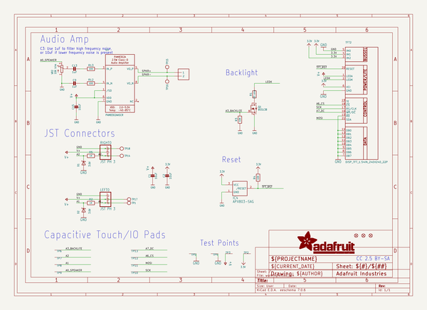

# adafruit_tft_gizmo_pcb
 
## summary 
* id: adafruit_adafruit_tft_gizmo_pcb_adafruit_circuit_playground_tft_gizmo
* user: adafruit
* name: adafruit_tft_gizmo_pcb
* board: adafruit_circuit_playground_tft_gizmo
* repo: https://github.com/adafruit/Adafruit-TFT-Gizmo-PCB

* src_file_repo_sch: 
* src_file_repo_sch_link: https://github.com/adafruit/Adafruit-TFT-Gizmo-PCB/tree/master/
* full details link: https://github.com/oomlout/oomlout_oomp_project_bot_v_2/tree/main/projects/adafruit_adafruit_tft_gizmo_pcb_adafruit_circuit_playground_tft_gizmo/current_version/working  

## schematic  
  
[schematic (pdf)](working_schematic.pdf)  

## pcb  
 
  
  
  
[board (pdf)](working.pdf)  

## working_bom
| Id | Designator | Footprint | Quantity | Designation | Supplier and ref |  | None | 
| --- | --- | --- | --- | --- | --- | --- | --- | 
| 1 | TP3,TP13,TP6,TP7,TP4,TP10,TP8,TP12,TP2,TP11,TP9,TP5 | SMT_NUT_3MM | 12 | SEWTAP_SMTNUTM3 |  |  | [''] | 
| 2 | R13,R12 | 0603-NO | 2 | 100 |  |  | [''] | 
| 3 | VR2 | TRIMPOT_BOURNS_3303W | 1 | 10K trim |  |  | [''] | 
| 4 | D1,D2 | SOD-323 | 2 | 3.6V |  |  | [''] | 
| 5 | R4,R3 | 0603-NO | 2 | 10K |  |  | [''] | 
| 6 | U$7 | PCBFEAT-REV-040 | 1 |  |  |  | [''] | 
| 7 | U$1 | 53398-0271 | 1 | CON_MOLEX_2P |  |  | [''] | 
| 8 | C9,C13 | 0603-NO | 2 | 1uF |  |  | [''] | 
| 9 | Q1 | SOT23-WIDE | 1 | BSS138 |  |  | [''] | 
| 10 | U$2,U$6,U$3 | FIDUCIAL_1MM | 3 | FIDUCIAL_1MM |  |  | [''] | 
| 11 | R2,R5 | 0603-NO | 2 | 1K |  |  | [''] | 
| 12 | R1 | 0603-NO | 1 | 33 ohm |  |  | [''] | 
| 13 | IC4 | SOT23 | 1 | APX803-SAG |  |  | [''] | 
| 14 | U$18 | TFTGIZMO_BACK | 1 |  |  |  | [''] | 
| 15 | U5 | MSOP8_0.65MM | 1 | PAM8302AASCR |  |  | [''] | 
| 16 | RIGHT0,LEFT0 | JSTPH3 | 2 | JST PH 3 |  |  | [''] | 
| 17 | C15,C1,C2 | 0805-NO | 3 | 10uF |  |  | [''] | 
| 18 | TP14,TP17,TP1,TP16,TP15,TP18 | TESTPOINT_ROUND_1.5MM_NO | 6 |  |  |  | [''] | 
| 19 | TFT2 | TFT_1.54IN_240X240_22PIN | 1 | DISP_TFT_1.54IN_240X240_22P |  |  | [''] | 
| 20 | U$17 | TFTGIZMO_FRONT | 1 |  |  |  | [''] | 

## bom_schematic
| Ref | Qnty | Value | Cmp name | Footprint | Description | Vendor | DNP | 
| --- | --- | --- | --- | --- | --- | --- | --- | 
| C1, C2, C15 | 3 | 10uF | CAP_CERAMIC0805-NOOUTLINE | working:0805-NO |  |  |  | 
| C9, C13 | 2 | 1uF | CAP_CERAMIC0603_NO | working:0603-NO |  |  |  | 
| D1, D2 | 2 | 3.6V | DIODE-ZENERSOD323 | working:SOD-323 |  |  |  | 
| IC4 | 1 | APX803-SAG | AXP083-SAG | working:SOT23 |  |  |  | 
| LEFT0 | 1 | JST PH 3 | CON_JST_PH_3PIN | working:JSTPH3 |  |  |  | 
| Q1 | 1 | BSS138 | MOSFET-NWIDE | working:SOT23-WIDE |  |  |  | 
| R1 | 1 | 33 ohm | RESISTOR_0603_NOOUT | working:0603-NO |  |  |  | 
| R2, R5 | 2 | 1K | RESISTOR_0603_NOOUT | working:0603-NO |  |  |  | 
| R3, R4 | 2 | 10K | RESISTOR_0603_NOOUT | working:0603-NO |  |  |  | 
| R12, R13 | 2 | 100 | RESISTOR_0603_NOOUT | working:0603-NO |  |  |  | 
| RIGHT0 | 1 | JST PH 3 | CON_JST_PH_3PIN | working:JSTPH3 |  |  |  | 
| TFT2 | 1 | DISP_TFT_1.54IN_240X240_22P | DISP_TFT_1.54IN_240X240_22P | working:TFT_1.54IN_240X240_22PIN |  |  |  | 
| TP1, TP14, TP15, TP16, TP17, TP18 | 6 | TESTPOINTROUND1.5MMNO | TESTPOINTROUND1.5MMNO | working:TESTPOINT_ROUND_1.5MM_NO |  |  |  | 
| TP2, TP3, TP4, TP5, TP6, TP7, TP8, TP9, TP10, TP11, TP12, TP13 | 12 | SEWTAP_SMTNUTM3 | SEWTAP_SMTNUTM3 | working:SMT_NUT_3MM |  |  |  | 
| U5 | 1 | PAM8302AASCR | AUDIOAMP_PAM8302A | working:MSOP8_0.65MM |  |  |  | 
| U$1 | 1 | CON_MOLEX_2P | CON_MOLEX_2P | working:53398-0271 |  |  |  | 
| U$2, U$3, U$6 | 3 | FIDUCIAL_1MM | FIDUCIAL_1MM | working:FIDUCIAL_1MM |  |  |  | 
| VR2 | 1 | 10K trim | TRIMPOT3303W/X | working:TRIMPOT_BOURNS_3303W |  |  |  | 

