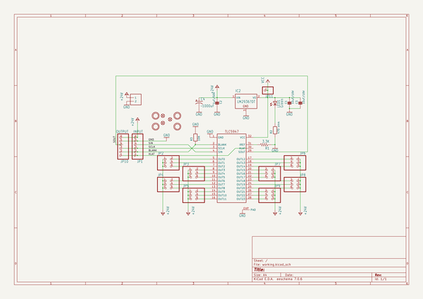

# adafruit_tlc5947_pcb
 
## summary 
* id: adafruit_adafruit_tlc5947_pcb_adafruit_tlc5947
* user: adafruit
* name: adafruit_tlc5947_pcb
* board: adafruit_tlc5947
* repo: https://github.com/adafruit/Adafruit-TLC5947-PCB

* src_file_repo_sch: 
* src_file_repo_sch_link: https://github.com/adafruit/Adafruit-TLC5947-PCB/tree/master/
* full details link: https://github.com/oomlout/oomlout_oomp_project_bot_v_2/tree/main/projects/adafruit_adafruit_tlc5947_pcb_adafruit_tlc5947/current_version/working  

## schematic  
  
[schematic (pdf)](working_schematic.pdf) 

## pcb  
 
  
  
  
[board (pdf)](working.pdf)  

## working_bom
| Id | Designator | Footprint | Quantity | Designation | Supplier and ref |  | None | 
| --- | --- | --- | --- | --- | --- | --- | --- | 
| 1 | C3,C1 | 0805 | 2 | 10uF/16V |  |  | [''] | 
| 2 | JP8,JP6,JP2,JP3,JP4,JP9,JP5,JP7 | 2X03_ROUND_70MIL | 8 |  |  |  | [''] | 
| 3 | LED1 | CHIP-LED0805 | 1 | Green |  |  | [''] | 
| 4 | C4 | E3,5-8 | 1 | ~1000uF |  |  | [''] | 
| 5 | U$1,U$2,U$4,U$3 | MOUNTINGHOLE_2.5_PLATED | 4 | MOUNTINGHOLE2.5 |  |  | [''] | 
| 6 | JP1 | 1X06-CLEANBIG | 1 | INPUT |  |  | [''] | 
| 7 | FID3,FID2,FID1 | FIDUCIAL_1MM | 3 | FIDUCIAL" |  |  | [''] | 
| 8 | IC2 | TO252 | 1 | LM2931ADT-5.0 |  |  | [''] | 
| 9 | R3 | 0805 | 1 | 10K |  |  | [''] | 
| 10 | C2 | 0805 | 1 | 1uF/50V |  |  | [''] | 
| 11 | R2 | 0805 | 1 | 470 ohm |  |  | [''] | 
| 12 | IC1 | HTSSOP32DAP | 1 | TLC5947-DAP |  |  | [''] | 
| 13 | JP11 | 1X01-CLEANBIG | 1 |  |  |  | [''] | 
| 14 | R1 | 0805-THM | 1 | 3.3K |  |  | [''] | 
| 15 | JP10 | 1X06-CLEANBIG | 1 | OUTPUT |  |  | [''] | 
| 16 | U$6 | ADAFRUIT_3.5MM | 1 |  |  |  | [''] | 
| 17 | U$5 | ADAFRUIT_TEXT_20MM | 1 |  |  |  | [''] | 
| 18 | J1 | 1X2-3.5MM | 1 | 1X2-3.5MM |  |  | [''] | 

## bom_schematic
| Ref | Qnty | Value | Cmp name | Footprint | Description | Vendor | DNP | 
| --- | --- | --- | --- | --- | --- | --- | --- | 
| C1, C3 | 2 | 10uF/16V | CAP_CERAMIC0805 | working:0805 |  |  |  | 
| C2 | 1 | 1uF/50V | CAP_CERAMIC0805 | working:0805 |  |  |  | 
| C4 | 1 | ~1000uF | CPOL-USE3.5-8 | working:E3,5-8 |  |  |  | 
| FID1, FID2, FID3 | 3 | FIDUCIAL"" | FIDUCIAL{dblquote}{dblquote} | working:FIDUCIAL_1MM |  |  |  | 
| IC1 | 1 | TLC5947-DAP | TLC5947-DAP | working:HTSSOP32DAP |  |  |  | 
| IC2 | 1 | LM2936?DT | LM2936?DT | working:TO252 |  |  |  | 
| J1 | 1 | 1X2-3.5MM | 1X2-3.5MM | working:1X2-3.5MM |  |  |  | 
| JP1 | 1 | INPUT | PINHD-1X6CB | working:1X06-CLEANBIG |  |  |  | 
| JP2, JP3, JP4, JP5, JP6, JP7, JP8, JP9 | 8 | HEADER-2X3 | HEADER-2X3 | working:2X03_ROUND_70MIL |  |  |  | 
| JP10 | 1 | OUTPUT | PINHD-1X6CB | working:1X06-CLEANBIG |  |  |  | 
| JP11 | 1 | PINHD-1X1CB | PINHD-1X1CB | working:1X01-CLEANBIG |  |  |  | 
| LED1 | 1 | Green | LEDCHIP-LED0805 | working:CHIP-LED0805 |  |  |  | 
| R1 | 1 | 3.3K | FLIPFLOP-RES | working:0805-THM |  |  |  | 
| R2 | 1 | 470 ohm | RESISTOR0805 | working:0805 |  |  |  | 
| R3 | 1 | 10K | RESISTOR0805 | working:0805 |  |  |  | 
| U$1, U$2, U$3, U$4 | 4 | MOUNTINGHOLE2.5 | MOUNTINGHOLE2.5 | working:MOUNTINGHOLE_2.5_PLATED |  |  |  | 

## mounting_holes
| x | y | package | value | ref | size | 
| --- | --- | --- | --- | --- | --- | 
| 0.0 | 20.32 | MOUNTINGHOLE_2.5_PLATED | MOUNTINGHOLE2.5 | U$1 | m3 | 
| 45.72 | 20.32 | MOUNTINGHOLE_2.5_PLATED | MOUNTINGHOLE2.5 | U$2 | m3 | 
| 0.0 | 0.0 | MOUNTINGHOLE_2.5_PLATED | MOUNTINGHOLE2.5 | U$3 | m3 | 
| 45.72 | 0.0 | MOUNTINGHOLE_2.5_PLATED | MOUNTINGHOLE2.5 | U$4 | m3 | 

