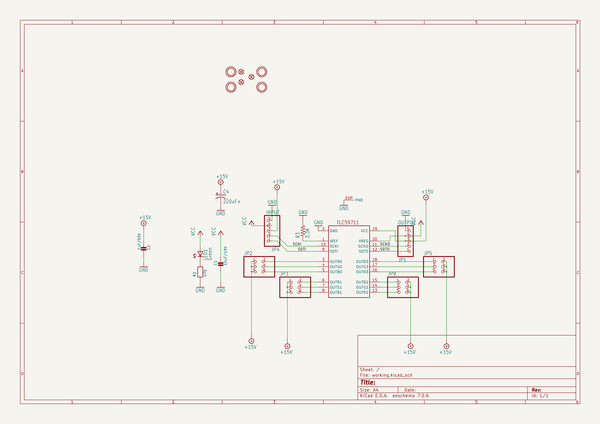

# adafruit_tlc59711_breakout_pcb
 
## summary 
* id: adafruit_adafruit_tlc59711_breakout_pcb_adafruit_tlc59711_v1
* user: adafruit
* name: adafruit_tlc59711_breakout_pcb
* board: adafruit_tlc59711_v1
* repo: https://github.com/adafruit/Adafruit-TLC59711-Breakout-PCB

* src_file_repo_sch: 
* src_file_repo_sch_link: https://github.com/adafruit/Adafruit-TLC59711-Breakout-PCB/tree/master/
* full details link: https://github.com/oomlout/oomlout_oomp_project_bot_v_2/tree/main/projects/adafruit_adafruit_tlc59711_breakout_pcb_adafruit_tlc59711_v1/current_version/working  

## schematic  
  
[schematic (pdf)](working_schematic.pdf) 

## pcb  
 
  
  
  
[board (pdf)](working.pdf)  

## working_bom
| Id | Designator | Footprint | Quantity | Designation | Supplier and ref |  | None | 
| --- | --- | --- | --- | --- | --- | --- | --- | 
| 1 | FID1,FID3,FID2 | FIDUCIAL_1MM | 3 | FIDUCIAL" |  |  | [''] | 
| 2 | R2 | 0805 | 1 | 470 |  |  | [''] | 
| 3 | U$3,U$1,U$2,U$4 | MOUNTINGHOLE_2.5_PLATED | 4 | MOUNTINGHOLE2.5 |  |  | [''] | 
| 4 | R3 | 0805-THM-7 | 1 | 3.3K |  |  | [''] | 
| 5 | JP3,JP2,JP5,JP8 | 2X03_ROUND_70MIL | 4 |  |  |  | [''] | 
| 6 | JP1 | 1X05_ROUND_70 | 1 | OUTPUT |  |  | [''] | 
| 7 | C1 | 0805 | 1 | 10uF/16V |  |  | [''] | 
| 8 | LED1 | CHIP-LED0805 | 1 | Green |  |  | [''] | 
| 9 | C2 | 0805 | 1 | 1uF/50V |  |  | [''] | 
| 10 | C4 | E2,5-7 | 1 | 220uF+ |  |  | [''] | 
| 11 | IC1 | HTSSOP20DAP | 1 | TLC59711 |  |  | [''] | 
| 12 | JP4 | 1X05_ROUND_70 | 1 | INPUT |  |  | [''] | 
| 13 | U$7 | ADAFRUIT_2.5MM | 1 |  |  |  | [''] | 
| 14 | U$8 | ADAFRUIT_3.5MM | 1 |  |  |  | [''] | 

## bom_schematic
| Ref | Qnty | Value | Cmp name | Footprint | Description | Vendor | DNP | 
| --- | --- | --- | --- | --- | --- | --- | --- | 
| C1 | 1 | 10uF/16V | CAP_CERAMIC0805 | working:0805 |  |  |  | 
| C2 | 1 | 1uF/50V | CAP_CERAMIC0805 | working:0805 |  |  |  | 
| C4 | 1 | 220uF+ | CPOL-USE2.5-7 | working:E2,5-7 |  |  |  | 
| FID1, FID2, FID3 | 3 | FIDUCIAL"" | FIDUCIAL{dblquote}{dblquote} | working:FIDUCIAL_1MM |  |  |  | 
| IC1 | 1 | TLC59711 | TLC59711 | working:HTSSOP20DAP |  |  |  | 
| JP1 | 1 | OUTPUT | HEADER-1X570MIL | working:1X05_ROUND_70 |  |  |  | 
| JP2, JP3, JP5, JP8 | 4 | HEADER-2X3 | HEADER-2X3 | working:2X03_ROUND_70MIL |  |  |  | 
| JP4 | 1 | INPUT | HEADER-1X570MIL | working:1X05_ROUND_70 |  |  |  | 
| LED1 | 1 | Green | LEDCHIP-LED0805 | working:CHIP-LED0805 |  |  |  | 
| R2 | 1 | 470 | RESISTOR0805 | working:0805 |  |  |  | 
| R3 | 1 | 3.3K | R-US_FLIPFLOP7 | working:0805-THM-7 |  |  |  | 
| U$1, U$2, U$3, U$4 | 4 | MOUNTINGHOLE2.5 | MOUNTINGHOLE2.5 | working:MOUNTINGHOLE_2.5_PLATED |  |  |  | 

## mounting_holes
| x | y | package | value | ref | size | 
| --- | --- | --- | --- | --- | --- | 
| 0.0 | 17.91 | MOUNTINGHOLE_2.5_PLATED | MOUNTINGHOLE2.5 | U$1 | m3 | 
| 22.73 | 17.78 | MOUNTINGHOLE_2.5_PLATED | MOUNTINGHOLE2.5 | U$2 | m3 | 
| 0.0 | 0.13 | MOUNTINGHOLE_2.5_PLATED | MOUNTINGHOLE2.5 | U$3 | m3 | 
| 22.73 | 0.0 | MOUNTINGHOLE_2.5_PLATED | MOUNTINGHOLE2.5 | U$4 | m3 | 

