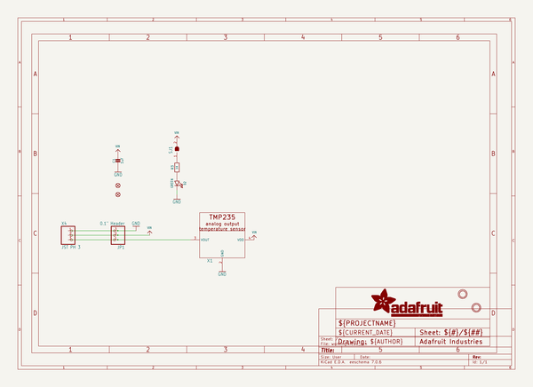

# adafruit_tmp235_pcb
 
## summary 
* id: adafruit_adafruit_tmp235_pcb_tmp235_rev_a
* user: adafruit
* name: adafruit_tmp235_pcb
* board: tmp235_rev_a
* repo: https://github.com/adafruit/Adafruit-TMP235-PCB

* src_file_repo_sch: 
* src_file_repo_sch_link: https://github.com/adafruit/Adafruit-TMP235-PCB/tree/main/
* full details link: https://github.com/oomlout/oomlout_oomp_project_bot_v_2/tree/main/projects/adafruit_adafruit_tmp235_pcb_tmp235_rev_a/current_version/working  

## schematic  
  
[schematic (pdf)](working_schematic.pdf)  

## pcb  
 
  
  
  
[board (pdf)](working.pdf)  

## working_bom
| Id | Designator | Footprint | Quantity | Designation | Supplier and ref |  | None | 
| --- | --- | --- | --- | --- | --- | --- | --- | 
| 1 | C1 | 0805-NO | 1 | 1uF |  |  | [''] | 
| 2 | U$8,U$1 | MOUNTINGHOLE_2.5_PLATED | 2 | MOUNTINGHOLE2.5 |  |  | [''] | 
| 3 | FID2,FID3 | FIDUCIAL_1MM | 2 | FIDUCIAL_1MM |  |  | [''] | 
| 4 | R3 | 0603-NO | 1 | 1K |  |  | [''] | 
| 5 | X4 | JSTPH3 | 1 | JST PH 3 |  |  | [''] | 
| 6 | JP1 | 1X03_OVAL | 1 | 0.1 Header" |  |  | [''] | 
| 7 | D2 | CHIPLED_0805_NOOUTLINE | 1 | GREEN |  |  | [''] | 
| 8 | X1 | SC70-5 | 1 | TMP235_DCKR |  |  | [''] | 
| 9 | U$13 | TMP235_FRONT | 1 |  |  |  | [''] | 
| 10 | U$5 | PCBFEAT-REV-040 | 1 |  |  |  | [''] | 
| 11 | SJ1 | SOLDERJUMPER_CLOSEDWIRE | 1 |  |  |  | [''] | 
| 12 | U$12 | TMP235_BACK | 1 |  |  |  | [''] | 

## bom_schematic
| Ref | Qnty | Value | Cmp name | Footprint | Description | Vendor | DNP | 
| --- | --- | --- | --- | --- | --- | --- | --- | 
| C1 | 1 | 1uF | CAP_CERAMIC0805-NOOUTLINE | working:0805-NO |  |  |  | 
| D2 | 1 | GREEN | LED0805_NOOUTLINE | working:CHIPLED_0805_NOOUTLINE |  |  |  | 
| FID2, FID3 | 2 | FIDUCIAL_1MM | FIDUCIAL_1MM | working:FIDUCIAL_1MM |  |  |  | 
| JP1 | 1 | 0.1" Header | HEADER-1X3 | working:1X03_OVAL |  |  |  | 
| R3 | 1 | 1K | RESISTOR_0603_NOOUT | working:0603-NO |  |  |  | 
| SJ1 | 1 | SOLDERJUMPER_CLOSED | SOLDERJUMPER_CLOSED | working:SOLDERJUMPER_CLOSEDWIRE |  |  |  | 
| U$1, U$8 | 2 | MOUNTINGHOLE2.5 | MOUNTINGHOLE2.5 | working:MOUNTINGHOLE_2.5_PLATED |  |  |  | 
| X1 | 1 | TMP235_DCKR | TMP235_DCKR | working:SC70-5 |  |  |  | 
| X4 | 1 | JST PH 3 | CON_JST_PH_3PIN | working:JSTPH3 |  |  |  | 

## mounting_holes
| x | y | package | value | ref | size | 
| --- | --- | --- | --- | --- | --- | 
| 0.0 | 0.0 | MOUNTINGHOLE_2.5_PLATED | MOUNTINGHOLE2.5 | U$1 | m3 | 
| 0.0 | 12.700000000000003 | MOUNTINGHOLE_2.5_PLATED | MOUNTINGHOLE2.5 | U$8 | m3 | 

