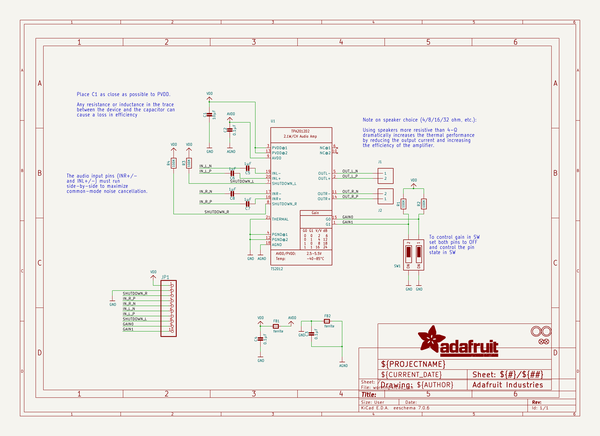

# adafruit_tpa2012_or_ts2012_breakout_pcb
 
## summary 
* id: adafruit_adafruit_tpa2012_or_ts2012_breakout_pcb_adafruit_ts2012_tpa2012_class_d_audio_amp
* user: adafruit
* name: adafruit_tpa2012_or_ts2012_breakout_pcb
* board: adafruit_ts2012_tpa2012_class_d_audio_amp
* repo: https://github.com/adafruit/Adafruit-TPA2012-or-TS2012-Breakout-PCB

* src_file_repo_sch: 
* src_file_repo_sch_link: https://github.com/adafruit/Adafruit-TPA2012-or-TS2012-Breakout-PCB/tree/master/
* full details link: https://github.com/oomlout/oomlout_oomp_project_bot_v_2/tree/main/projects/adafruit_adafruit_tpa2012_or_ts2012_breakout_pcb_adafruit_ts2012_tpa2012_class_d_audio_amp/current_version/working  

## schematic  
  
[schematic (pdf)](working_schematic.pdf)  

## pcb  
 
  
  
  
[board (pdf)](working.pdf)  

## working_bom
| Id | Designator | Footprint | Quantity | Designation | Supplier and ref |  | None | 
| --- | --- | --- | --- | --- | --- | --- | --- | 
| 1 | FB2,FB1 | _0805MP | 2 | ferrite |  |  | [''] | 
| 2 | C4,C3,C2 | _0805MP | 3 | 0.1µF |  |  | [''] | 
| 3 | U$23 | PCBFEAT-REV-040 | 1 |  |  |  | [''] | 
| 4 | U$22 | ADAFRUIT_2.5MM | 1 |  |  |  | [''] | 
| 5 | JP1 | 1X10_ROUND70 | 1 |  |  |  | [''] | 
| 6 | R2,R4,R3,R1 | _0805MP | 4 | 100K |  |  | [''] | 
| 7 | J1,J2 | TERMBLOCK_1X2-3.5MM | 2 |  |  |  | [''] | 
| 8 | C5,C6,C7,C8 | _0805MP | 4 | 1µF |  |  | [''] | 
| 9 | U$21,U$20 | MOUNTINGHOLE_2.5_PLATED_THICK | 2 | MOUNTINGHOLE2.5_THICK |  |  | [''] | 
| 10 | FID2,FID1 | FIDUCIAL_1MM | 2 | FIDUCIAL" |  |  | [''] | 
| 11 | SW1 | DIPSWITCH_2PIN | 1 |  |  |  | [''] | 
| 12 | U1 | WQFN20 | 1 | TS2012 |  |  | [''] | 
| 13 | C1 | _0805MP | 1 | 10µF |  |  | [''] | 

## bom_schematic
| Ref | Qnty | Value | Cmp name | Footprint | Description | Vendor | DNP | 
| --- | --- | --- | --- | --- | --- | --- | --- | 
| C1 | 1 | 10µF | CAP_CERAMIC_0805MP | working:_0805MP |  |  |  | 
| C2, C3, C4 | 3 | 0.1µF | CAP_CERAMIC_0805MP | working:_0805MP |  |  |  | 
| C5, C6, C7, C8 | 4 | 1µF | CAP_CERAMIC_0805MP | working:_0805MP |  |  |  | 
| FB1, FB2 | 2 | ferrite | FERRITE_0805MP | working:_0805MP |  |  |  | 
| FID1, FID2 | 2 | FIDUCIAL"" | FIDUCIAL{dblquote}{dblquote} | working:FIDUCIAL_1MM |  |  |  | 
| J1, J2 | 2 | TERMBLOCK_1X2 | TERMBLOCK_1X2 | working:TERMBLOCK_1X2-3.5MM |  |  |  | 
| JP1 | 1 | HEADER-1X1070MIL | HEADER-1X1070MIL | working:1X10_ROUND70 |  |  |  | 
| R1, R2, R3, R4 | 4 | 100K | RESISTOR_0805MP | working:_0805MP |  |  |  | 
| SW1 | 1 | DIPSWITCH_2PIN | DIPSWITCH_2PIN | working:DIPSWITCH_2PIN |  |  |  | 
| U1 | 1 | TS2012 | AUDIOAMP_TPA2012D2 | working:WQFN20 |  |  |  | 
| U$20, U$21 | 2 | MOUNTINGHOLE2.5_THICK | MOUNTINGHOLE2.5_THICK | working:MOUNTINGHOLE_2.5_PLATED_THICK |  |  |  | 

## mounting_holes
| x | y | package | value | ref | size | 
| --- | --- | --- | --- | --- | --- | 
| 0.0 | 0.0 | MOUNTINGHOLE_2.5_PLATED_THICK | MOUNTINGHOLE2.5_THICK | U$20 | m3 | 
| 0.0 | 23.0 | MOUNTINGHOLE_2.5_PLATED_THICK | MOUNTINGHOLE2.5_THICK | U$21 | m3 | 

