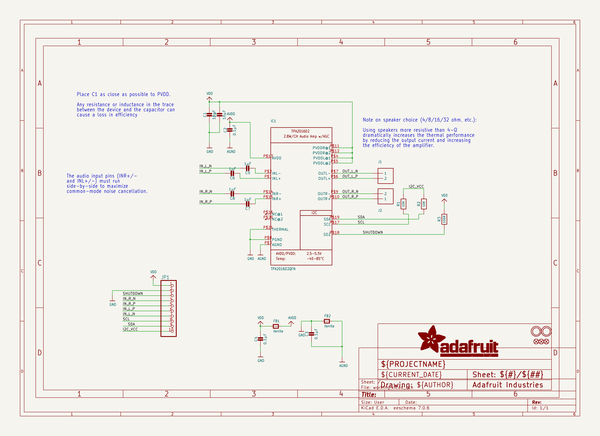
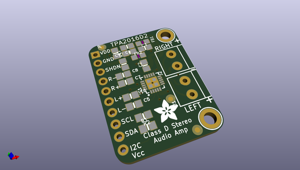
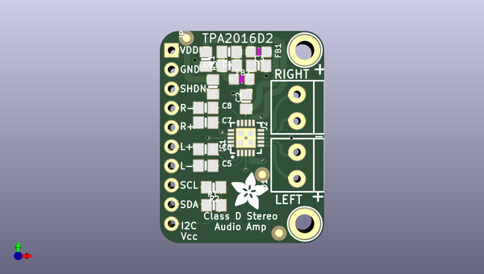
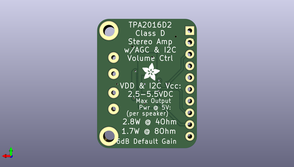

# adafruit_tpa2016_pcb
 
## summary 
* id: adafruit_adafruit_tpa2016_pcb_adafruit_tpa2016d2
* user: adafruit
* name: adafruit_tpa2016_pcb
* board: adafruit_tpa2016d2
* repo: https://github.com/adafruit/Adafruit-TPA2016-PCB

* src_file_repo_sch: 
* src_file_repo_sch_link: https://github.com/adafruit/Adafruit-TPA2016-PCB/tree/master/
* full details link: https://github.com/oomlout/oomlout_oomp_project_bot_v_2/tree/main/projects/adafruit_adafruit_tpa2016_pcb_adafruit_tpa2016d2/current_version/working  

## schematic  
  
[schematic (pdf)](working_schematic.pdf) 

## pcb  
 
  
  
  
[board (pdf)](working.pdf)  

## working_bom
| Id | Designator | Footprint | Quantity | Designation | Supplier and ref |  | None | 
| --- | --- | --- | --- | --- | --- | --- | --- | 
| 1 | FB1,FB2 | _0805MP | 2 | ferrite |  |  | [''] | 
| 2 | R2,R1 | 0805-NO | 2 | 10K |  |  | [''] | 
| 3 | J1,J2 | TERMBLOCK_1X2-3.5MM | 2 |  |  |  | [''] | 
| 4 | U$20,U$21 | MOUNTINGHOLE_2.5_PLATED_THICK | 2 | MOUNTINGHOLE2.5_THICK |  |  | [''] | 
| 5 | C4,C2,C3 | 0805-NO | 3 | 0.1µF |  |  | [''] | 
| 6 | C9,C1 | 0805-NO | 2 | 10µF |  |  | [''] | 
| 7 | C7,C5,C6,C8 | 0805-NO | 4 | 1µF |  |  | [''] | 
| 8 | IC1 | QFN20_4MM | 1 | TPA2016D2QFN |  |  | [''] | 
| 9 | R3 | 0805-NO | 1 | 100K |  |  | [''] | 
| 10 | FID1,FID3,FID2 | FIDUCIAL_1MM | 3 | FIDUCIAL" |  |  | [''] | 
| 11 | JP1 | 1X10_ROUND70 | 1 |  |  |  | [''] | 
| 12 | U$3 | ADAFRUIT_5MM | 1 |  |  |  | [''] | 
| 13 | U$4 | ADAFRUIT_3.5MM | 1 |  |  |  | [''] | 

## bom_schematic
| Ref | Qnty | Value | Cmp name | Footprint | Description | Vendor | DNP | 
| --- | --- | --- | --- | --- | --- | --- | --- | 
| C1, C9 | 2 | 10µF | CAP_CERAMIC0805-NOOUTLINE | working:0805-NO |  |  |  | 
| C2, C3, C4 | 3 | 0.1µF | CAP_CERAMIC0805-NOOUTLINE | working:0805-NO |  |  |  | 
| C5, C6, C7, C8 | 4 | 1µF | CAP_CERAMIC0805-NOOUTLINE | working:0805-NO |  |  |  | 
| FB1, FB2 | 2 | ferrite | FERRITE_0805MP | working:_0805MP |  |  |  | 
| FID1, FID2, FID3 | 3 | FIDUCIAL"" | FIDUCIAL{dblquote}{dblquote} | working:FIDUCIAL_1MM |  |  |  | 
| IC1 | 1 | TPA2016D2QFN | TPA2016D2QFN | working:QFN20_4MM |  |  |  | 
| J1, J2 | 2 | TERMBLOCK_1X2 | TERMBLOCK_1X2 | working:TERMBLOCK_1X2-3.5MM |  |  |  | 
| JP1 | 1 | HEADER-1X1070MIL | HEADER-1X1070MIL | working:1X10_ROUND70 |  |  |  | 
| R1, R2 | 2 | 10K | RESISTOR0805_NOOUTLINE | working:0805-NO |  |  |  | 
| R3 | 1 | 100K | RESISTOR0805_NOOUTLINE | working:0805-NO |  |  |  | 
| U$20, U$21 | 2 | MOUNTINGHOLE2.5_THICK | MOUNTINGHOLE2.5_THICK | working:MOUNTINGHOLE_2.5_PLATED_THICK |  |  |  | 

## mounting_holes
| x | y | package | value | ref | size | 
| --- | --- | --- | --- | --- | --- | 
| 0.0 | 0.0 | MOUNTINGHOLE_2.5_PLATED_THICK | MOUNTINGHOLE2.5_THICK | U$20 | m3 | 
| 0.0 | 22.86 | MOUNTINGHOLE_2.5_PLATED_THICK | MOUNTINGHOLE2.5_THICK | U$21 | m3 | 

