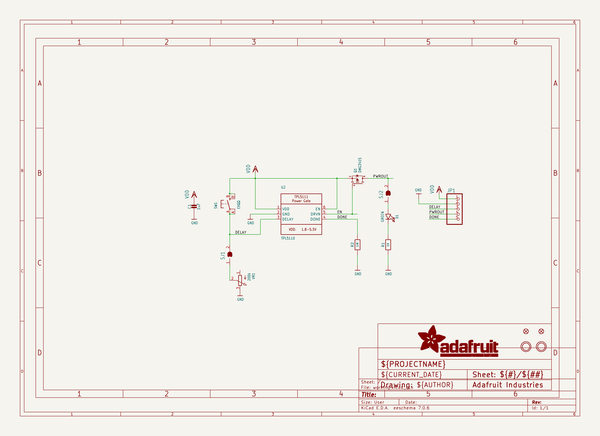
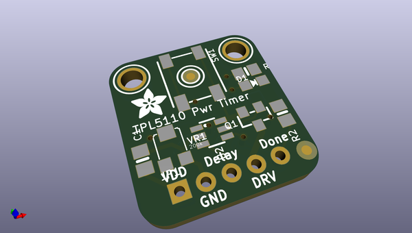
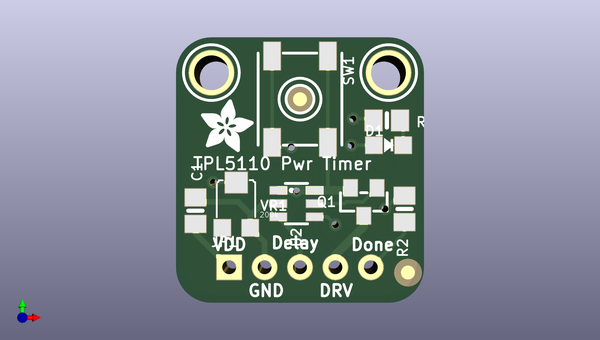
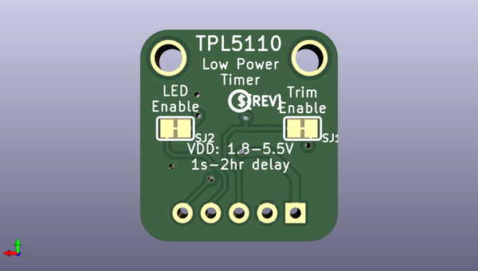

# adafruit_tpl5110_power_timer_breakout_pcb
 
## summary 
* id: adafruit_adafruit_tpl5110_power_timer_breakout_pcb_adafruit_tpl5110
* user: adafruit
* name: adafruit_tpl5110_power_timer_breakout_pcb
* board: adafruit_tpl5110
* repo: https://github.com/adafruit/Adafruit-TPL5110-Power-Timer-Breakout-PCB

* src_file_repo_sch: 
* src_file_repo_sch_link: https://github.com/adafruit/Adafruit-TPL5110-Power-Timer-Breakout-PCB/tree/master/
* full details link: https://github.com/oomlout/oomlout_oomp_project_bot_v_2/tree/main/projects/adafruit_adafruit_tpl5110_power_timer_breakout_pcb_adafruit_tpl5110/current_version/working  

## schematic  
  
[schematic (pdf)](working_schematic.pdf) 

## pcb  
 
  
  
  
[board (pdf)](working.pdf)  

## working_bom
| Id | Designator | Footprint | Quantity | Designation | Supplier and ref |  | None | 
| --- | --- | --- | --- | --- | --- | --- | --- | 
| 1 | R1 | 0805-NO | 1 | 1K |  |  | [''] | 
| 2 | FID2,FID1 | FIDUCIAL_1MM | 2 | FIDUCIAL" |  |  | [''] | 
| 3 | VR1 | TRIMPOT_BOURNS_TC33X-2 | 1 | 200k |  |  | [''] | 
| 4 | U$7,U$8 | MOUNTINGHOLE_2.5_PLATED | 2 | MOUNTINGHOLE2.5 |  |  | [''] | 
| 5 | U$5 | ADAFRUIT_3.5MM | 1 |  |  |  | [''] | 
| 6 | U2 | SOT23-6 | 1 | TPL5110 |  |  | [''] | 
| 7 | SW1 | EVQ-Q2_SMALLER | 1 | EVQQ |  |  | [''] | 
| 8 | Q1 | SOT23-WIDE | 1 | DMG3415 |  |  | [''] | 
| 9 | R2 | 0805-NO | 1 | 1M |  |  | [''] | 
| 10 | JP1 | 1X05_ROUND_70 | 1 |  |  |  | [''] | 
| 11 | D1 | CHIPLED_0805_NOOUTLINE | 1 | GREEN |  |  | [''] | 
| 12 | C1 | 0805-NO | 1 | 1uF |  |  | [''] | 
| 13 | SJ2,SJ1 | SOLDERJUMPER_CLOSEDWIRE | 2 |  |  |  | [''] | 
| 14 | U$11 | PCBFEAT-REV-040 | 1 |  |  |  | [''] | 

## bom_schematic
| Ref | Qnty | Value | Cmp name | Footprint | Description | Vendor | DNP | 
| --- | --- | --- | --- | --- | --- | --- | --- | 
| C1 | 1 | 1uF | CAP_CERAMIC0805-NOOUTLINE | working:0805-NO |  |  |  | 
| D1 | 1 | GREEN | LED0805_NOOUTLINE | working:CHIPLED_0805_NOOUTLINE |  |  |  | 
| FID1, FID2 | 2 | FIDUCIAL"" | FIDUCIAL{dblquote}{dblquote} | working:FIDUCIAL_1MM |  |  |  | 
| JP1 | 1 | HEADER-1X570MIL | HEADER-1X570MIL | working:1X05_ROUND_70 |  |  |  | 
| Q1 | 1 | DMG3415 | MOSFET-PWIDE | working:SOT23-WIDE |  |  |  | 
| R1 | 1 | 1K | RESISTOR0805_NOOUTLINE | working:0805-NO |  |  |  | 
| R2 | 1 | 1M | RESISTOR0805_NOOUTLINE | working:0805-NO |  |  |  | 
| SJ1, SJ2 | 2 | SOLDERJUMPERCLOSED | SOLDERJUMPERCLOSED | working:SOLDERJUMPER_CLOSEDWIRE |  |  |  | 
| SW1 | 1 | EVQQ | SWITCH_TACT_SMT_EVQQ2_SMALL | working:EVQ-Q2_SMALLER |  |  |  | 
| U2 | 1 | TPL5110 | TPL5111 | working:SOT23-6 |  |  |  | 
| U$7, U$8 | 2 | MOUNTINGHOLE2.5 | MOUNTINGHOLE2.5 | working:MOUNTINGHOLE_2.5_PLATED |  |  |  | 
| VR1 | 1 | 200k | TRIMPOTTC33X-2 | working:TRIMPOT_BOURNS_TC33X-2 |  |  |  | 

## mounting_holes
| x | y | package | value | ref | size | 
| --- | --- | --- | --- | --- | --- | 
| 12.7 | 0.0 | MOUNTINGHOLE_2.5_PLATED | MOUNTINGHOLE2.5 | U$7 | m3 | 
| 0.0 | 0.0 | MOUNTINGHOLE_2.5_PLATED | MOUNTINGHOLE2.5 | U$8 | m3 | 

