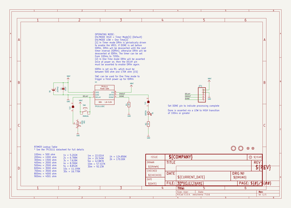
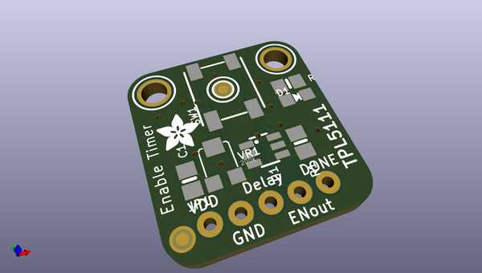
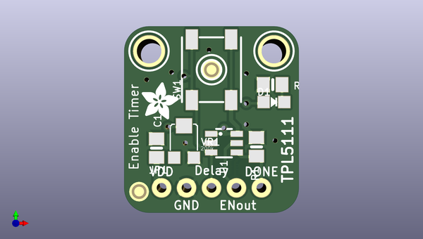
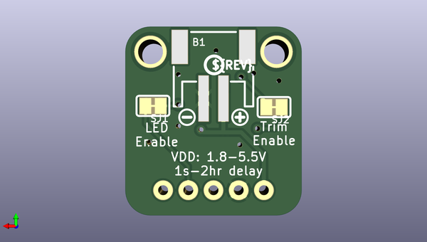

# adafruit_tpl5111_reset_enable_timer_pcb
 
## summary 
* id: adafruit_adafruit_tpl5111_reset_enable_timer_pcb_adafruit_tpl5111_reset_enable_timer
* user: adafruit
* name: adafruit_tpl5111_reset_enable_timer_pcb
* board: adafruit_tpl5111_reset_enable_timer
* repo: https://github.com/adafruit/Adafruit-TPL5111-Reset-Enable-Timer-PCB

* src_file_repo_sch: 
* src_file_repo_sch_link: https://github.com/adafruit/Adafruit-TPL5111-Reset-Enable-Timer-PCB/tree/master/
* full details link: https://github.com/oomlout/oomlout_oomp_project_bot_v_2/tree/main/projects/adafruit_adafruit_tpl5111_reset_enable_timer_pcb_adafruit_tpl5111_reset_enable_timer/current_version/working  

## schematic  
  
[schematic (pdf)](working_schematic.pdf)  

## pcb  
 
  
  
  
[board (pdf)](working.pdf)  

## working_bom
| Id | Designator | Footprint | Quantity | Designation | Supplier and ref |  | None | 
| --- | --- | --- | --- | --- | --- | --- | --- | 
| 1 | U1 | SOT23-6 | 1 | TPL5111DDC |  |  | [''] | 
| 2 | U$8,U$9 | MOUNTINGHOLE_2.5_PLATED | 2 | MOUNTINGHOLE2.5 |  |  | [''] | 
| 3 | FID2,FID3 | FIDUCIAL_1MM | 2 | FIDUCIAL_1MM |  |  | [''] | 
| 4 | JP1 | 1X05_ROUND_76 | 1 |  |  |  | [''] | 
| 5 | D1 | CHIPLED_0805_NOOUTLINE | 1 | GREEN |  |  | [''] | 
| 6 | VR1 | TRIMPOT_BOURNS_TC33X-2 | 1 | 200k |  |  | [''] | 
| 7 | C1 | 0805-NO | 1 | 10uF |  |  | [''] | 
| 8 | SW1 | EVQ-Q2_SMALLER | 1 | MANUAL |  |  | [''] | 
| 9 | U$10 | ADAFRUIT_3.5MM | 1 |  |  |  | [''] | 
| 10 | R2 | 0805-NO | 1 | 1K |  |  | [''] | 
| 11 | R1 | 0805-NO | 1 | 1M |  |  | [''] | 
| 12 | SJ1,SJ2 | SOLDERJUMPER_CLOSEDWIRE | 2 |  |  |  | [''] | 
| 13 | U$15 | PCBFEAT-REV-040 | 1 |  |  |  | [''] | 
| 14 | B1 | JSTPH2 | 1 | JSTPH2 |  |  | [''] | 
| 15 | U$12 | SYMBOL_MINUS | 1 |  |  |  | [''] | 
| 16 | U$11 | SYMBOL_PLUS | 1 |  |  |  | [''] | 

## bom_schematic
| Ref | Qnty | Value | Cmp name | Footprint | Description | Vendor | DNP | 
| --- | --- | --- | --- | --- | --- | --- | --- | 
| B1 | 1 | JSTPH2 | BATTERY | working:JSTPH2 |  |  |  | 
| C1 | 1 | 10uF | CAP_CERAMIC0805-NOOUTLINE | working:0805-NO |  |  |  | 
| D1 | 1 | GREEN | LED0805_NOOUTLINE | working:CHIPLED_0805_NOOUTLINE |  |  |  | 
| FID2, FID3 | 2 | FIDUCIAL_1MM | FIDUCIAL_1MM | working:FIDUCIAL_1MM |  |  |  | 
| JP1 | 1 | HEADER-1X576MIL | HEADER-1X576MIL | working:1X05_ROUND_76 |  |  |  | 
| R1 | 1 | 1M | RESISTOR0805_NOOUTLINE | working:0805-NO |  |  |  | 
| R2 | 1 | 1K | RESISTOR0805_NOOUTLINE | working:0805-NO |  |  |  | 
| SJ1, SJ2 | 2 | SOLDERJUMPERCLOSED | SOLDERJUMPERCLOSED | working:SOLDERJUMPER_CLOSEDWIRE |  |  |  | 
| SW1 | 1 | MANUAL | SWITCH_TACT_SMT_EVQQ2_SMALL | working:EVQ-Q2_SMALLER |  |  |  | 
| U1 | 1 | TPL5111DDC | TPL5111 | working:SOT23-6 |  |  |  | 
| U$8, U$9 | 2 | MOUNTINGHOLE2.5 | MOUNTINGHOLE2.5 | working:MOUNTINGHOLE_2.5_PLATED |  |  |  | 
| VR1 | 1 | 200k | TRIMPOTTC33X-2 | working:TRIMPOT_BOURNS_TC33X-2 |  |  |  | 

## mounting_holes
| x | y | package | value | ref | size | 
| --- | --- | --- | --- | --- | --- | 
| 12.699999999999989 | 0.0 | MOUNTINGHOLE_2.5_PLATED | MOUNTINGHOLE2.5 | U$8 | m3 | 
| 0.0 | 0.0 | MOUNTINGHOLE_2.5_PLATED | MOUNTINGHOLE2.5 | U$9 | m3 | 

