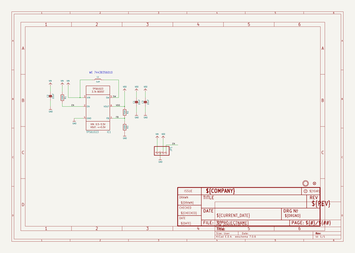

# adafruit_tps61023_pcb
 
## summary 
* id: adafruit_adafruit_tps61023_pcb_adafruit_tps61023
* user: adafruit
* name: adafruit_tps61023_pcb
* board: adafruit_tps61023
* repo: https://github.com/adafruit/Adafruit-TPS61023-PCB

* src_file_repo_sch: 
* src_file_repo_sch_link: https://github.com/adafruit/Adafruit-TPS61023-PCB/tree/master/
* full details link: https://github.com/oomlout/oomlout_oomp_project_bot_v_2/tree/main/projects/adafruit_adafruit_tps61023_pcb_adafruit_tps61023/current_version/working  

## schematic  
  
[schematic (pdf)](working_schematic.pdf)  

## pcb  
 
  
  
  
[board (pdf)](working.pdf)  

## working_bom
| Id | Designator | Footprint | Quantity | Designation | Supplier and ref |  | None | 
| --- | --- | --- | --- | --- | --- | --- | --- | 
| 1 | IC1 | SOT563 | 1 | TPS61023 |  |  | [''] | 
| 2 | R3,R1 | 0603-NO | 2 | 100K |  |  | [''] | 
| 3 | JP1 | 1X04_ROUND | 1 |  |  |  | [''] | 
| 4 | L1 | INDUCTOR_5X5MM_TDK_VLC5045 | 1 | 1uH |  |  | [''] | 
| 5 | C1,C2,C3 | 0805-NO | 3 | 22uF |  |  | [''] | 
| 6 | FID1 | FIDUCIAL_1MM | 1 | FIDUCIAL_1MM |  |  | [''] | 
| 7 | U$9 | MOUNTINGHOLE_2.5_PLATED | 1 | MOUNTINGHOLE2.5 |  |  | [''] | 
| 8 | R2 | 0603-NO | 1 | 732K |  |  | [''] | 
| 9 | U$10 | PCBFEAT-REV-040 | 1 |  |  |  | [''] | 
| 10 | U$11 | ADAFRUIT_2.5MM | 1 |  |  |  | [''] | 

## bom_schematic
| Ref | Qnty | Value | Cmp name | Footprint | Description | Vendor | DNP | 
| --- | --- | --- | --- | --- | --- | --- | --- | 
| C1, C2, C3 | 3 | 22uF | CAP_CERAMIC0805-NOOUTLINE | working:0805-NO |  |  |  | 
| FID1 | 1 | FIDUCIAL_1MM | FIDUCIAL_1MM | working:FIDUCIAL_1MM |  |  |  | 
| IC1 | 1 | TPS61023 | TPS61023 | working:SOT563 |  |  |  | 
| JP1 | 1 | HEADER-1X4ROUND | HEADER-1X4ROUND | working:1X04_ROUND |  |  |  | 
| L1 | 1 | 1uH | INDUCTORTDK_VLC5045 | working:INDUCTOR_5X5MM_TDK_VLC5045 |  |  |  | 
| R1, R3 | 2 | 100K | RESISTOR_0603_NOOUT | working:0603-NO |  |  |  | 
| R2 | 1 | 732K | RESISTOR_0603_NOOUT | working:0603-NO |  |  |  | 
| U$9 | 1 | MOUNTINGHOLE2.5 | MOUNTINGHOLE2.5 | working:MOUNTINGHOLE_2.5_PLATED |  |  |  | 

## mounting_holes
| x | y | package | value | ref | size | 
| --- | --- | --- | --- | --- | --- | 
| 0.0 | 0.0 | MOUNTINGHOLE_2.5_PLATED | MOUNTINGHOLE2.5 | U$9 | m3 | 

