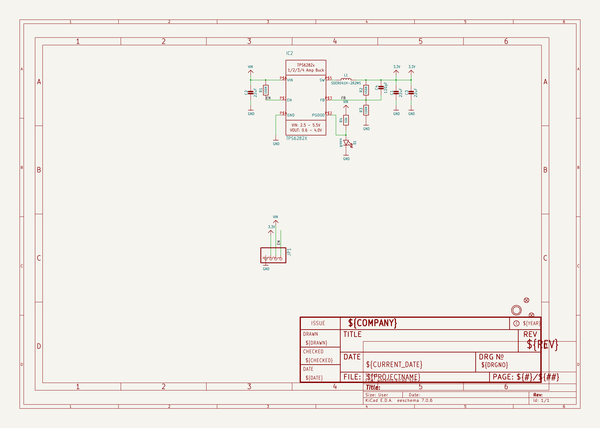

# adafruit_tps62827_pcb
 
## summary 
* id: adafruit_adafruit_tps62827_pcb_tps62827_3_3v_buck_converter
* user: adafruit
* name: adafruit_tps62827_pcb
* board: tps62827_3_3v_buck_converter
* repo: https://github.com/adafruit/Adafruit-TPS62827-PCB

* src_file_repo_sch: 
* src_file_repo_sch_link: https://github.com/adafruit/Adafruit-TPS62827-PCB/tree/main/
* full details link: https://github.com/oomlout/oomlout_oomp_project_bot_v_2/tree/main/projects/adafruit_adafruit_tps62827_pcb_tps62827_3_3v_buck_converter/current_version/working  

## schematic  
  
[schematic (pdf)](working_schematic.pdf) 

## pcb  
 
  
  
  
[board (pdf)](working.pdf)  

## working_bom
| Id | Designator | Footprint | Quantity | Designation | Supplier and ref |  | None | 
| --- | --- | --- | --- | --- | --- | --- | --- | 
| 1 | C4 | 0603-NO | 1 | 120pF |  |  | [''] | 
| 2 | R1,R3 | 0603-NO | 2 | 100K |  |  | [''] | 
| 3 | C3,C1,C2 | 0805-NO | 3 | 22uF |  |  | [''] | 
| 4 | R2 | 0603-NO | 1 | 450K |  |  | [''] | 
| 5 | IC2 | VSON_6 | 1 | TPS6282X |  |  | [''] | 
| 6 | D1 | CHIPLED_0603_NOOUTLINE | 1 | green |  |  | [''] | 
| 7 | U$9 | MOUNTINGHOLE_2.5_PLATED | 1 | MOUNTINGHOLE2.5 |  |  | [''] | 
| 8 | L1 | INDUCTOR_4X4MM_SRP0415 | 1 | SDER041H-2R2MS |  |  | [''] | 
| 9 | U$11 | ADAFRUIT_2.5MM | 1 |  |  |  | [''] | 
| 10 | R4 | _0603MP | 1 | 10k |  |  | [''] | 
| 11 | FID2,FID1 | FIDUCIAL_1MM | 2 | FIDUCIAL_1MM |  |  | [''] | 
| 12 | JP1 | 1X04_ROUND | 1 |  |  |  | [''] | 
| 13 | U$18 | ADAFRUIT_3.5MM | 1 |  |  |  | [''] | 
| 14 | U$10 | PCBFEAT-REV-040 | 1 |  |  |  | [''] | 

## bom_schematic
| Ref | Qnty | Value | Cmp name | Footprint | Description | Vendor | DNP | 
| --- | --- | --- | --- | --- | --- | --- | --- | 
| C1, C2, C3 | 3 | 22uF | CAP_CERAMIC0805-NOOUTLINE | working:0805-NO |  |  |  | 
| C4 | 1 | 120pF | CAP_CERAMIC0603_NO | working:0603-NO |  |  |  | 
| D1 | 1 | green | LED0603_NOOUTLINE | working:CHIPLED_0603_NOOUTLINE |  |  |  | 
| FID1, FID2 | 2 | FIDUCIAL_1MM | FIDUCIAL_1MM | working:FIDUCIAL_1MM |  |  |  | 
| IC2 | 1 | TPS6282X | TPS6282X | working:VSON_6 |  |  |  | 
| JP1 | 1 | HEADER-1X4ROUND | HEADER-1X4ROUND | working:1X04_ROUND |  |  |  | 
| L1 | 1 | SDER041H-2R2MS | INDUCTOR_SRP0415 | working:INDUCTOR_4X4MM_SRP0415 |  |  |  | 
| R1, R3 | 2 | 100K | RESISTOR_0603_NOOUT | working:0603-NO |  |  |  | 
| R2 | 1 | 450K | RESISTOR_0603_NOOUT | working:0603-NO |  |  |  | 
| R4 | 1 | 10k | RESISTOR_0603MP | working:_0603MP |  |  |  | 
| U$9 | 1 | MOUNTINGHOLE2.5 | MOUNTINGHOLE2.5 | working:MOUNTINGHOLE_2.5_PLATED |  |  |  | 

## mounting_holes
| x | y | package | value | ref | size | 
| --- | --- | --- | --- | --- | --- | 
| 0.0 | 0.0 | MOUNTINGHOLE_2.5_PLATED | MOUNTINGHOLE2.5 | U$9 | m3 | 

