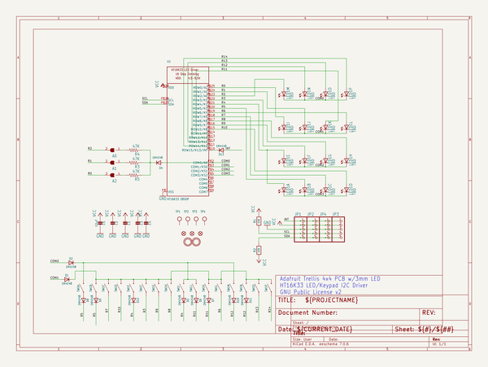
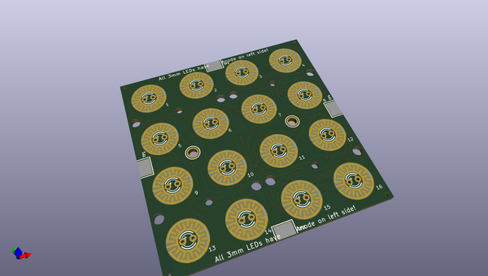
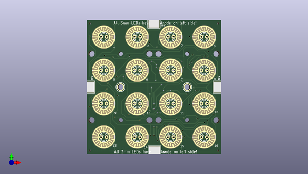
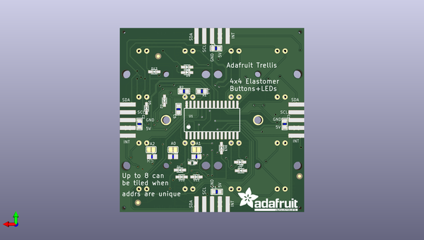

# adafruit_trellis
 
## summary 
* id: adafruit_adafruit_trellis_adafruit_trellis_4x4_3mm_ht16k33
* user: adafruit
* name: adafruit_trellis
* board: adafruit_trellis_4x4_3mm_ht16k33
* repo: https://github.com/adafruit/Adafruit_Trellis

* src_file_repo_sch: 
* src_file_repo_sch_link: https://github.com/adafruit/Adafruit_Trellis/tree/master/
* full details link: https://github.com/oomlout/oomlout_oomp_project_bot_v_2/tree/main/projects/adafruit_adafruit_trellis_adafruit_trellis_4x4_3mm_ht16k33/current_version/working  

## schematic  
  
[schematic (pdf)](working_schematic.pdf)  

## pcb  
 
  
  
  
[board (pdf)](working.pdf)  

## working_bom
| Id | Designator | Footprint | Quantity | Designation | Supplier and ref |  | None | 
| --- | --- | --- | --- | --- | --- | --- | --- | 
| 1 | U$2,U$1 | MOUNTINGHOLE_2.5_PLATED | 2 | MOUNTINGHOLE2.5 |  |  | [''] | 
| 2 | TP4,TP2,TP3,TP1 | TESTPOINT_SMT | 4 |  |  |  | [''] | 
| 3 | LED1 | LED3MM-4X4GRID | 1 | TBD |  |  | [''] | 
| 4 | SW1 | ELAST_PAD_SQUARE_10MM_5.4MM_4X4GRID | 1 |  |  |  | [''] | 
| 5 | C5 | _0805 | 1 | 10uF |  |  | [''] | 
| 6 | D8,D2,D11,D7,D13,D12,D6,D9,D10,D5,D1 | SOD-323 | 11 | 1N4148 |  |  | [''] | 
| 7 | U$3 | ADAFRUIT_TEXT_20MM | 1 |  |  |  | [''] | 
| 8 | D4 | SOD-323F | 1 | 1N4148 |  |  | [''] | 
| 9 | R1,R2 | _0805 | 2 | 10K |  |  | [''] | 
| 10 | R5,R3,R4 | R0805 | 3 | 47K |  |  | [''] | 
| 11 | U1 | SOP28_300MIL | 1 | HT16K33 28SOP |  |  | [''] | 
| 12 | C4,C3,C2,C1 | _0805 | 4 |  |  |  | [''] | 
| 13 | A2,A1,A0 | SOLDERJUMPER_REFLOW_NOPASTE | 3 |  |  |  | [''] | 
| 14 | FID3,FID1,FID2 | FIDUCIAL_1MM | 3 | FIDUCIAL" |  |  | [''] | 
| 15 | JP2,JP1,JP3,JP4 | 1X5_SMT | 4 |  |  |  | [''] | 

## bom_schematic
| Ref | Qnty | Value | Cmp name | Footprint | Description | Vendor | DNP | 
| --- | --- | --- | --- | --- | --- | --- | --- | 
| A0, A1, A2 | 3 | SOLDERJUMPERREFLOW_NOPASTE | SOLDERJUMPERREFLOW_NOPASTE | working:SOLDERJUMPER_REFLOW_NOPASTE |  |  |  | 
| C1, C2, C3, C4 | 4 | CAP_CERAMIC_0805 | CAP_CERAMIC_0805 | working:_0805 |  |  |  | 
| C5 | 1 | 10uF | CAP_CERAMIC_0805 | working:_0805 |  |  |  | 
| D1, D2, D5, D6, D7, D8, D9, D10, D11, D12, D13 | 11 | 1N4148 | DIODESOD-323 | working:SOD-323 |  |  |  | 
| D4 | 1 | 1N4148 | DIODESOD-323F | working:SOD-323F |  |  |  | 
| FID1, FID2, FID3 | 3 | FIDUCIAL"" | FIDUCIAL{dblquote}{dblquote} | working:FIDUCIAL_1MM |  |  |  | 
| JP1, JP2, JP3, JP4 | 4 | HEADER-1X5EDGESMT | HEADER-1X5EDGESMT | working:1X5_SMT |  |  |  | 
| LED1 | 1 | TBD | LED-3MM-4X4GRID-3MM | working:LED3MM-4X4GRID |  |  |  | 
| R1, R2 | 2 | 10K | RESISTOR_0805 | working:_0805 |  |  |  | 
| R3, R4, R5 | 3 | 47K | R-US_R0805 | working:R0805 |  |  |  | 
| SW1 | 1 | SWITCH-SILICON-4X4GRID-10MM-5.4MM | SWITCH-SILICON-4X4GRID-10MM-5.4MM | working:ELAST_PAD_SQUARE_10MM_5.4MM_4X4GRID |  |  |  | 
| TP1, TP2, TP3, TP4 | 4 | TESTPOINT | TESTPOINT | working:TESTPOINT_SMT |  |  |  | 
| U1 | 1 | HT16K33 28SOP | HT16K33_SOP28 | working:SOP28_300MIL |  |  |  | 
| U$1, U$2 | 2 | MOUNTINGHOLE2.5 | MOUNTINGHOLE2.5 | working:MOUNTINGHOLE_2.5_PLATED |  |  |  | 

## mounting_holes
| x | y | package | value | ref | size | 
| --- | --- | --- | --- | --- | --- | 
| 0.0 | 0.0 | MOUNTINGHOLE_2.5_PLATED | MOUNTINGHOLE2.5 | U$1 | m3 | 
| 29.97200000000001 | 0.0 | MOUNTINGHOLE_2.5_PLATED | MOUNTINGHOLE2.5 | U$2 | m3 | 

