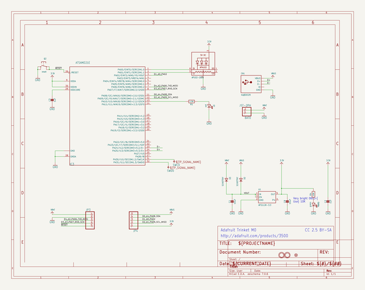
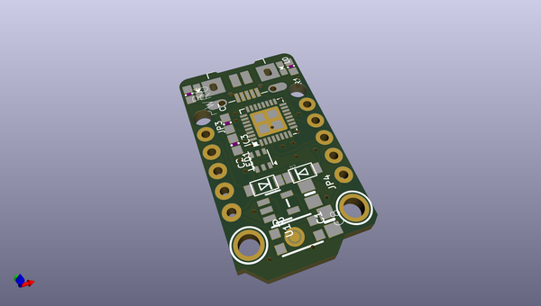
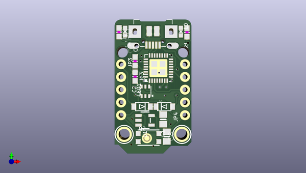
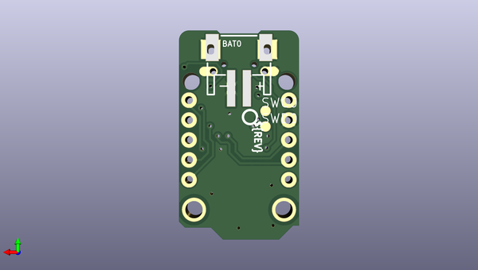

# adafruit_trinket_m0_pcb
 
## summary 
* id: adafruit_adafruit_trinket_m0_pcb_trinket_m0_rev_d
* user: adafruit
* name: adafruit_trinket_m0_pcb
* board: trinket_m0_rev_d
* repo: https://github.com/adafruit/Adafruit-Trinket-M0-PCB

* src_file_repo_sch: 
* src_file_repo_sch_link: https://github.com/adafruit/Adafruit-Trinket-M0-PCB/tree/master/
* full details link: https://github.com/oomlout/oomlout_oomp_project_bot_v_2/tree/main/projects/adafruit_adafruit_trinket_m0_pcb_trinket_m0_rev_d/current_version/working  

## schematic  
  
[schematic (pdf)](working_schematic.pdf) 

## pcb  
 
  
  
  
[board (pdf)](working.pdf)  

## working_bom
| Id | Designator | Footprint | Quantity | Designation | Supplier and ref |  | None | 
| --- | --- | --- | --- | --- | --- | --- | --- | 
| 1 | U1 | SOT23-5 | 1 | AP2112K-3.3 |  |  | [''] | 
| 2 | JP4,JP3 | 1X05_ROUND_76 | 2 |  |  |  | [''] | 
| 3 | C8,C1 | 0805-NO | 2 | 10uF |  |  | [''] | 
| 4 | PWR0 | CHIPLED_0603_NOOUTLINE | 1 | green |  |  | [''] | 
| 5 | D2,D3 | SOD-123FL | 2 | SCHOTTKY |  |  | [''] | 
| 6 | CN1 | 4UCONN_20329_V2 | 1 | 4U#20329 |  |  | [''] | 
| 7 | @HOLE1,@HOLE0 |  | 2 |  |  |  | [''] | 
| 8 | LED1 | APA102_2020 | 1 | AP102-2020 |  |  | [''] | 
| 9 | C2,C3 | 0603-NO | 2 | 1uF |  |  | [''] | 
| 10 | U$20 | TRINKET_M0_TOP | 1 |  |  |  | [''] | 
| 11 | U$9,U$8 | MOUNTINGHOLE_2.0_PLATED | 2 | MOUNTINGHOLE2.0 |  |  | [''] | 
| 12 | U$6 | FIDUCIAL_1MM | 1 | FIDUCIAL_1MM |  |  | [''] | 
| 13 | L0 | CHIPLED_0603_NOOUTLINE | 1 | red |  |  | [''] | 
| 14 | R1 | 0603-NO | 1 | 1.5K |  |  | [''] | 
| 15 | Q2 | BTN_KMR2_4.6X2.8 | 1 | reset |  |  | [''] | 
| 16 | IC3 | QFN32_5MM | 1 | ATSAMD21E |  |  | [''] | 
| 17 | R4 | 0603-NO | 1 | 10K |  |  | [''] | 
| 18 | BAT0 | JSTPH2 | 1 | JST-2PH |  |  | [''] | 
| 19 | SWC0,SWD0 | B1,27 | 2 | TPB1,27 |  |  | [''] | 
| 20 | U$1 | TRINKET_M0_BOTTOM | 1 |  |  |  | [''] | 
| 21 | U$12 | PCBFEAT-REV-040 | 1 |  |  |  | [''] | 

## bom_schematic
| Ref | Qnty | Value | Cmp name | Footprint | Description | Vendor | DNP | 
| --- | --- | --- | --- | --- | --- | --- | --- | 
| BAT0 | 1 | JST-2PH | CON_JST_PH_2PIN | working:JSTPH2 |  |  |  | 
| C1, C8 | 2 | 10uF | CAP_CERAMIC0805-NOOUTLINE | working:0805-NO |  |  |  | 
| C2, C3 | 2 | 1uF | CAP_CERAMIC0603_NO | working:0603-NO |  |  |  | 
| CN1 | 1 | 4U#20329 | USB_MICRO_20329_V2 | working:4UCONN_20329_V2 |  |  |  | 
| D2, D3 | 2 | SCHOTTKY | DIODE_SOD-123FL | working:SOD-123FL |  |  |  | 
| IC3 | 1 | ATSAMD21E | ATSAMD21E | working:QFN32_5MM |  |  |  | 
| JP3, JP4 | 2 | HEADER-1X576MIL | HEADER-1X576MIL | working:1X05_ROUND_76 |  |  |  | 
| L0 | 1 | red | LED0603_NOOUTLINE | working:CHIPLED_0603_NOOUTLINE |  |  |  | 
| LED1 | 1 | AP102-2020 | APA1022020 | working:APA102_2020 |  |  |  | 
| PWR0 | 1 | green | LED0603_NOOUTLINE | working:CHIPLED_0603_NOOUTLINE |  |  |  | 
| Q2 | 1 | reset | SWITCH_TACT_SMT4.6X2.8 | working:BTN_KMR2_4.6X2.8 |  |  |  | 
| R1 | 1 | 1.5K | RESISTOR_0603_NOOUT | working:0603-NO |  |  |  | 
| R4 | 1 | 10K | RESISTOR_0603_NOOUT | working:0603-NO |  |  |  | 
| SWC0 | 1 | TPB1,27 | TPB1,27 | working:B1,27 |  |  |  | 
| SWD0 | 1 | TPB1,27 | TPB1,27 | working:B1,27 |  |  |  | 
| U1 | 1 | AP2112K-3.3 | VREG_SOT23-5 | working:SOT23-5 |  |  |  | 
| U$6 | 1 | FIDUCIAL_1MM | FIDUCIAL_1MM | working:FIDUCIAL_1MM |  |  |  | 
| U$8, U$9 | 2 | MOUNTINGHOLE2.0 | MOUNTINGHOLE2.0 | working:MOUNTINGHOLE_2.0_PLATED |  |  |  | 

## mounting_holes
| x | y | package | value | ref | size | 
| --- | --- | --- | --- | --- | --- | 
| 0.0 | 0.0 | MOUNTINGHOLE_2.0_PLATED | MOUNTINGHOLE2.0 | U$8 | m3 | 
| 11.43 | 0.0 | MOUNTINGHOLE_2.0_PLATED | MOUNTINGHOLE2.0 | U$9 | m3 | 

