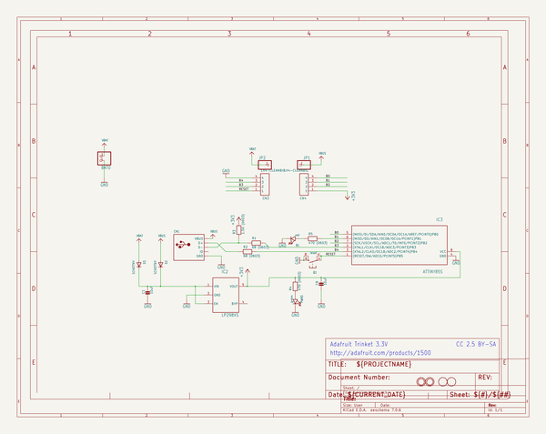

# adafruit_trinket_pcb
 
## summary 
* id: adafruit_adafruit_trinket_pcb_adafruit_trinket_5v_microusb
* user: adafruit
* name: adafruit_trinket_pcb
* board: adafruit_trinket_5v_microusb
* repo: https://github.com/adafruit/Adafruit-Trinket-PCB

* src_file_repo_sch: 
* src_file_repo_sch_link: https://github.com/adafruit/Adafruit-Trinket-PCB/tree/master/
* full details link: https://github.com/oomlout/oomlout_oomp_project_bot_v_2/tree/main/projects/adafruit_adafruit_trinket_pcb_adafruit_trinket_5v_microusb/current_version/working  

## schematic  
  
[schematic (pdf)](working_schematic.pdf) 

## pcb  
 
  
  
  
[board (pdf)](working.pdf)  

## working_bom
| Id | Designator | Footprint | Quantity | Designation | Supplier and ref |  | None | 
| --- | --- | --- | --- | --- | --- | --- | --- | 
| 1 | IC3 | SOIC8 | 1 | ATTINY85-20S |  |  | [''] | 
| 2 | D3,D2 | SOD-123FL | 2 | SCHOTTKY |  |  | [''] | 
| 3 | U$1,U$6 | FIDUCIAL_1MM | 2 | FIDUCIAL |  |  | [''] | 
| 4 | U$8,U$9 | MOUNTINGHOLE_2.0_PLATED | 2 | MOUNTINGHOLE2.0 |  |  | [''] | 
| 5 | CN1 | USB-MINIB | 1 |  |  |  | [''] | 
| 6 | @HOLE0,@HOLE1 |  | 2 |  |  |  | [''] | 
| 7 | R5,R4 | 0603-NO | 2 | 470 (0603) |  |  | [''] | 
| 8 | C1,C8 | 0805-NO | 2 | 10uF |  |  | [''] | 
| 9 | B1 | CHIPLED_0805_NOOUTLINE | 1 | red |  |  | [''] | 
| 10 | PWR0 | CHIPLED_0805_NOOUTLINE | 1 | green |  |  | [''] | 
| 11 | IC2 | SOT23-5L | 1 | MIC5225-3.3v |  |  | [''] | 
| 12 | R3 | 0603-NO | 1 | 1.5K (0603) |  |  | [''] | 
| 13 | JP2,JP1 | 1X01-CLEANBIG | 2 |  |  |  | [''] | 
| 14 | Q1 | BTN_KMR2_4.6X2.8 | 1 | reset |  |  | [''] | 
| 15 | R1,R2 | 0603-NO | 2 | 68 (0603) |  |  | [''] | 
| 16 | CN3,CN4 | 1X04-CLEANBIG | 2 | 1X4-CLEANBIG |  |  | [''] | 
| 17 | BAT0 | JSTPH2 | 1 |  |  |  | [''] | 
| 18 | U$5 | ADAFRUIT_3.5MM | 1 |  |  |  | [''] | 

## bom_schematic
| Ref | Qnty | Value | Cmp name | Footprint | Description | Vendor | DNP | 
| --- | --- | --- | --- | --- | --- | --- | --- | 
| B1 | 1 | red | LED0805_NOOUTLINE | working:CHIPLED_0805_NOOUTLINE |  |  |  | 
| BAT0 | 1 | CON_JST_PH_2PIN | CON_JST_PH_2PIN | working:JSTPH2 |  |  |  | 
| C1, C8 | 2 | 10uF | CAP_CERAMIC0805-NOOUTLINE | working:0805-NO |  |  |  | 
| CN1 | 1 | USBMINIB | USBMINIB | working:USB-MINIB |  |  |  | 
| CN3, CN4 | 2 | 1X4-CLEANBIG | 1X4-CLEANBIG | working:1X04-CLEANBIG |  |  |  | 
| D2, D3 | 2 | SCHOTTKY | DIODE_SOD-123FL | working:SOD-123FL |  |  |  | 
| IC2 | 1 | LP298XS | LP298XS | working:SOT23-5L |  |  |  | 
| IC3 | 1 | ATTINY85S | ATTINY85S | working:SOIC8 |  |  |  | 
| JP1, JP2 | 2 | PINHD-1X1CB | PINHD-1X1CB | working:1X01-CLEANBIG |  |  |  | 
| PWR0 | 1 | green | LED0805_NOOUTLINE | working:CHIPLED_0805_NOOUTLINE |  |  |  | 
| Q1 | 1 | reset | SWITCH_TACT_SMT4.6X2.8 | working:BTN_KMR2_4.6X2.8 |  |  |  | 
| R1, R2 | 2 | 68 (0603) | RESISTOR_0603_NOOUT | working:0603-NO |  |  |  | 
| R3 | 1 | 1.5K (0603) | RESISTOR_0603_NOOUT | working:0603-NO |  |  |  | 
| R4, R5 | 2 | 470 (0603) | RESISTOR_0603_NOOUT | working:0603-NO |  |  |  | 
| U$1, U$6 | 2 | FIDUCIAL | FIDUCIAL | working:FIDUCIAL_1MM |  |  |  | 
| U$8, U$9 | 2 | MOUNTINGHOLE2.0 | MOUNTINGHOLE2.0 | working:MOUNTINGHOLE_2.0_PLATED |  |  |  | 

## mounting_holes
| x | y | package | value | ref | size | 
| --- | --- | --- | --- | --- | --- | 
| 0.0 | 0.0 | MOUNTINGHOLE_2.0_PLATED | MOUNTINGHOLE2.0 | U$8 | m3 | 
| 11.43 | 0.0 | MOUNTINGHOLE_2.0_PLATED | MOUNTINGHOLE2.0 | U$9 | m3 | 

