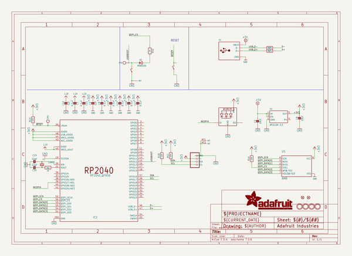

# adafruit_trinkey_qt2040_pcb
 
## summary 
* id: adafruit_adafruit_trinkey_qt2040_pcb_adafruit_qt2040_trinkey
* user: adafruit
* name: adafruit_trinkey_qt2040_pcb
* board: adafruit_qt2040_trinkey
* repo: https://github.com/adafruit/Adafruit-Trinkey-QT2040-PCB

* src_file_repo_sch: 
* src_file_repo_sch_link: https://github.com/adafruit/Adafruit-Trinkey-QT2040-PCB/tree/main/
* full details link: https://github.com/oomlout/oomlout_oomp_project_bot_v_2/tree/main/projects/adafruit_adafruit_trinkey_qt2040_pcb_adafruit_qt2040_trinkey/current_version/working  

## schematic  
  
[schematic (pdf)](working_schematic.pdf) 

## pcb  
 
  
  
  
[board (pdf)](working.pdf)  

## working_bom
| Id | Designator | Footprint | Quantity | Designation | Supplier and ref |  | None | 
| --- | --- | --- | --- | --- | --- | --- | --- | 
| 1 | U$1,U$5,U$2,U$4 | MOUNTINGHOLE_2.5_PLATED | 4 | MOUNTINGHOLE2.5 |  |  | [''] | 
| 2 | SW3,SW2 | SPST_TACTILE_RA | 2 |  |  |  | [''] | 
| 3 | U$8,U$6 | FIDUCIAL_1MM | 2 | FIDUCIAL_1MM |  |  | [''] | 
| 4 | LED1 | SK6805_1515 | 1 | WS2812B_SK6805_1515 |  |  | [''] | 
| 5 | C2,C12 | 0603-NO | 2 | 1uF |  |  | [''] | 
| 6 | X1 | USBA_PCB | 1 |  |  |  | [''] | 
| 7 | C1,C8 | 0805-NO | 2 | 10uF |  |  | [''] | 
| 8 | C14,C17,C13,C16,C9,C11 | 0603-NO | 6 | 0.1uF |  |  | [''] | 
| 9 | R16,R6 | 0603-NO | 2 | 1K |  |  | [''] | 
| 10 | C20,C19 | 0603-NO | 2 | 22pF |  |  | [''] | 
| 11 | U5 | USON8_4X4 | 1 | 8MB |  |  | [''] | 
| 12 | C7 | _0603MP | 1 | 0.1uF |  |  | [''] | 
| 13 | IC2 | QFN56_7MM_REDUCEDEPAD | 1 | RP2040_QFN56 |  |  | [''] | 
| 14 | R1 | RESPACK_4X0603 | 1 | 10K |  |  | [''] | 
| 15 | R15,R14 | 0603-NO | 2 | 27 |  |  | [''] | 
| 16 | D2 | SOD-323_MINI | 1 |   NSR0320 |  |  | [''] | 
| 17 | CONN1 | JST_SH4_SKINNY | 1 | STEMMA_I2C_QTSKINNY |  |  | [''] | 
| 18 | U1 | SOT23-5 | 1 | AP2112K-3.3 |  |  | [''] | 
| 19 | Y1 | CRYSTAL_2.5X2 | 1 | 12MHZ |  |  | [''] | 
| 20 | TP3,TP4 | TESTPOINT_ROUND_1.5MM_NO | 2 |  |  |  | [''] | 
| 21 | U$9 | PCBFEAT-REV-040 | 1 |  |  |  | [''] | 
| 22 | U$7 | STEMMAQT | 1 |  |  |  | [''] | 
| 23 | U$10 | ADAFRUIT_5MM | 1 |  |  |  | [''] | 

## bom_schematic
| Ref | Qnty | Value | Cmp name | Footprint | Description | Vendor | DNP | 
| --- | --- | --- | --- | --- | --- | --- | --- | 
| C1, C8 | 2 | 10uF | CAP_CERAMIC0805-NOOUTLINE | working:0805-NO |  |  |  | 
| C2, C12 | 2 | 1uF | CAP_CERAMIC0603_NO | working:0603-NO |  |  |  | 
| C7 | 1 | 0.1uF | CAP_CERAMIC_0603MP | working:_0603MP |  |  |  | 
| C9, C11, C13, C14, C16, C17 | 6 | 0.1uF | CAP_CERAMIC0603_NO | working:0603-NO |  |  |  | 
| C19, C20 | 2 | 22pF | CAP_CERAMIC0603_NO | working:0603-NO |  |  |  | 
| CONN1 | 1 | STEMMA_I2C_QTSKINNY | STEMMA_I2C_QTSKINNY | working:JST_SH4_SKINNY |  |  |  | 
| D2 | 1 |   NSR0320 | DIODE_SOD323MINI | working:SOD-323_MINI |  |  |  | 
| IC2 | 1 | RP2040_QFN56 | RP2040_QFN56 | working:QFN56_7MM_REDUCEDEPAD |  |  |  | 
| LED1 | 1 | WS2812B_SK6805_1515 | WS2812B_SK6805_1515 | working:SK6805_1515 |  |  |  | 
| R1 | 1 | 10K | RESISTOR_4PACK | working:RESPACK_4X0603 |  |  |  | 
| R6, R16 | 2 | 1K | RESISTOR_0603_NOOUT | working:0603-NO |  |  |  | 
| R14, R15 | 2 | 27 | RESISTOR_0603_NOOUT | working:0603-NO |  |  |  | 
| SW2, SW3 | 2 | SWITCH_SPST_TACT_RA | SWITCH_SPST_TACT_RA | working:SPST_TACTILE_RA |  |  |  | 
| TP3, TP4 | 2 | TESTPOINTROUND1.5MMNO | TESTPOINTROUND1.5MMNO | working:TESTPOINT_ROUND_1.5MM_NO |  |  |  | 
| U1 | 1 | AP2112K-3.3 | VREG_SOT23-5 | working:SOT23-5 |  |  |  | 
| U5 | 1 | 8MB | SPIFLASH_8PIN_4X4 | working:USON8_4X4 |  |  |  | 
| U$1, U$2, U$4, U$5 | 4 | MOUNTINGHOLE2.5 | MOUNTINGHOLE2.5 | working:MOUNTINGHOLE_2.5_PLATED |  |  |  | 
| U$6, U$8 | 2 | FIDUCIAL_1MM | FIDUCIAL_1MM | working:FIDUCIAL_1MM |  |  |  | 
| X1 | 1 | USB_TYPEAPCB | USB_TYPEAPCB | working:USBA_PCB |  |  |  | 
| Y1 | 1 | 12MHZ | CRYSTAL2.5X2.0 | working:CRYSTAL_2.5X2 |  |  |  | 

## mounting_holes
| x | y | package | value | ref | size | 
| --- | --- | --- | --- | --- | --- | 
| 0.0 | 12.7 | MOUNTINGHOLE_2.5_PLATED | MOUNTINGHOLE2.5 | U$1 | m3 | 
| 0.0 | 0.0 | MOUNTINGHOLE_2.5_PLATED | MOUNTINGHOLE2.5 | U$2 | m3 | 
| 20.32 | 0.0 | MOUNTINGHOLE_2.5_PLATED | MOUNTINGHOLE2.5 | U$4 | m3 | 
| 20.32 | 12.7 | MOUNTINGHOLE_2.5_PLATED | MOUNTINGHOLE2.5 | U$5 | m3 | 

