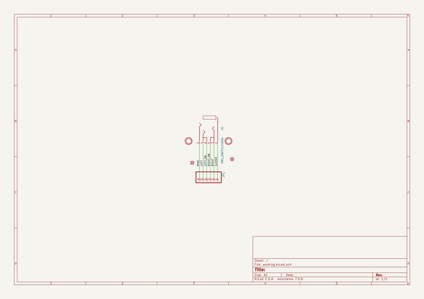

# adafruit_trrs_jack_breakout_pcb
 
## summary 
* id: adafruit_adafruit_trrs_jack_breakout_pcb_adafruit_trrs_jack_breakout
* user: adafruit
* name: adafruit_trrs_jack_breakout_pcb
* board: adafruit_trrs_jack_breakout
* repo: https://github.com/adafruit/Adafruit-TRRS-Jack-Breakout-PCB

* src_file_repo_sch: 
* src_file_repo_sch_link: https://github.com/adafruit/Adafruit-TRRS-Jack-Breakout-PCB/tree/main/
* full details link: https://github.com/oomlout/oomlout_oomp_project_bot_v_2/tree/main/projects/adafruit_adafruit_trrs_jack_breakout_pcb_adafruit_trrs_jack_breakout/current_version/working  

## schematic  
  
[schematic (pdf)](working_schematic.pdf)  

## pcb  
 
  
  
  
[board (pdf)](working.pdf)  

## working_bom
| Id | Designator | Footprint | Quantity | Designation | Supplier and ref |  | None | 
| --- | --- | --- | --- | --- | --- | --- | --- | 
| 1 | FID2,FID1 | FIDUCIAL_1MM | 2 | FIDUCIAL_1MM |  |  | [''] | 
| 2 | PLABEL7 | PLABEL7 | 1 |  |  |  | [''] | 
| 3 | PLABEL5 | PLABEL5 | 1 |  |  |  | [''] | 
| 4 | PLABEL8 | PLABEL8 | 1 |  |  |  | [''] | 
| 5 | PLABEL4 | PLABEL4 | 1 |  |  |  | [''] | 
| 6 | X1 | PJ-332A | 1 | TRRS_2SWITCH_PJ332A |  |  | [''] | 
| 7 | PLABEL0 | PLABEL0 | 1 |  |  |  | [''] | 
| 8 | JP1 | 1X06_ROUND_70 | 1 |  |  |  | [''] | 
| 9 | U$2,U$4 | MOUNTINGHOLE_2.0_PLATED | 2 | MOUNTINGHOLE2.0 |  |  | [''] | 
| 10 | PLABEL3 | PLABEL3 | 1 |  |  |  | [''] | 
| 11 | PLABEL2 | PLABEL2 | 1 |  |  |  | [''] | 
| 12 | PLABEL1 | PLABEL1 | 1 |  |  |  | [''] | 
| 13 | U$5 | ADAFRUIT_3.5MM | 1 |  |  |  | [''] | 
| 14 | PLABEL6 | PLABEL6 | 1 |  |  |  | [''] | 
| 15 | U$1 | PCBFEAT-REV-040 | 1 |  |  |  | [''] | 
| 16 | PLABEL9 | PLABEL9 | 1 |  |  |  | [''] | 
| 17 | U$3 | ADAFRUIT_2.5MM | 1 |  |  |  | [''] | 

## bom_schematic
| Ref | Qnty | Value | Cmp name | Footprint | Description | Vendor | DNP | 
| --- | --- | --- | --- | --- | --- | --- | --- | 
| FID1, FID2 | 2 | FIDUCIAL_1MM | FIDUCIAL_1MM | working:FIDUCIAL_1MM |  |  |  | 
| JP1 | 1 | HEADER-1X670MIL | HEADER-1X670MIL | working:1X06_ROUND_70 |  |  |  | 
| U$2, U$4 | 2 | MOUNTINGHOLE2.0 | MOUNTINGHOLE2.0 | working:MOUNTINGHOLE_2.0_PLATED |  |  |  | 
| X1 | 1 | TRRS_2SWITCH_PJ332A | TRRS_2SWITCH_PJ332A | working:PJ-332A |  |  |  | 

## mounting_holes
| x | y | package | value | ref | size | 
| --- | --- | --- | --- | --- | --- | 
| 0.0 | 0.0 | MOUNTINGHOLE_2.0_PLATED | MOUNTINGHOLE2.0 | U$2 | m3 | 
| 12.699999999999989 | 0.0 | MOUNTINGHOLE_2.0_PLATED | MOUNTINGHOLE2.0 | U$4 | m3 | 

