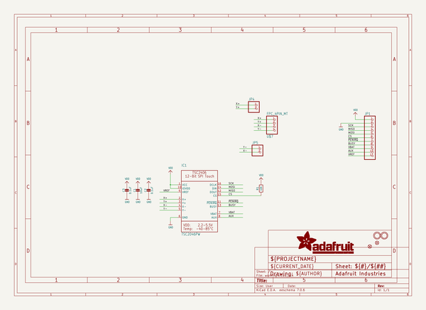

# adafruit_tsc2046_pcb
 
## summary 
* id: adafruit_adafruit_tsc2046_pcb_adafruit_tsc2046_breakout
* user: adafruit
* name: adafruit_tsc2046_pcb
* board: adafruit_tsc2046_breakout
* repo: https://github.com/adafruit/Adafruit-TSC2046-PCB

* src_file_repo_sch: 
* src_file_repo_sch_link: https://github.com/adafruit/Adafruit-TSC2046-PCB/tree/main/
* full details link: https://github.com/oomlout/oomlout_oomp_project_bot_v_2/tree/main/projects/adafruit_adafruit_tsc2046_pcb_adafruit_tsc2046_breakout/current_version/working  

## schematic  
  
[schematic (pdf)](working_schematic.pdf) 

## pcb  
 
  
  
  
[board (pdf)](working.pdf)  

## working_bom
| Id | Designator | Footprint | Quantity | Designation | Supplier and ref |  | None | 
| --- | --- | --- | --- | --- | --- | --- | --- | 
| 1 | C2,C3 | 0603-NO | 2 | 0.1uF |  |  | [''] | 
| 2 | PLABEL11 | PLABEL11 | 1 |  |  |  | [''] | 
| 3 | JP1 | 1X11_ROUND | 1 |  |  |  | [''] | 
| 4 | PLABEL14 | PLABEL14 | 1 |  |  |  | [''] | 
| 5 | JP4,JP5 | 1X02_ROUND | 2 |  |  |  | [''] | 
| 6 | U$8 | ADAFRUIT_3.5MM | 1 |  |  |  | [''] | 
| 7 | U$7 | FPC_CONN_1MM_DUAL_4P_MT | 1 | FPC_4PIN_MT |  |  | [''] | 
| 8 | U$4,U$5 | MOUNTINGHOLE_2.5_PLATED | 2 | MOUNTINGHOLE2.5 |  |  | [''] | 
| 9 | FID2,FID3 | FIDUCIAL_1MM | 2 | FIDUCIAL_1MM |  |  | [''] | 
| 10 | PLABEL5 | PLABEL5 | 1 |  |  |  | [''] | 
| 11 | PLABEL3 | PLABEL3 | 1 |  |  |  | [''] | 
| 12 | PLABEL13 | PLABEL13 | 1 |  |  |  | [''] | 
| 13 | PLABEL0 | PLABEL0 | 1 |  |  |  | [''] | 
| 14 | PLABEL12 | PLABEL12 | 1 |  |  |  | [''] | 
| 15 | PLABEL4 | PLABEL4 | 1 |  |  |  | [''] | 
| 16 | PLABEL6 | PLABEL6 | 1 |  |  |  | [''] | 
| 17 | PLABEL7 | PLABEL7 | 1 |  |  |  | [''] | 
| 18 | PLABEL10 | PLABEL10 | 1 |  |  |  | [''] | 
| 19 | PLABEL16 | PLABEL16 | 1 |  |  |  | [''] | 
| 20 | PLABEL9 | PLABEL9 | 1 |  |  |  | [''] | 
| 21 | U$6 | PCBFEAT-REV-040 | 1 |  |  |  | [''] | 
| 22 | PLABEL2 | PLABEL2 | 1 |  |  |  | [''] | 
| 23 | PLABEL1 | PLABEL1 | 1 |  |  |  | [''] | 
| 24 | PLABEL8 | PLABEL8 | 1 |  |  |  | [''] | 
| 25 | R1 | 0603-NO | 1 | 10K |  |  | [''] | 
| 26 | C1 | 0805-NO | 1 | 10uF |  |  | [''] | 
| 27 | IC1 | TSSOP16 | 1 | TSC2046PW |  |  | [''] | 
| 28 | PLABEL15 | PLABEL15 | 1 |  |  |  | [''] | 
| 29 | PLABEL17 | PLABEL17 | 1 |  |  |  | [''] | 
| 30 | PLABEL18 | PLABEL18 | 1 |  |  |  | [''] | 

## bom_schematic
| Ref | Qnty | Value | Cmp name | Footprint | Description | Vendor | DNP | 
| --- | --- | --- | --- | --- | --- | --- | --- | 
| C1 | 1 | 10uF | CAP_CERAMIC0805-NOOUTLINE | working:0805-NO |  |  |  | 
| C2, C3 | 2 | 0.1uF | CAP_CERAMIC0603_NO | working:0603-NO |  |  |  | 
| FID2, FID3 | 2 | FIDUCIAL_1MM | FIDUCIAL_1MM | working:FIDUCIAL_1MM |  |  |  | 
| IC1 | 1 | TSC2046PW | TSC2046PW | working:TSSOP16 |  |  |  | 
| JP1 | 1 | HEADER-1X11 | HEADER-1X11 | working:1X11_ROUND |  |  |  | 
| JP4, JP5 | 2 | HEADER-1X2ROUND | HEADER-1X2ROUND | working:1X02_ROUND |  |  |  | 
| R1 | 1 | 10K | RESISTOR_0603_NOOUT | working:0603-NO |  |  |  | 
| U$4, U$5 | 2 | MOUNTINGHOLE2.5 | MOUNTINGHOLE2.5 | working:MOUNTINGHOLE_2.5_PLATED |  |  |  | 
| U$7 | 1 | FPC_4PIN_MT | FPC_4PIN_MT | working:FPC_CONN_1MM_DUAL_4P_MT |  |  |  | 

## mounting_holes
| x | y | package | value | ref | size | 
| --- | --- | --- | --- | --- | --- | 
| 0.0 | 0.0 | MOUNTINGHOLE_2.5_PLATED | MOUNTINGHOLE2.5 | U$4 | m3 | 
| 24.13 | 0.0 | MOUNTINGHOLE_2.5_PLATED | MOUNTINGHOLE2.5 | U$5 | m3 | 

