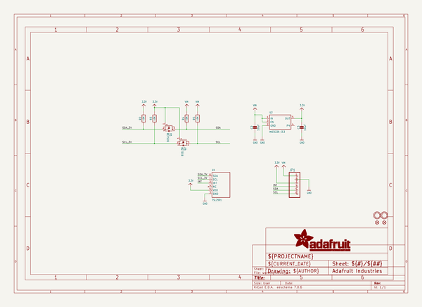

# adafruit_tsl2591_breakout_pcb
 
## summary 
* id: adafruit_adafruit_tsl2591_breakout_pcb_adafruit_tsl2591_original
* user: adafruit
* name: adafruit_tsl2591_breakout_pcb
* board: adafruit_tsl2591_original
* repo: https://github.com/adafruit/Adafruit-TSL2591-Breakout-PCB

* src_file_repo_sch: 
* src_file_repo_sch_link: https://github.com/adafruit/Adafruit-TSL2591-Breakout-PCB/tree/master/
* full details link: https://github.com/oomlout/oomlout_oomp_project_bot_v_2/tree/main/projects/adafruit_adafruit_tsl2591_breakout_pcb_adafruit_tsl2591_original/current_version/working  

## schematic  
  
[schematic (pdf)](working_schematic.pdf) 

## pcb  
 
  
  
  
[board (pdf)](working.pdf)  

## bom_schematic
| Ref | Qnty | Value | Cmp name | Footprint | Description | Vendor | DNP | 
| --- | --- | --- | --- | --- | --- | --- | --- | 
| C2, C3 | 2 | 10uF | CAP_CERAMIC0805-NOOUTLINE | working:0805-NO |  |  |  | 
| FID1, FID2 | 2 | FIDUCIAL"" | FIDUCIAL{dblquote}{dblquote} | working:FIDUCIAL_1MM |  |  |  | 
| JP1 | 1 | HEADER-1X676MIL_FULLROUND | HEADER-1X676MIL_FULLROUND | working:1X06_ROUND_FULL_76 |  |  |  | 
| Q1, Q2 | 2 | BSS138 | MOSFET-NWIDE | working:SOT23-WIDE |  |  |  | 
| R2, R3, R4 | 3 | 10K | RESISTOR0805_NOOUTLINE | working:0805-NO |  |  |  | 
| R5 | 1 | 10K | RESISTOR_0805MP | working:_0805MP |  |  |  | 
| U1 | 1 | TSL2591 | LIGHT_TSL2591 | working:DFN6_TAOS |  |  |  | 
| U2 | 1 | MIC5225-3.3 | VREG_SOT23-5 | working:SOT23-5 |  |  |  | 
| U$18, U$19 | 2 | MOUNTINGHOLE2.5 | MOUNTINGHOLE2.5 | working:MOUNTINGHOLE_2.5_PLATED |  |  |  | 

