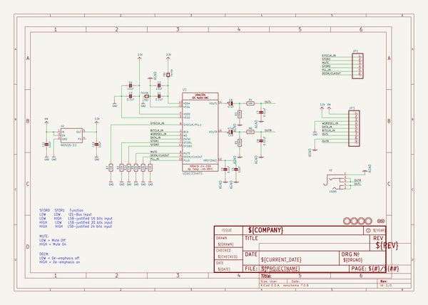

# adafruit_uda1334a_i2s_stereo_dac_pcb
 
## summary 
* id: adafruit_adafruit_uda1334a_i2s_stereo_dac_pcb_adafruit_uda1334_i2s_dac
* user: adafruit
* name: adafruit_uda1334a_i2s_stereo_dac_pcb
* board: adafruit_uda1334_i2s_dac
* repo: https://github.com/adafruit/Adafruit-UDA1334A-I2S-Stereo-DAC-PCB

* src_file_repo_sch: 
* src_file_repo_sch_link: https://github.com/adafruit/Adafruit-UDA1334A-I2S-Stereo-DAC-PCB/tree/master/
* full details link: https://github.com/oomlout/oomlout_oomp_project_bot_v_2/tree/main/projects/adafruit_adafruit_uda1334a_i2s_stereo_dac_pcb_adafruit_uda1334_i2s_dac/current_version/working  

## schematic  
  
[schematic (pdf)](working_schematic.pdf)  

## pcb  
 
  
  
  
[board (pdf)](working.pdf)  

## working_bom
| Id | Designator | Footprint | Quantity | Designation | Supplier and ref |  | None | 
| --- | --- | --- | --- | --- | --- | --- | --- | 
| 1 | C7,C8 | 0805-NO | 2 | 0.01uF |  |  | [''] | 
| 2 | U1 | SSOP16_4.4MM | 1 | UDA1334ATS |  |  | [''] | 
| 3 | U$12,U$11,U$13,U$14 | MOUNTINGHOLE_2.5_PLATED | 4 | MOUNTINGHOLE2.5 |  |  | [''] | 
| 4 | C4,C11,C12,C5,C2 | 0805-NO | 5 | 10uF |  |  | [''] | 
| 5 | C3,C1,C9 | 0805-NO | 3 | 0.1uF |  |  | [''] | 
| 6 | FID2,FID1 | FIDUCIAL_1MM | 2 | FIDUCIAL_1MM |  |  | [''] | 
| 7 | R4,R6 | 0805-NO | 2 | 100 |  |  | [''] | 
| 8 | JP3 | 1X09_ROUND_70 | 1 |  |  |  | [''] | 
| 9 | R1,R2,R8,R10,R7,R9 | 0603-NO | 6 | 10k |  |  | [''] | 
| 10 | FB1,FB2 | 0805 | 2 | Ferrite |  |  | [''] | 
| 11 | C6,C10 | PANASONIC_C | 2 | 47uF |  |  | [''] | 
| 12 | U2 | SOT23-5 | 1 | MIC5225-3.3 |  |  | [''] | 
| 13 | U$29 | ADAFRUIT_3.5MM | 1 |  |  |  | [''] | 
| 14 | R3,R5 | 0805-NO | 2 | 220k |  |  | [''] | 
| 15 | JP1 | 1X06_ROUND_70 | 1 |  |  |  | [''] | 
| 16 | X2 | 4UCONN_19269 | 1 | 19269 |  |  | [''] | 
| 17 | U$5 | PCBFEAT-REV-040 | 1 |  |  |  | [''] | 
| 18 | U$6 | ADAFRUIT_5MM | 1 |  |  |  | [''] | 

## bom_schematic
| Ref | Qnty | Value | Cmp name | Footprint | Description | Vendor | DNP | 
| --- | --- | --- | --- | --- | --- | --- | --- | 
| C1, C3, C9 | 3 | 0.1uF | CAP_CERAMIC0805-NOOUTLINE | working:0805-NO |  |  |  | 
| C2, C4, C5, C11, C12 | 5 | 10uF | CAP_CERAMIC0805-NOOUTLINE | working:0805-NO |  |  |  | 
| C6, C10 | 2 | 47uF | CAP_ELECTROLYTICPANASONIC_C | working:PANASONIC_C |  |  |  | 
| C7, C8 | 2 | 0.01uF | CAP_CERAMIC0805-NOOUTLINE | working:0805-NO |  |  |  | 
| FB1, FB2 | 2 | Ferrite | FERRITE0805 | working:0805 |  |  |  | 
| FID1, FID2 | 2 | FIDUCIAL_1MM | FIDUCIAL_1MM | working:FIDUCIAL_1MM |  |  |  | 
| JP1 | 1 | HEADER-1X670MIL | HEADER-1X670MIL | working:1X06_ROUND_70 |  |  |  | 
| JP3 | 1 | HEADER-1X970MIL | HEADER-1X970MIL | working:1X09_ROUND_70 |  |  |  | 
| R1, R2, R7, R8, R9, R10 | 6 | 10k | RESISTOR_0603_NOOUT | working:0603-NO |  |  |  | 
| R3, R5 | 2 | 220k | RESISTOR0805_NOOUTLINE | working:0805-NO |  |  |  | 
| R4, R6 | 2 | 100 | RESISTOR0805_NOOUTLINE | working:0805-NO |  |  |  | 
| U1 | 1 | UDA1334ATS | AUDIO_I2S_UDA1334{dblquote}{dblquote} | working:SSOP16_4.4MM |  |  |  | 
| U2 | 1 | MIC5225-3.3 | VREG_SOT23-5 | working:SOT23-5 |  |  |  | 
| U$11, U$12, U$13, U$14 | 4 | MOUNTINGHOLE2.5 | MOUNTINGHOLE2.5 | working:MOUNTINGHOLE_2.5_PLATED |  |  |  | 
| X2 | 1 | 19269 | AUDIO_3.5MMJACK | working:4UCONN_19269 |  |  |  | 

## mounting_holes
| x | y | package | value | ref | size | 
| --- | --- | --- | --- | --- | --- | 
| 0.0 | 0.0 | MOUNTINGHOLE_2.5_PLATED | MOUNTINGHOLE2.5 | U$11 | m3 | 
| 33.02000000000001 | 0.0 | MOUNTINGHOLE_2.5_PLATED | MOUNTINGHOLE2.5 | U$12 | m3 | 
| 0.0 | 20.320000000000007 | MOUNTINGHOLE_2.5_PLATED | MOUNTINGHOLE2.5 | U$13 | m3 | 
| 33.02000000000001 | 20.320000000000007 | MOUNTINGHOLE_2.5_PLATED | MOUNTINGHOLE2.5 | U$14 | m3 | 

