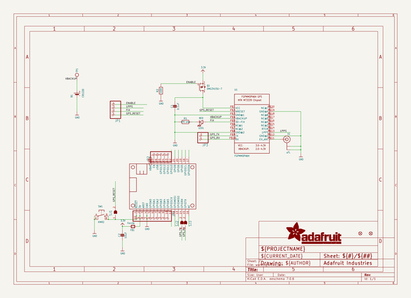
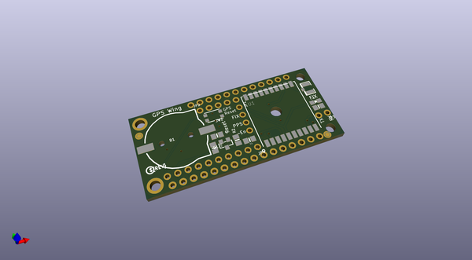
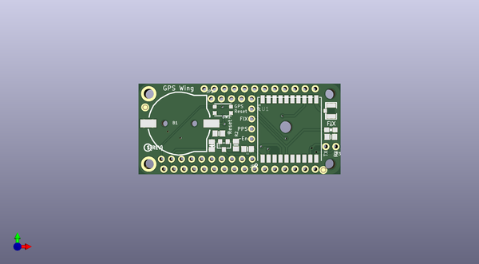
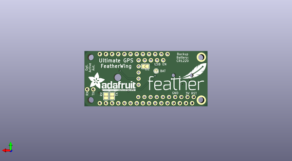

# adafruit_ultimate_gps
 
## summary 
* id: adafruit_adafruit_ultimate_gps_adafruit_ultimate_gps_shield
* user: adafruit
* name: adafruit_ultimate_gps
* board: adafruit_ultimate_gps_shield
* repo: https://github.com/adafruit/Adafruit-Ultimate-GPS

* src_file_repo_sch: 
* src_file_repo_sch_link: https://github.com/adafruit/Adafruit-Ultimate-GPS/tree/master/
* full details link: https://github.com/oomlout/oomlout_oomp_project_bot_v_2/tree/main/projects/adafruit_adafruit_ultimate_gps_adafruit_ultimate_gps_shield/current_version/working  

## schematic  
  
[schematic (pdf)](working_schematic.pdf)  

## pcb  
 
  
  
  
[board (pdf)](working.pdf)  

## working_bom
| Id | Designator | Footprint | Quantity | Designation | Supplier and ref |  | None | 
| --- | --- | --- | --- | --- | --- | --- | --- | 
| 1 | R1 | 0805-NO | 1 | 470 ohm |  |  | [''] | 
| 2 | FB1 | 0805-NO | 1 | Ferrite |  |  | [''] | 
| 3 | JP4 | 1X10_ROUND | 1 |  |  |  | [''] | 
| 4 | JP2 | 1X05_ROUND_70 | 1 |  |  |  | [''] | 
| 5 | Q1 | SOT23-WIDE | 1 | DMG3415U-7  |  |  | [''] | 
| 6 | FID2,FID1 | FIDUCIAL_1MM | 2 | FIDUCIAL" |  |  | [''] | 
| 7 | B1 | CR1220-2 | 1 | CR1220 |  |  | [''] | 
| 8 | MS1 | FEATHERWING | 1 | FEATHERWING |  |  | [''] | 
| 9 | X1 | U.FL | 1 | uFL |  |  | [''] | 
| 10 | R2 | 0805-NO | 1 | 100K |  |  | [''] | 
| 11 | C1 | 0805-NO | 1 | 0.1uF |  |  | [''] | 
| 12 | C2 | 0805-NO | 1 | 10uF |  |  | [''] | 
| 13 | U1 | FGPMMOPA6H | 1 | FGPMMOPA6H |  |  | [''] | 
| 14 | JP1 | 1X04_ROUND | 1 |  |  |  | [''] | 
| 15 | U$9 | PCBFEAT-REV-040 | 1 |  |  |  | [''] | 
| 16 | SW1 | BTN_KMR2_4.6X2.8 | 1 | KMR2 |  |  | [''] | 
| 17 | JP3 | 1X02_ROUND | 1 |  |  |  | [''] | 
| 18 | LED1 | CHIPLED_0805_NOOUTLINE | 1 | RED |  |  | [''] | 
| 19 | SJ2,SJ3 | SOLDERJUMPER_CLOSEDWIRE | 2 |  |  |  | [''] | 
| 20 | U$11 | ADAFRUIT_TEXT_20MM | 1 |  |  |  | [''] | 
| 21 | SJ1 | SOLDERJUMPER_ARROW_NOPASTE | 1 |  |  |  | [''] | 
| 22 | TP1 | TESTPOINT_ROUND_1.5MM | 1 |  |  |  | [''] | 
| 23 | U$10 | FEATHERLOGO | 1 |  |  |  | [''] | 

## bom_schematic
| Ref | Qnty | Value | Cmp name | Footprint | Description | Vendor | DNP | 
| --- | --- | --- | --- | --- | --- | --- | --- | 
| B1 | 1 | CR1220 | BATTERYCR1220_2 | working:CR1220-2 |  |  |  | 
| C1 | 1 | 0.1uF | CAP_CERAMIC0805-NOOUTLINE | working:0805-NO |  |  |  | 
| C2 | 1 | 10uF | CAP_CERAMIC0805-NOOUTLINE | working:0805-NO |  |  |  | 
| FB1 | 1 | Ferrite | FERRITE-0805NO | working:0805-NO |  |  |  | 
| FID1, FID2 | 2 | FIDUCIAL"" | FIDUCIAL{dblquote}{dblquote} | working:FIDUCIAL_1MM |  |  |  | 
| JP1 | 1 | HEADER-1X4ROUND | HEADER-1X4ROUND | working:1X04_ROUND |  |  |  | 
| JP2 | 1 | HEADER-1X570MIL | HEADER-1X570MIL | working:1X05_ROUND_70 |  |  |  | 
| JP3 | 1 | HEADER-1X2ROUND | HEADER-1X2ROUND | working:1X02_ROUND |  |  |  | 
| JP4 | 1 | HEADER-1X10ROUND | HEADER-1X10ROUND | working:1X10_ROUND |  |  |  | 
| LED1 | 1 | RED | LED0805_NOOUTLINE | working:CHIPLED_0805_NOOUTLINE |  |  |  | 
| MS1 | 1 | FEATHERWING | FEATHERWING | working:FEATHERWING |  |  |  | 
| Q1 | 1 | DMG3415U-7  | MOSFET-PWIDE | working:SOT23-WIDE |  |  |  | 
| R1 | 1 | 470 ohm | RESISTOR0805_NOOUTLINE | working:0805-NO |  |  |  | 
| R2 | 1 | 100K | RESISTOR0805_NOOUTLINE | working:0805-NO |  |  |  | 
| SJ1 | 1 | SOLDERJUMPER | SOLDERJUMPER | working:SOLDERJUMPER_ARROW_NOPASTE |  |  |  | 
| SJ2, SJ3 | 2 | SOLDERJUMPERCLOSED | SOLDERJUMPERCLOSED | working:SOLDERJUMPER_CLOSEDWIRE |  |  |  | 
| SW1 | 1 | KMR2 | SWITCH_TACT_SMT4.6X2.8 | working:BTN_KMR2_4.6X2.8 |  |  |  | 
| TP1 | 1 | TESTPOINTROUND1.5MM | TESTPOINTROUND1.5MM | working:TESTPOINT_ROUND_1.5MM |  |  |  | 
| U1 | 1 | FGPMMOPA6H | GPS_FGPMMOPA6H | working:FGPMMOPA6H |  |  |  | 
| X1 | 1 | uFL | ANTENNA_U.FL | working:U.FL |  |  |  | 

