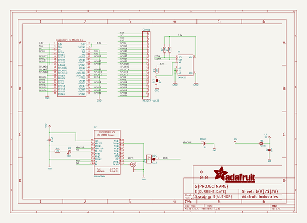

# adafruit_ultimate_gps_hat_pcb
 
## summary 
* id: adafruit_adafruit_ultimate_gps_hat_pcb_adafruit_ultimate_gps_hat
* user: adafruit
* name: adafruit_ultimate_gps_hat_pcb
* board: adafruit_ultimate_gps_hat
* repo: https://github.com/adafruit/Adafruit-Ultimate-GPS-HAT-PCB

* src_file_repo_sch: 
* src_file_repo_sch_link: https://github.com/adafruit/Adafruit-Ultimate-GPS-HAT-PCB/tree/master/
* full details link: https://github.com/oomlout/oomlout_oomp_project_bot_v_2/tree/main/projects/adafruit_adafruit_ultimate_gps_hat_pcb_adafruit_ultimate_gps_hat/current_version/working  

## schematic  
  
[schematic (pdf)](working_schematic.pdf) 

## pcb  
 
  
  
  
[board (pdf)](working.pdf)  

## working_bom
| Id | Designator | Footprint | Quantity | Designation | Supplier and ref |  | None | 
| --- | --- | --- | --- | --- | --- | --- | --- | 
| 1 | U$6 | PCBFEAT-REV-056 | 1 |  |  |  | [''] | 
| 2 | U1 | SOIC8_150MIL | 1 | CAT24C32 |  |  | [''] | 
| 3 | FID2,FID3,FID1 | FIDUCIAL_1MM | 3 | FIDUCIAL" |  |  | [''] | 
| 4 | U$3 | ADAFRUIT_TEXT_20MM | 1 |  |  |  | [''] | 
| 5 | U$4 | PIHATLOGO | 1 |  |  |  | [''] | 
| 6 | JP1 | 1X01-CLEANBIG | 1 |  |  |  | [''] | 
| 7 | C1 | 0805-NO | 1 | 0.1uF |  |  | [''] | 
| 8 | SJ2 | SOLDERJUMPER_CLOSEDWIRE | 1 | PPS |  |  | [''] | 
| 9 | R2,R3,R1 | 0805-NO | 3 | 3.9K |  |  | [''] | 
| 10 | U$20 | U.FL | 1 | U.FL |  |  | [''] | 
| 11 | B1 | CR1220 | 1 | CR1220 |  |  | [''] | 
| 12 | LED1 | CHIPLED_0805 | 1 | RED |  |  | [''] | 
| 13 | U2 | FGPMMOPA6H | 1 | FGPMMOPA6H |  |  | [''] | 
| 14 | C2 | 0805-NO | 1 | 10uF |  |  | [''] | 
| 15 | R4 | 0805-NO | 1 | 470 |  |  | [''] | 
| 16 | SJ1 | SOLDERJUMPER_CLOSEDWIRE | 1 | WP |  |  | [''] | 
| 17 | FB1 | 0805 | 1 | Ferrite |  |  | [''] | 
| 18 | CONN1 | 1X25_ROUND_70MIL | 1 | HEADER-1X25 |  |  | [''] | 
| 19 | RPI1 | PI_HAT_SLOTS | 1 | RASPBERRYPI_BPLUS_HATSLOTS |  |  | [''] | 

## bom_schematic
| Ref | Qnty | Value | Cmp name | Footprint | Description | Vendor | DNP | 
| --- | --- | --- | --- | --- | --- | --- | --- | 
| B1 | 1 | CR1220 | BATTERYCR1220_SMT | working:CR1220 |  |  |  | 
| C1 | 1 | 0.1uF | CAP_CERAMIC0805-NOOUTLINE | working:0805-NO |  |  |  | 
| C2 | 1 | 10uF | CAP_CERAMIC0805-NOOUTLINE | working:0805-NO |  |  |  | 
| CONN1 | 1 | HEADER-1X25 | HEADER-1X25 | working:1X25_ROUND_70MIL |  |  |  | 
| FB1 | 1 | Ferrite | FERRITE0805 | working:0805 |  |  |  | 
| FID1, FID2, FID3 | 3 | FIDUCIAL"" | FIDUCIAL{dblquote}{dblquote} | working:FIDUCIAL_1MM |  |  |  | 
| JP1 | 1 | PINHD-1X1CB | PINHD-1X1CB | working:1X01-CLEANBIG |  |  |  | 
| LED1 | 1 | RED | LED0805 | working:CHIPLED_0805 |  |  |  | 
| R1, R2, R3 | 3 | 3.9K | RESISTOR0805_NOOUTLINE | working:0805-NO |  |  |  | 
| R4 | 1 | 470 | RESISTOR0805_NOOUTLINE | working:0805-NO |  |  |  | 
| RPI1 | 1 | RASPBERRYPI_BPLUS_HATSLOTS | RASPBERRYPI_BPLUS_HATSLOTS | working:PI_HAT_SLOTS |  |  |  | 
| SJ1 | 1 | WP | SOLDERJUMPER_CLOSED | working:SOLDERJUMPER_CLOSEDWIRE |  |  |  | 
| SJ2 | 1 | PPS | SOLDERJUMPER_CLOSED | working:SOLDERJUMPER_CLOSEDWIRE |  |  |  | 
| U1 | 1 | CAT24C32 | EEPROM_I2C_SOIC8_GENERIC | working:SOIC8_150MIL |  |  |  | 
| U2 | 1 | FGPMMOPA6H | GPS_FGPMMOPA6H | working:FGPMMOPA6H |  |  |  | 
| U$20 | 1 | U.FL | U.FL | working:U.FL |  |  |  | 

