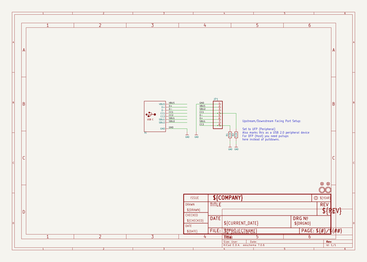

# adafruit_usb_c_downstream_breakout
 
## summary 
* id: adafruit_adafruit_usb_c_downstream_breakout_adafruit_usb_type_c_downstream_breakout_rev_b
* user: adafruit
* name: adafruit_usb_c_downstream_breakout
* board: adafruit_usb_type_c_downstream_breakout_rev_b
* repo: https://github.com/adafruit/Adafruit-USB-C-Downstream-Breakout

* src_file_repo_sch: 
* src_file_repo_sch_link: https://github.com/adafruit/Adafruit-USB-C-Downstream-Breakout/tree/master/
* full details link: https://github.com/oomlout/oomlout_oomp_project_bot_v_2/tree/main/projects/adafruit_adafruit_usb_c_downstream_breakout_adafruit_usb_type_c_downstream_breakout_rev_b/current_version/working  

## schematic  
  
[schematic (pdf)](working_schematic.pdf) 

## pcb  
 
  
  
  
[board (pdf)](working.pdf)  

## working_bom
| Id | Designator | Footprint | Quantity | Designation | Supplier and ref |  | None | 
| --- | --- | --- | --- | --- | --- | --- | --- | 
| 1 | U$1,U$2 | MOUNTINGHOLE_2.5_PLATED | 2 | MOUNTINGHOLE2.5 |  |  | [''] | 
| 2 | FID2,FID1 | FIDUCIAL_1MM | 2 | FIDUCIAL_1MM |  |  | [''] | 
| 3 | R1,R2 | 0603-NO | 2 | 5.1K |  |  | [''] | 
| 4 | U$3 | ADAFRUIT_2.5MM | 1 |  |  |  | [''] | 
| 5 | X1 | USB_C_CUSB31-CFM2AX-01-X | 1 |  |  |  | [''] | 
| 6 | JP1 | 1X08_ROUND_76 | 1 |  |  |  | [''] | 
| 7 | U$8 | PCBFEAT-REV-040 | 1 |  |  |  | [''] | 

## bom_schematic
| Ref | Qnty | Value | Cmp name | Footprint | Description | Vendor | DNP | 
| --- | --- | --- | --- | --- | --- | --- | --- | 
| FID1, FID2 | 2 | FIDUCIAL_1MM | FIDUCIAL_1MM | working:FIDUCIAL_1MM |  |  |  | 
| JP1 | 1 | HEADER-1X876MIL | HEADER-1X876MIL | working:1X08_ROUND_76 |  |  |  | 
| R1, R2 | 2 | 5.1K | RESISTOR_0603_NOOUT | working:0603-NO |  |  |  | 
| U$1, U$2 | 2 | MOUNTINGHOLE2.5 | MOUNTINGHOLE2.5 | working:MOUNTINGHOLE_2.5_PLATED |  |  |  | 
| X1 | 1 | USB_C | USB_C | working:USB_C_CUSB31-CFM2AX-01-X |  |  |  | 

## mounting_holes
| x | y | package | value | ref | size | 
| --- | --- | --- | --- | --- | --- | 
| 15.24 | 0.0 | MOUNTINGHOLE_2.5_PLATED | MOUNTINGHOLE2.5 | U$1 | m3 | 
| 0.0 | 0.0 | MOUNTINGHOLE_2.5_PLATED | MOUNTINGHOLE2.5 | U$2 | m3 | 

