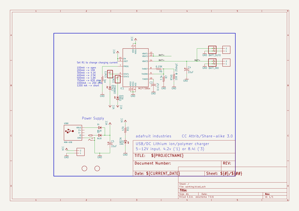

# adafruit_usb_dc_lipoly_charger
 
## summary 
* id: adafruit_adafruit_usb_dc_lipoly_charger_adafruit_mcp7386x
* user: adafruit
* name: adafruit_usb_dc_lipoly_charger
* board: adafruit_mcp7386x
* repo: https://github.com/adafruit/Adafruit-USB-DC-LiPoly-Charger

* src_file_repo_sch: 
* src_file_repo_sch_link: https://github.com/adafruit/Adafruit-USB-DC-LiPoly-Charger/tree/master/
* full details link: https://github.com/oomlout/oomlout_oomp_project_bot_v_2/tree/main/projects/adafruit_adafruit_usb_dc_lipoly_charger_adafruit_mcp7386x/current_version/working  

## schematic  
  
[schematic (pdf)](working_schematic.pdf)  

## pcb  
 
  
  
  
[board (pdf)](working.pdf)  

## working_bom
| Id | Designator | Footprint | Quantity | Designation | Supplier and ref |  | None | 
| --- | --- | --- | --- | --- | --- | --- | --- | 
| 1 | C3 | C0805K | 1 | 0.47uF |  |  | [''] | 
| 2 | D1,D2 | SMADIODE | 2 | B120 |  |  | [''] | 
| 3 | CHG0 | CHIPLED_0805 | 1 | ORANGE |  |  | [''] | 
| 4 | U$3,U$4 | FIDUCIAL_1MM | 2 | FIDUCIAL |  |  | [''] | 
| 5 | @HOLE3,@HOLE1,@HOLE0,@HOLE2 |  | 4 |  |  |  | [''] | 
| 6 | VIN0,IN0,OUT0 | 3.5MMTERM | 3 | 1X2-3.5MM |  |  | [''] | 
| 7 | BATT_IN0,BATT_OUT0 | JSTPH2 | 2 |  |  |  | [''] | 
| 8 | ERR0 | CHIPLED_0805 | 1 | RED |  |  | [''] | 
| 9 | R6 | R0805 | 1 | 6.19K |  |  | [''] | 
| 10 | STAT3,STAT4 | 1X01 | 2 |  |  |  | [''] | 
| 11 | U$1 | DCJACK_2MM_SMT | 1 | 2.1MMJACKSMT |  |  | [''] | 
| 12 | C5,C4 | A_3216-18R | 2 | 10uF |  |  | [''] | 
| 13 | IC1 | SO16 | 1 |  |  |  | [''] | 
| 14 | PG0 | CHIPLED_0805 | 1 | GREEN |  |  | [''] | 
| 15 | U$2 | ADAFRUIT200MIL | 1 |  |  |  | [''] | 
| 16 | R7 | R0805 | 1 | 7.3k |  |  | [''] | 
| 17 | R11 | R0805 | 1 | 470 |  |  | [''] | 
| 18 | RTH0 | 0805-THM | 1 | 10K @ 25degC |  |  | [''] | 
| 19 | USB0 | USB-MINIB | 1 | MINI-USB |  |  | [''] | 
| 20 | R1 | 0805-THM | 1 | adj |  |  | [''] | 

## bom_schematic
| Ref | Qnty | Value | Cmp name | Footprint | Description | Vendor | DNP | 
| --- | --- | --- | --- | --- | --- | --- | --- | 
| BATT_IN0 | 1 | JST_2PIN | JST_2PIN | working:JSTPH2 |  |  |  | 
| BATT_OUT0 | 1 | JST_2PIN | JST_2PIN | working:JSTPH2 |  |  |  | 
| C3 | 1 | 0.47uF | C-USC0805K | working:C0805K |  |  |  | 
| C4, C5 | 2 | 10uF | CPOL-USA/3216-18R | working:A_3216-18R |  |  |  | 
| CHG0 | 1 | ORANGE | LEDCHIPLED_0805 | working:CHIPLED_0805 |  |  |  | 
| D1, D2 | 2 | B120 | DIODESMA | working:SMADIODE |  |  |  | 
| ERR0 | 1 | RED | LEDCHIPLED_0805 | working:CHIPLED_0805 |  |  |  | 
| IC1 | 1 | MCP7386XS | MCP7386XS | working:SO16 |  |  |  | 
| IN0 | 1 | 1X2-3.5MM | 1X2-3.5MM | working:3.5MMTERM |  |  |  | 
| OUT0 | 1 | 1X2-3.5MM | 1X2-3.5MM | working:3.5MMTERM |  |  |  | 
| PG0 | 1 | GREEN | LEDCHIPLED_0805 | working:CHIPLED_0805 |  |  |  | 
| R1 | 1 | adj | R-US_FLIPFLOP | working:0805-THM |  |  |  | 
| R6 | 1 | 6.19K | R-US_R0805 | working:R0805 |  |  |  | 
| R7 | 1 | 7.3k | R-US_R0805 | working:R0805 |  |  |  | 
| R11 | 1 | 470 | R-US_R0805 | working:R0805 |  |  |  | 
| RTH0 | 1 | 10K @ 25degC | R-US_FLIPFLOP | working:0805-THM |  |  |  | 
| STAT3, STAT4 | 2 | PINHD-1X1 | PINHD-1X1 | working:1X01 |  |  |  | 
| U$1 | 1 | 2.1MMJACKSMT | 2.1MMJACKSMT | working:DCJACK_2MM_SMT |  |  |  | 
| U$3, U$4 | 2 | FIDUCIAL | FIDUCIAL | working:FIDUCIAL_1MM |  |  |  | 
| USB0 | 1 | MINI-USB | USBMINIB | working:USB-MINIB |  |  |  | 
| VIN0 | 1 | 1X2-3.5MM | 1X2-3.5MM | working:3.5MMTERM |  |  |  | 

