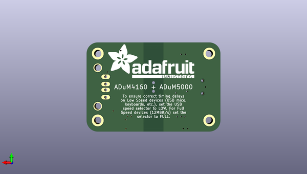

# adafruit_usb_isolator_pcb
 
## summary 
* id: adafruit_adafruit_usb_isolator_pcb_adafruit_usb_isolator
* user: adafruit
* name: adafruit_usb_isolator_pcb
* board: adafruit_usb_isolator
* repo: https://github.com/adafruit/Adafruit-USB-Isolator-PCB

* src_file_repo_sch: 
* src_file_repo_sch_link: https://github.com/adafruit/Adafruit-USB-Isolator-PCB/tree/master/
* full details link: https://github.com/oomlout/oomlout_oomp_project_bot_v_2/tree/main/projects/adafruit_adafruit_usb_isolator_pcb_adafruit_usb_isolator/current_version/working  

## pcb  
 
  
  
  
[board (pdf)](working.pdf)  

## working_bom
| Id | Designator | Footprint | Quantity | Designation | Supplier and ref |  | None | 
| --- | --- | --- | --- | --- | --- | --- | --- | 
| 1 | U2 | SOIC16WIDE | 1 | ADuM5000 |  |  | [''] | 
| 2 | FID3,FID2,FID1 | FIDUCIAL_1MM | 3 | FIDUCIAL" |  |  | [''] | 
| 3 | R1,R2,R3 | 0805-NO | 3 | 24 |  |  | [''] | 
| 4 | C4,C7,C8,C5,C3,C2,C1,C10 | 0805-NO | 8 | 0.1uF |  |  | [''] | 
| 5 | R4 | _0805MP | 1 | 24 |  |  | [''] | 
| 6 | X3 | USB-MINIB_LARGER | 1 | 06564 |  |  | [''] | 
| 7 | U$9,U$8,U$7,U$10 | MOUNTINGHOLE_2.5_PLATED_THICK | 4 | MOUNTINGHOLE2.5_THICK |  |  | [''] | 
| 8 | C6,C9 | 0805-NO | 2 | 10uF |  |  | [''] | 
| 9 | R5 | 0805-NO | 1 | 1K |  |  | [''] | 
| 10 | D1 | CHIPLED_0805_NOOUTLINE | 1 | GREEN |  |  | [''] | 
| 11 | X2 | USB_HOST-PTH | 1 | 05241 |  |  | [''] | 
| 12 | U$14 | ADAFRUIT_5MM | 1 |  |  |  | [''] | 
| 13 | U1 | SOIC16WIDE | 1 | ADuM4160 |  |  | [''] | 
| 14 | SW1 | EG1390 | 1 |  |  |  | [''] | 
| 15 | U$16 | ADAFRUIT_TEXT_30MM | 1 |  |  |  | [''] | 

## mounting_holes
| x | y | package | value | ref | size | 
| --- | --- | --- | --- | --- | --- | 
| 38.1 | 22.86 | MOUNTINGHOLE_2.5_PLATED_THICK | MOUNTINGHOLE2.5_THICK | U$7 | m3 | 
| 0.0 | 0.0 | MOUNTINGHOLE_2.5_PLATED_THICK | MOUNTINGHOLE2.5_THICK | U$8 | m3 | 
| 0.0 | 22.86 | MOUNTINGHOLE_2.5_PLATED_THICK | MOUNTINGHOLE2.5_THICK | U$9 | m3 | 
| 38.1 | 0.0 | MOUNTINGHOLE_2.5_PLATED_THICK | MOUNTINGHOLE2.5_THICK | U$10 | m3 | 

