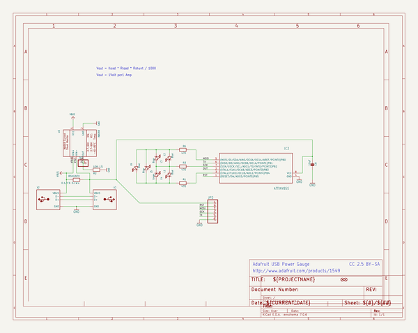

# adafruit_usb_power_gauge_pcb
 
## summary 
* id: adafruit_adafruit_usb_power_gauge_pcb_adafruit_usb_power_gauge
* user: adafruit
* name: adafruit_usb_power_gauge_pcb
* board: adafruit_usb_power_gauge
* repo: https://github.com/adafruit/Adafruit-USB-Power-Gauge-PCB

* src_file_repo_sch: 
* src_file_repo_sch_link: https://github.com/adafruit/Adafruit-USB-Power-Gauge-PCB/tree/master/
* full details link: https://github.com/oomlout/oomlout_oomp_project_bot_v_2/tree/main/projects/adafruit_adafruit_usb_power_gauge_pcb_adafruit_usb_power_gauge/current_version/working  

## schematic  
  
[schematic (pdf)](working_schematic.pdf) 

## pcb  
 
  
  
  
[board (pdf)](working.pdf)  

## working_bom
| Id | Designator | Footprint | Quantity | Designation | Supplier and ref |  | None | 
| --- | --- | --- | --- | --- | --- | --- | --- | 
| 1 | U$3 | ADAFRUIT_2.5MM | 1 |  |  |  | [''] | 
| 2 | FID2,FID1 | FIDUCIAL_1MM | 2 | FIDUCIAL" |  |  | [''] | 
| 3 | JP1 | 1X01-CLEANBIG | 1 |  |  |  | [''] | 
| 4 | L6,L3,L5,L1,L2 | CHIPLED_0805_NOOUTLINE | 5 | Blue |  |  | [''] | 
| 5 | R1,R6,R3 | 0805-NO | 3 | 470 |  |  | [''] | 
| 6 | IC3 | SOIC8 | 1 | ATTINY85V-10S |  |  | [''] | 
| 7 | L4 | CHIPLED_0805_NOOUTLINE | 1 | Green |  |  | [''] | 
| 8 | C8 | 0805-NO | 1 | 10uF |  |  | [''] | 
| 9 | RSHUNT0 | 0805-NO | 1 | 0.1/1% 0.1W+ |  |  | [''] | 
| 10 | R2 | 0805-NO | 1 | 10K 1% |  |  | [''] | 
| 11 | X2 | USB_A-THM | 1 |  |  |  | [''] | 
| 12 | JP2 | 1X06-CLEANBIG | 1 |  |  |  | [''] | 
| 13 | U2 | SOT23-5 | 1 | INA169 |  |  | [''] | 
| 14 | X3 | USB_HOST-PTH | 1 |  |  |  | [''] | 

## bom_schematic
| Ref | Qnty | Value | Cmp name | Footprint | Description | Vendor | DNP | 
| --- | --- | --- | --- | --- | --- | --- | --- | 
| C8 | 1 | 10uF | CAP_CERAMIC0805-NOOUTLINE | working:0805-NO |  |  |  | 
| FID1, FID2 | 2 | FIDUCIAL"" | FIDUCIAL{dblquote}{dblquote} | working:FIDUCIAL_1MM |  |  |  | 
| IC3 | 1 | ATTINY85S | ATTINY85S | working:SOIC8 |  |  |  | 
| JP1 | 1 | PINHD-1X1CB | PINHD-1X1CB | working:1X01-CLEANBIG |  |  |  | 
| JP2 | 1 | PINHD-1X6CB | PINHD-1X6CB | working:1X06-CLEANBIG |  |  |  | 
| L1, L2, L3, L5, L6 | 5 | Blue | LED0805_NOOUTLINE | working:CHIPLED_0805_NOOUTLINE |  |  |  | 
| L4 | 1 | Green | LED0805_NOOUTLINE | working:CHIPLED_0805_NOOUTLINE |  |  |  | 
| R1, R3, R6 | 3 | 470 | RESISTOR0805_NOOUTLINE | working:0805-NO |  |  |  | 
| R2 | 1 | 10K 1% | RESISTOR0805_NOOUTLINE | working:0805-NO |  |  |  | 
| RSHUNT0 | 1 | 0.1/1% 0.1W+ | RESISTOR0805_NOOUTLINE | working:0805-NO |  |  |  | 
| U2 | 1 | INA169 | INA169 | working:SOT23-5 |  |  |  | 
| X2 | 1 | USB_TYPEA_CLIENTTHM | USB_TYPEA_CLIENTTHM | working:USB_A-THM |  |  |  | 
| X3 | 1 | USB_TYPEAPTHFML | USB_TYPEAPTHFML | working:USB_HOST-PTH |  |  |  | 

