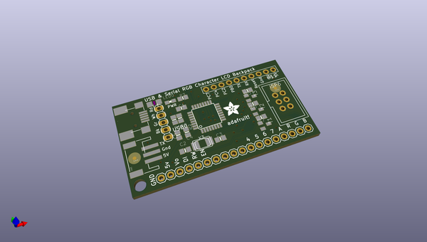

# adafruit_usb_serial_rgb_character_backpack_pcb
 
## summary 
* id: adafruit_adafruit_usb_serial_rgb_character_backpack_pcb_adafruit_usb_serial_char_lcd
* user: adafruit
* name: adafruit_usb_serial_rgb_character_backpack_pcb
* board: adafruit_usb_serial_char_lcd
* repo: https://github.com/adafruit/Adafruit-USB-Serial-RGB-Character-Backpack-PCB

* src_file_repo_sch: 
* src_file_repo_sch_link: https://github.com/adafruit/Adafruit-USB-Serial-RGB-Character-Backpack-PCB/tree/master/
* full details link: https://github.com/oomlout/oomlout_oomp_project_bot_v_2/tree/main/projects/adafruit_adafruit_usb_serial_rgb_character_backpack_pcb_adafruit_usb_serial_char_lcd/current_version/working  

## schematic  
  
[schematic (pdf)](working_schematic.pdf)  

## pcb  
 
  
  
  
[board (pdf)](working.pdf)  

## working_bom
| Id | Designator | Footprint | Quantity | Designation | Supplier and ref |  | None | 
| --- | --- | --- | --- | --- | --- | --- | --- | 
| 1 | IC2 | TQFP32-08 | 1 | AT90USB162 |  |  | [''] | 
| 2 | C3,C2 | 0805-NO | 2 | 18pF |  |  | [''] | 
| 3 | CN1 | USB-MINIB_LARGER | 1 | miniB |  |  | [''] | 
| 4 | FID2,FID1 | FIDUCIAL-1X2.5 | 2 | FIDUCIAL1X2.5 |  |  | [''] | 
| 5 | R5,R7,R3,R6 | 0805-NO | 4 | 1K |  |  | [''] | 
| 6 | ISP6 | ISP6 | 1 | PINHD-2X3THM |  |  | [''] | 
| 7 | C1,C5 | 0805-NO | 2 | 10uF |  |  | [''] | 
| 8 | CN3 | JSTPH3 | 1 | JST-PH-3 |  |  | [''] | 
| 9 | R1,R2 | 0805-NO | 2 | 22 |  |  | [''] | 
| 10 | T2,T3,T1 | SOT23-BEC | 3 | MMBT222 |  |  | [''] | 
| 11 | LED0 | CHIPLED_0805_NOOUTLINE | 1 | RED |  |  | [''] | 
| 12 | USB0 | 1X05 | 1 | MALE |  |  | [''] | 
| 13 | U$2 | ADAFRUIT_5MM | 1 |  |  |  | [''] | 
| 14 | JP1 | 1X18-BIG | 1 | CHARLCD |  |  | [''] | 
| 15 | C4 | 0805-NO | 1 | 0.1uF |  |  | [''] | 
| 16 | @HOLE0 |  | 1 |  |  |  | [''] | 
| 17 | F1 | R1206 | 1 | 500mA |  |  | [''] | 
| 18 | X3 | NX5032 | 1 | 16MHz |  |  | [''] | 
| 19 | U$1 | 1X10-BIG | 1 | PINHD-1X10 |  |  | [''] | 

## bom_schematic
| Ref | Qnty | Value | Cmp name | Footprint | Description | Vendor | DNP | 
| --- | --- | --- | --- | --- | --- | --- | --- | 
| C1, C5 | 2 | 10uF | CAP_CERAMIC0805-NOOUTLINE | working:0805-NO |  |  |  | 
| C2, C3 | 2 | 18pF | CAP_CERAMIC0805-NOOUTLINE | working:0805-NO |  |  |  | 
| C4 | 1 | 0.1uF | CAP_CERAMIC0805-NOOUTLINE | working:0805-NO |  |  |  | 
| CN1 | 1 | miniB | USBMINIBLARGE | working:USB-MINIB_LARGER |  |  |  | 
| CN3 | 1 | JST-PH-3 | JST_3PIN | working:JSTPH3 |  |  |  | 
| F1 | 1 | 500mA | PTCFUSE-1206 | working:R1206 |  |  |  | 
| FID1, FID2 | 2 | FIDUCIAL1X2.5 | FIDUCIAL1X2.5 | working:FIDUCIAL-1X2.5 |  |  |  | 
| IC2 | 1 | ATMEGA32U2-TQFP | ATMEGA32U2-TQFP | working:TQFP32-08 |  |  |  | 
| ISP6 | 1 | PINHD-2X3THM | PINHD-2X3THM | working:ISP6 |  |  |  | 
| JP1 | 1 | CHARLCD | PINHD-1X18-BIG | working:1X18-BIG |  |  |  | 
| LED0 | 1 | RED | LED0805_NOOUTLINE | working:CHIPLED_0805_NOOUTLINE |  |  |  | 
| R1, R2 | 2 | 22 | RESISTOR0805_NOOUTLINE | working:0805-NO |  |  |  | 
| R3, R5, R6, R7 | 4 | 1K | RESISTOR0805_NOOUTLINE | working:0805-NO |  |  |  | 
| T1, T2, T3 | 3 | MMBT222 | -NPN-SOT23-BEC | working:SOT23-BEC |  |  |  | 
| U$1 | 1 | PINHD-1X10 | PINHD-1X10 | working:1X10-BIG |  |  |  | 
| USB0 | 1 | MALE | PINHD-1X5 | working:1X05 |  |  |  | 
| X3 | 1 | 16MHz | XTALNX5032 | working:NX5032 |  |  |  | 

