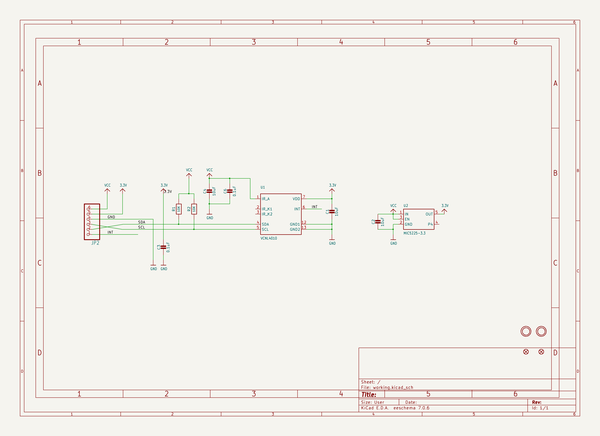

# adafruit_vcnl40x0_pcb
 
## summary 
* id: adafruit_adafruit_vcnl40x0_pcb_vcnl4000
* user: adafruit
* name: adafruit_vcnl40x0_pcb
* board: vcnl4000
* repo: https://github.com/adafruit/Adafruit-VCNL40X0-PCB

* src_file_repo_sch: 
* src_file_repo_sch_link: https://github.com/adafruit/Adafruit-VCNL40X0-PCB/tree/master/
* full details link: https://github.com/oomlout/oomlout_oomp_project_bot_v_2/tree/main/projects/adafruit_adafruit_vcnl40x0_pcb_vcnl4000/current_version/working  

## schematic  
  
[schematic (pdf)](working_schematic.pdf) 

## pcb  
 
  
  
  
[board (pdf)](working.pdf)  

## working_bom
| Id | Designator | Footprint | Quantity | Designation | Supplier and ref |  | None | 
| --- | --- | --- | --- | --- | --- | --- | --- | 
| 1 | U1 | VCNL4010 | 1 | VCNL4010 |  |  | [''] | 
| 2 | C6,C3 | 0805-NO | 2 | 0.1uF |  |  | [''] | 
| 3 | U$5,U$6 | MOUNTINGHOLE_2.5_PLATED | 2 | MOUNTINGHOLE2.5 |  |  | [''] | 
| 4 | JP2 | 1X06_ROUND_76 | 1 |  |  |  | [''] | 
| 5 | C2,C1,C4 | 0805-NO | 3 | 10uF |  |  | [''] | 
| 6 | R2,R1 | 0805-NO | 2 | 10K |  |  | [''] | 
| 7 | U$8,U$7 | FIDUCIAL_1MM | 2 | FIDUCIAL" |  |  | [''] | 
| 8 | U2 | SOT23-5 | 1 | MIC5225-3.3 |  |  | [''] | 
| 9 | U$13 | PCBFEAT-REV-040 | 1 |  |  |  | [''] | 
| 10 | U$14 | ADAFRUIT_3.5MM | 1 |  |  |  | [''] | 

## bom_schematic
| Ref | Qnty | Value | Cmp name | Footprint | Description | Vendor | DNP | 
| --- | --- | --- | --- | --- | --- | --- | --- | 
| C1, C2, C4 | 3 | 10uF | CAP_CERAMIC0805-NOOUTLINE | working:0805-NO |  |  |  | 
| C3, C6 | 2 | 0.1uF | CAP_CERAMIC0805-NOOUTLINE | working:0805-NO |  |  |  | 
| JP2 | 1 | HEADER-1X676MIL | HEADER-1X676MIL | working:1X06_ROUND_76 |  |  |  | 
| R1, R2 | 2 | 10K | RESISTOR0805_NOOUTLINE | working:0805-NO |  |  |  | 
| U1 | 1 | VCNL4010 | VCNL4010 | working:VCNL4010 |  |  |  | 
| U2 | 1 | MIC5225-3.3 | VREG_SOT23-5 | working:SOT23-5 |  |  |  | 
| U$5, U$6 | 2 | MOUNTINGHOLE2.5 | MOUNTINGHOLE2.5 | working:MOUNTINGHOLE_2.5_PLATED |  |  |  | 
| U$7, U$8 | 2 | FIDUCIAL"" | FIDUCIAL{dblquote}{dblquote} | working:FIDUCIAL_1MM |  |  |  | 

## mounting_holes
| x | y | package | value | ref | size | 
| --- | --- | --- | --- | --- | --- | 
| 0.0 | 0.0 | MOUNTINGHOLE_2.5_PLATED | MOUNTINGHOLE2.5 | U$5 | m3 | 
| 11.43 | 0.0 | MOUNTINGHOLE_2.5_PLATED | MOUNTINGHOLE2.5 | U$6 | m3 | 

