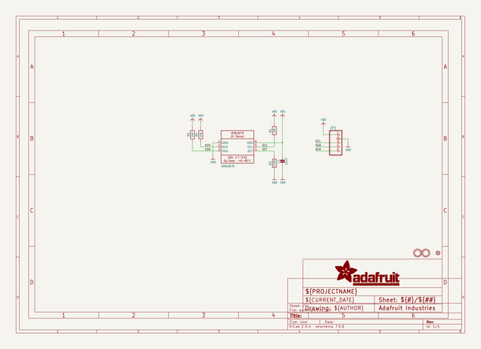
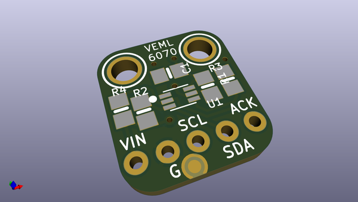
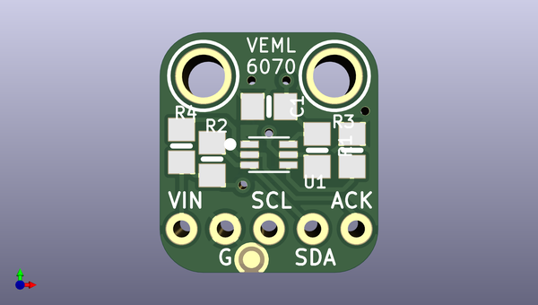
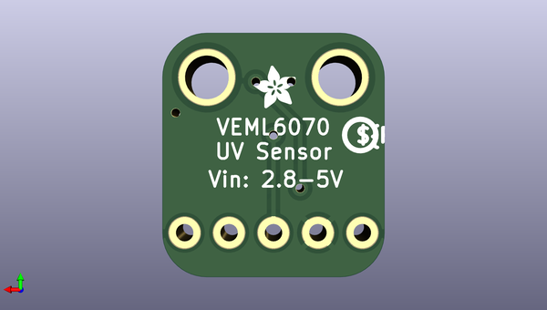

# adafruit_veml6070_pcb
 
## summary 
* id: adafruit_adafruit_veml6070_pcb_adafruit_veml6070
* user: adafruit
* name: adafruit_veml6070_pcb
* board: adafruit_veml6070
* repo: https://github.com/adafruit/Adafruit-VEML6070-PCB

* src_file_repo_sch: 
* src_file_repo_sch_link: https://github.com/adafruit/Adafruit-VEML6070-PCB/tree/master/
* full details link: https://github.com/oomlout/oomlout_oomp_project_bot_v_2/tree/main/projects/adafruit_adafruit_veml6070_pcb_adafruit_veml6070/current_version/working  

## schematic  
  
[schematic (pdf)](working_schematic.pdf) 

## pcb  
 
  
  
  
[board (pdf)](working.pdf)  

## working_bom
| Id | Designator | Footprint | Quantity | Designation | Supplier and ref |  | None | 
| --- | --- | --- | --- | --- | --- | --- | --- | 
| 1 | FID1 | FIDUCIAL_1MM | 1 | FIDUCIAL" |  |  | [''] | 
| 2 | U$11,U$10 | MOUNTINGHOLE_2.5_PLATED | 2 | MOUNTINGHOLE2.5 |  |  | [''] | 
| 3 | C1 | 0805-NO | 1 | 10uF |  |  | [''] | 
| 4 | U1 | VEML6070 | 1 | VEML6070 |  |  | [''] | 
| 5 | JP1 | 1X05_ROUND_70 | 1 |  |  |  | [''] | 
| 6 | R1,R4,R2 | 0805-NO | 3 | 10K |  |  | [''] | 
| 7 | R3 | 0805-NO | 1 | 270K |  |  | [''] | 
| 8 | U$2 | PCBFEAT-REV-040 | 1 |  |  |  | [''] | 
| 9 | U$14 | ADAFRUIT_2.5MM | 1 |  |  |  | [''] | 

## bom_schematic
| Ref | Qnty | Value | Cmp name | Footprint | Description | Vendor | DNP | 
| --- | --- | --- | --- | --- | --- | --- | --- | 
| C1 | 1 | 10uF | CAP_CERAMIC0805-NOOUTLINE | working:0805-NO |  |  |  | 
| FID1 | 1 | FIDUCIAL"" | FIDUCIAL{dblquote}{dblquote} | working:FIDUCIAL_1MM |  |  |  | 
| JP1 | 1 | HEADER-1X570MIL | HEADER-1X570MIL | working:1X05_ROUND_70 |  |  |  | 
| R1, R2, R4 | 3 | 10K | RESISTOR0805_NOOUTLINE | working:0805-NO |  |  |  | 
| R3 | 1 | 270K | RESISTOR0805_NOOUTLINE | working:0805-NO |  |  |  | 
| U1 | 1 | VEML6070 | UV_VEML6070 | working:VEML6070 |  |  |  | 
| U$10, U$11 | 2 | MOUNTINGHOLE2.5 | MOUNTINGHOLE2.5 | working:MOUNTINGHOLE_2.5_PLATED |  |  |  | 

## mounting_holes
| x | y | package | value | ref | size | 
| --- | --- | --- | --- | --- | --- | 
| 0.0 | 0.0 | MOUNTINGHOLE_2.5_PLATED | MOUNTINGHOLE2.5 | U$10 | m3 | 
| 7.62 | 0.0 | MOUNTINGHOLE_2.5_PLATED | MOUNTINGHOLE2.5 | U$11 | m3 | 

