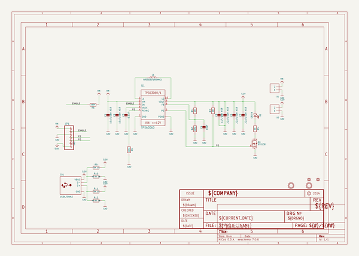
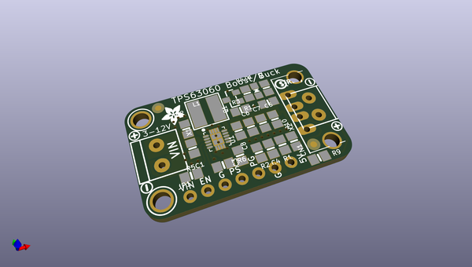
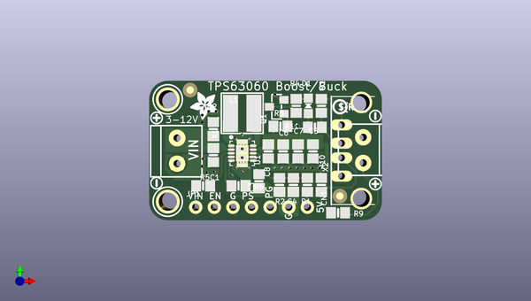
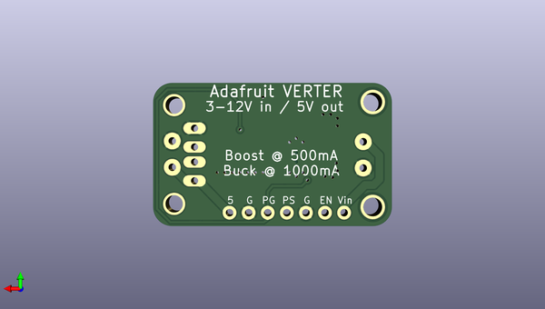

# adafruit_verter_pcb
 
## summary 
* id: adafruit_adafruit_verter_pcb_adafruit_verter_tps63060_2a_boostbuck
* user: adafruit
* name: adafruit_verter_pcb
* board: adafruit_verter_tps63060_2a_boostbuck
* repo: https://github.com/adafruit/Adafruit-Verter-PCB

* src_file_repo_sch: 
* src_file_repo_sch_link: https://github.com/adafruit/Adafruit-Verter-PCB/tree/master/
* full details link: https://github.com/oomlout/oomlout_oomp_project_bot_v_2/tree/main/projects/adafruit_adafruit_verter_pcb_adafruit_verter_tps63060_2a_boostbuck/current_version/working  

## schematic  
  
[schematic (pdf)](working_schematic.pdf) 

## pcb  
 
  
  
  
[board (pdf)](working.pdf)  

## working_bom
| Id | Designator | Footprint | Quantity | Designation | Supplier and ref |  | None | 
| --- | --- | --- | --- | --- | --- | --- | --- | 
| 1 | R11,R9 | 0805-NO | 2 | 75K 1% |  |  | [''] | 
| 2 | R5,R6,R2 | 0805-NO | 3 | 105K |  |  | [''] | 
| 3 | U$23,U$22 | SYMBOL_PLUS | 2 |  |  |  | [''] | 
| 4 | R12,R10 | 0805-NO | 2 | 49.9K 1% |  |  | [''] | 
| 5 | X1,X2 | TERMBLOCK_1X2-3.5MM | 2 |  |  |  | [''] | 
| 6 | C5,C6,C7 | 0805-NO | 3 | 22uF/10V X5R |  |  | [''] | 
| 7 | C4 | 0805-NO | 1 | 10pF |  |  | [''] | 
| 8 | R3,R1 | 0805-NO | 2 | 1M |  |  | [''] | 
| 9 | CN1 | USB_HOST-PTH | 1 | USBA_FEMALE |  |  | [''] | 
| 10 | C8 | 0805-NO | 1 | 1uF/10V X5R |  |  | [''] | 
| 11 | D1 | CHIPLED_0805_NOOUTLINE | 1 | GREEN |  |  | [''] | 
| 12 | U$15,U$17 | MOUNTINGHOLE_2.5_PLATED | 2 | MOUNTINGHOLE2.5 |  |  | [''] | 
| 13 | U$38 | PCBFEAT-REV-040 | 1 |  |  |  | [''] | 
| 14 | C2,C1 | 0805-NO | 2 | 10uF/16V X5R |  |  | [''] | 
| 15 | Q1 | SOT23-WIDE | 1 | BSS138 |  |  | [''] | 
| 16 | U$24,U$25 | SYMBOL_MINUS | 2 |  |  |  | [''] | 
| 17 | FID2,FID1 | FIDUCIAL_1MM | 2 | FIDUCIAL" |  |  | [''] | 
| 18 | U1 | PWSON-N10 | 1 | TPS63060 |  |  | [''] | 
| 19 | L1 | INDUCTOR_5X5MM_TDK_VLC5045 | 1 | NRS5030T1R0NMGJ  |  |  | [''] | 
| 20 | JP1 | 1X07_ROUND_70 | 1 |  |  |  | [''] | 
| 21 | R4 | 0805-NO | 1 | 1K |  |  | [''] | 
| 22 | U$27 | ADAFRUIT_3.5MM | 1 |  |  |  | [''] | 
| 23 | C3 | 0805-NO | 1 | 0.1uF |  |  | [''] | 
| 24 | U$37 | VERTERLOGO | 1 |  |  |  | [''] | 

## bom_schematic
| Ref | Qnty | Value | Cmp name | Footprint | Description | Vendor | DNP | 
| --- | --- | --- | --- | --- | --- | --- | --- | 
| C1, C2 | 2 | 10uF/16V X5R | CAP_CERAMIC0805-NOOUTLINE | working:0805-NO |  |  |  | 
| C3 | 1 | 0.1uF | CAP_CERAMIC0805-NOOUTLINE | working:0805-NO |  |  |  | 
| C4 | 1 | 10pF | CAP_CERAMIC0805-NOOUTLINE | working:0805-NO |  |  |  | 
| C5, C6, C7 | 3 | 22uF/10V X5R | CAP_CERAMIC0805-NOOUTLINE | working:0805-NO |  |  |  | 
| C8 | 1 | 1uF/10V X5R | CAP_CERAMIC0805-NOOUTLINE | working:0805-NO |  |  |  | 
| CN1 | 1 | USBA_FEMALE | USB_TYPEAPTHFML | working:USB_HOST-PTH |  |  |  | 
| D1 | 1 | GREEN | LED0805_NOOUTLINE | working:CHIPLED_0805_NOOUTLINE |  |  |  | 
| FID1, FID2 | 2 | FIDUCIAL"" | FIDUCIAL{dblquote}{dblquote} | working:FIDUCIAL_1MM |  |  |  | 
| JP1 | 1 | HEADER-1X770MIL | HEADER-1X770MIL | working:1X07_ROUND_70 |  |  |  | 
| L1 | 1 | NRS5030T1R0NMGJ  | INDUCTORTDK_VLC5045 | working:INDUCTOR_5X5MM_TDK_VLC5045 |  |  |  | 
| Q1 | 1 | BSS138 | MOSFET-NWIDE | working:SOT23-WIDE |  |  |  | 
| R1, R3 | 2 | 1M | RESISTOR0805_NOOUTLINE | working:0805-NO |  |  |  | 
| R2, R5, R6 | 3 | 105K | RESISTOR0805_NOOUTLINE | working:0805-NO |  |  |  | 
| R4 | 1 | 1K | RESISTOR0805_NOOUTLINE | working:0805-NO |  |  |  | 
| R9, R11 | 2 | 75K 1% | RESISTOR0805_NOOUTLINE | working:0805-NO |  |  |  | 
| R10, R12 | 2 | 49.9K 1% | RESISTOR0805_NOOUTLINE | working:0805-NO |  |  |  | 
| U1 | 1 | TPS63060 | VREG_TPS63060/1 | working:PWSON-N10 |  |  |  | 
| U$15, U$17 | 2 | MOUNTINGHOLE2.5 | MOUNTINGHOLE2.5 | working:MOUNTINGHOLE_2.5_PLATED |  |  |  | 
| X1, X2 | 2 | TERMBLOCK_1X2 | TERMBLOCK_1X2 | working:TERMBLOCK_1X2-3.5MM |  |  |  | 

## mounting_holes
| x | y | package | value | ref | size | 
| --- | --- | --- | --- | --- | --- | 
| 0.0 | 0.0 | MOUNTINGHOLE_2.5_PLATED | MOUNTINGHOLE2.5 | U$15 | m3 | 
| 0.0 | 13.97 | MOUNTINGHOLE_2.5_PLATED | MOUNTINGHOLE2.5 | U$17 | m3 | 

