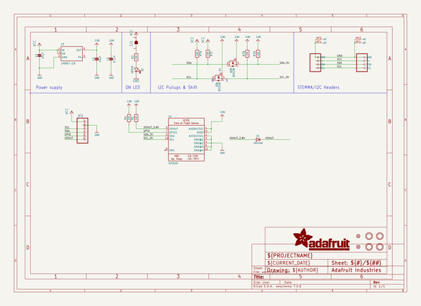
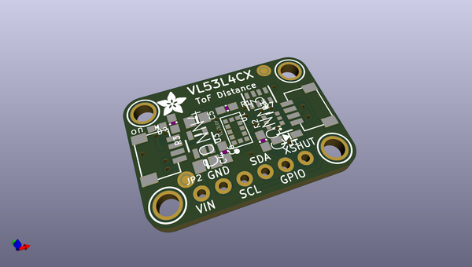
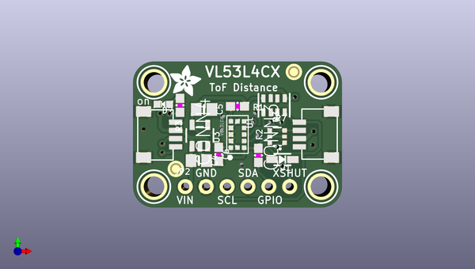
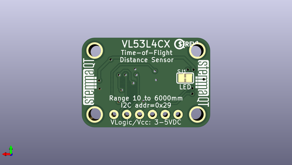

# adafruit_vl53l4cx_pcb
 
## summary 
* id: adafruit_adafruit_vl53l4cx_pcb_adafruit_vl53l4cx
* user: adafruit
* name: adafruit_vl53l4cx_pcb
* board: adafruit_vl53l4cx
* repo: https://github.com/adafruit/Adafruit-VL53L4CX-PCB

* src_file_repo_sch: 
* src_file_repo_sch_link: https://github.com/adafruit/Adafruit-VL53L4CX-PCB/tree/main/
* full details link: https://github.com/oomlout/oomlout_oomp_project_bot_v_2/tree/main/projects/adafruit_adafruit_vl53l4cx_pcb_adafruit_vl53l4cx/current_version/working  

## schematic  
  
[schematic (pdf)](working_schematic.pdf)  

## pcb  
 
  
  
  
[board (pdf)](working.pdf)  

## working_bom
| Id | Designator | Footprint | Quantity | Designation | Supplier and ref |  | None | 
| --- | --- | --- | --- | --- | --- | --- | --- | 
| 1 | FID1,FID4 | FIDUCIAL_1MM | 2 | FIDUCIAL_1MM |  |  | [''] | 
| 2 | C5,C4 | 0805-NO | 2 | 10uF |  |  | [''] | 
| 3 | CONN3,CONN4 | JST_SH4 | 2 | STEMMA_I2C_QT |  |  | [''] | 
| 4 | U1 | LGA12_ST | 1 | VL53L0X |  |  | [''] | 
| 5 | C6 | 0603-NO | 1 | 0.1uF |  |  | [''] | 
| 6 | U$33,U$34,U$30,U$31 | MOUNTINGHOLE_2.5_PLATED | 4 | MOUNTINGHOLE2.5 |  |  | [''] | 
| 7 | U3 | SOT23-5 | 1 | LP5907-2.8 |  |  | [''] | 
| 8 | JP2 | 1X06_ROUND_70 | 1 |  |  |  | [''] | 
| 9 | Q3 | SOT363 | 1 | BSS138 |  |  | [''] | 
| 10 | R1,R2,R3 | 0603-NO | 3 | 10K |  |  | [''] | 
| 11 | D2 | CHIPLED_0603_NOOUTLINE | 1 | GREEN |  |  | [''] | 
| 12 | U$36 | ADAFRUIT_3.5MM | 1 |  |  |  | [''] | 
| 13 | R7 | RESPACK_4X0603 | 1 | 10K |  |  | [''] | 
| 14 | D1 | SOD-323 | 1 | 1N4148 |  |  | [''] | 
| 15 | SJ1 | SOLDERJUMPER_CLOSEDWIRE | 1 |  |  |  | [''] | 
| 16 | U$38,U$39 | STEMMAQT | 2 |  |  |  | [''] | 
| 17 | U$37 | PCBFEAT-REV-040 | 1 |  |  |  | [''] | 

## bom_schematic
| Ref | Qnty | Value | Cmp name | Footprint | Description | Vendor | DNP | 
| --- | --- | --- | --- | --- | --- | --- | --- | 
| C4, C5 | 2 | 10uF | CAP_CERAMIC0805-NOOUTLINE | working:0805-NO |  |  |  | 
| C6 | 1 | 0.1uF | CAP_CERAMIC0603_NO | working:0603-NO |  |  |  | 
| CONN3, CONN4 | 2 | STEMMA_I2C_QT | STEMMA_I2C_QT | working:JST_SH4 |  |  |  | 
| D1 | 1 | 1N4148 | DIODESOD-323 | working:SOD-323 |  |  |  | 
| D2 | 1 | GREEN | LED0603_NOOUTLINE | working:CHIPLED_0603_NOOUTLINE |  |  |  | 
| FID1, FID4 | 2 | FIDUCIAL_1MM | FIDUCIAL_1MM | working:FIDUCIAL_1MM |  |  |  | 
| JP2 | 1 | HEADER-1X670MIL | HEADER-1X670MIL | working:1X06_ROUND_70 |  |  |  | 
| Q3 | 1 | BSS138 | MOSFET-N_DUAL | working:SOT363 |  |  |  | 
| R1, R2, R3 | 3 | 10K | RESISTOR_0603_NOOUT | working:0603-NO |  |  |  | 
| R7 | 1 | 10K | RESISTOR_4PACK | working:RESPACK_4X0603 |  |  |  | 
| SJ1 | 1 | SOLDERJUMPER_CLOSED | SOLDERJUMPER_CLOSED | working:SOLDERJUMPER_CLOSEDWIRE |  |  |  | 
| U1 | 1 | VL53L0X | VL53L0X | working:LGA12_ST |  |  |  | 
| U3 | 1 | LP5907-2.8 | VREG_SOT23-5 | working:SOT23-5 |  |  |  | 
| U$30, U$31, U$33, U$34 | 4 | MOUNTINGHOLE2.5 | MOUNTINGHOLE2.5 | working:MOUNTINGHOLE_2.5_PLATED |  |  |  | 

## mounting_holes
| x | y | package | value | ref | size | 
| --- | --- | --- | --- | --- | --- | 
| 0.0 | 12.700000000000003 | MOUNTINGHOLE_2.5_PLATED | MOUNTINGHOLE2.5 | U$30 | m3 | 
| 20.319999999999993 | 12.700000000000003 | MOUNTINGHOLE_2.5_PLATED | MOUNTINGHOLE2.5 | U$31 | m3 | 
| 0.0 | 0.0 | MOUNTINGHOLE_2.5_PLATED | MOUNTINGHOLE2.5 | U$33 | m3 | 
| 20.319999999999993 | 0.0 | MOUNTINGHOLE_2.5_PLATED | MOUNTINGHOLE2.5 | U$34 | m3 | 

