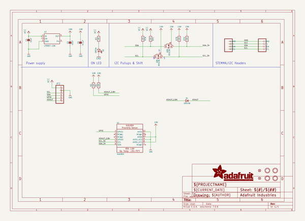
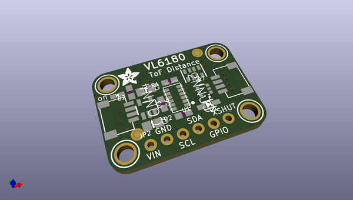
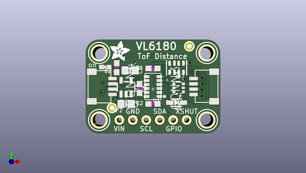
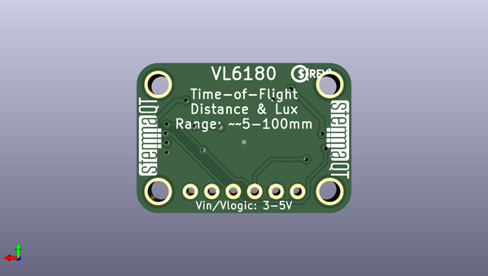

# adafruit_vl6180x_tof_distance_sensor_pcb
 
## summary 
* id: adafruit_adafruit_vl6180x_tof_distance_sensor_pcb_adafruit_vl6180x
* user: adafruit
* name: adafruit_vl6180x_tof_distance_sensor_pcb
* board: adafruit_vl6180x
* repo: https://github.com/adafruit/Adafruit-VL6180X-ToF-Distance-Sensor-PCB

* src_file_repo_sch: 
* src_file_repo_sch_link: https://github.com/adafruit/Adafruit-VL6180X-ToF-Distance-Sensor-PCB/tree/master/
* full details link: https://github.com/oomlout/oomlout_oomp_project_bot_v_2/tree/main/projects/adafruit_adafruit_vl6180x_tof_distance_sensor_pcb_adafruit_vl6180x/current_version/working  

## schematic  
  
[schematic (pdf)](working_schematic.pdf) 

## pcb  
 
  
  
  
[board (pdf)](working.pdf)  

## working_bom
| Id | Designator | Footprint | Quantity | Designation | Supplier and ref |  | None | 
| --- | --- | --- | --- | --- | --- | --- | --- | 
| 1 | C4,C5 | 0805-NO | 2 | 10uF |  |  | [''] | 
| 2 | D2 | CHIPLED_0603_NOOUTLINE | 1 | GREEN |  |  | [''] | 
| 3 | R1,R3,R2 | 0603-NO | 3 | 10K |  |  | [''] | 
| 4 | U$34,U$31,U$30,U$33 | MOUNTINGHOLE_2.5_PLATED | 4 | MOUNTINGHOLE2.5 |  |  | [''] | 
| 5 | U1 | VL6180 | 1 | VL6180X |  |  | [''] | 
| 6 | Q3 | SOT363 | 1 | BSS138 |  |  | [''] | 
| 7 | U$36 | ADAFRUIT_3.5MM | 1 |  |  |  | [''] | 
| 8 | CONN3,CONN4 | JST_SH4 | 2 | STEMMA_I2C_QT |  |  | [''] | 
| 9 | JP2 | 1X06_ROUND_70 | 1 |  |  |  | [''] | 
| 10 | R7 | RESPACK_4X0603 | 1 | 10K |  |  | [''] | 
| 11 | FID1,FID4 | FIDUCIAL_1MM | 2 | FIDUCIAL_1MM |  |  | [''] | 
| 12 | C6 | 0603-NO | 1 | 0.1uF |  |  | [''] | 
| 13 | D1 | SOD-323 | 1 | 1N4148 |  |  | [''] | 
| 14 | U3 | SOT23-5 | 1 | LP5907-2.8V |  |  | [''] | 
| 15 | U$37 | PCBFEAT-REV-040 | 1 |  |  |  | [''] | 
| 16 | U$39,U$38 | STEMMAQT | 2 |  |  |  | [''] | 

## mounting_holes
| x | y | package | value | ref | size | 
| --- | --- | --- | --- | --- | --- | 
| 0.0 | 12.7 | MOUNTINGHOLE_2.5_PLATED | MOUNTINGHOLE2.5 | U$30 | m3 | 
| 20.32 | 12.7 | MOUNTINGHOLE_2.5_PLATED | MOUNTINGHOLE2.5 | U$31 | m3 | 
| 0.0 | 0.0 | MOUNTINGHOLE_2.5_PLATED | MOUNTINGHOLE2.5 | U$33 | m3 | 
| 20.32 | 0.0 | MOUNTINGHOLE_2.5_PLATED | MOUNTINGHOLE2.5 | U$34 | m3 | 

